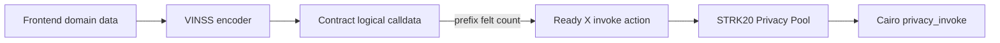
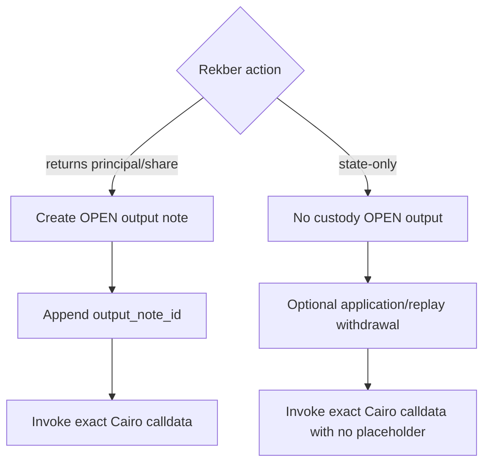
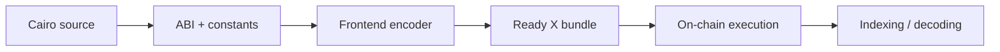

# Frontend Compatibility

This document defines the compatibility boundary between the current VINSS Cairo contracts, the frontend encoders, and the STRK20 / Ready X transaction builder.

Cairo compilation alone does **not** prove frontend compatibility. The browser must reproduce the exact contract domains, Poseidon input order, action selectors, calldata lengths, role values, fee rules, and output-note behavior expected by the deployed contracts.

Executable Cairo source is authoritative for contract ABI and state-transition rules. Frontend source is authoritative only for how the application currently constructs those calls.

## Compatibility Layers

A VINSS private transaction has three different representations that must not be conflated:

```text
1. Contract logical calldata
   Exact felts received by privacy_invoke.

2. Ready X invoke-action encoding
   [contract_calldata_length, ...contract_logical_calldata]

3. STRK20 transaction bundle
   withdraw / transfer OPEN / invoke actions in the required order.
```



The Ready X calldata-length prefix is wallet-helper framing. It is **not** the first application field seen by the Cairo action decoder.

## Current Compatibility Status

Most canonical domains and layouts currently match between Cairo and frontend source:

```text
Message envelope V2                    aligned
Offer envelope V2                      aligned
Private Escrow envelope V2             aligned
Invite commitment domain               aligned
Rekber capability domains              aligned
Certificate commitment domains         aligned
Rekber funding action 1                aligned
Rekber terminal/output action layouts  aligned in logical payload construction
```

There is, however, a **known Rekber state-only invocation mismatch on the current `main` frontend**. See [Known Rekber State-Only Invocation Mismatch](#known-rekber-state-only-invocation-mismatch).

This means a successful Cairo build or contract test suite must not be used as proof that every Ready X browser path is currently calldata-compatible.

---

## Encrypted Envelope Compatibility

Message, Offer, and Private Escrow coordination use the same six-field public encrypted-envelope header:

| Index | Field |
|---:|---|
| `0` | `envelope_version` |
| `1` | one-time action locator |
| `2` | opaque sender tag |
| `3` | opaque recipient tag |
| `4` | claimed payload commitment |
| `5` | ciphertext chunk count |
| `6...` | ciphertext chunks |

Current version:

```text
2
```

The `V2` label describes the encrypted-envelope format. It does not mean the helper contract itself is a `V2` contract.

The claimed commitment at index `4` is not included recursively in the Poseidon input. Frontend and Cairo independently compute the commitment from:

```text
domain
version
locator
sender_tag
recipient_tag
chunk_count
ciphertext...
```

and the contract then checks:

```text
computed_commitment == claimed_commitment
```

### Shared Envelope Bounds

Current contract bounds:

```text
Message        <= 64 ciphertext chunks
Offer          <= 64 ciphertext chunks
Private Escrow <= 64 ciphertext chunks
```

The frontend must never assume that successful local encryption implies the resulting payload satisfies those contract limits.

---

## Message

### Version and Domain

```text
version = 2
domain  = VINSS_MSG_COMMIT_V2
```

The current frontend constants match the Cairo constants.

### Commitment

Frontend and Cairo must compute:

```text
Poseidon(
  'VINSS_MSG_COMMIT_V2',
  2,
  message_locator,
  sender_tag,
  recipient_tag,
  chunk_count,
  ...ciphertext
)
```

### Contract Logical Calldata

`VinssMessageHelper.privacy_invoke` receives:

```text
[2,
 message_locator,
 sender_tag,
 recipient_tag,
 payload_commitment,
 chunk_count,
 ...ciphertext,
 quoted_fee,
 open_note_id]
```

The last two fields are outside the encrypted payload commitment.

### Fee Rule

Frontend obtains the current minimum using the helper's configured FeePolicy path:

```text
quote_fee(FEE_ACTION_MESSAGE)
```

Cairo requires:

```text
quoted_fee >= current minimum
```

The helper returns one revenue `OpenNoteDeposit` whose amount equals the caller-provided accepted `quoted_fee`.

### Current Ready X Bundle

The frontend currently builds:

```text
1. withdraw
   token     = message helper open-note token
   amount    = quoted_fee
   recipient = VinssMessageHelper

2. transfer
   token     = same revenue token
   amount    = OPEN
   recipient = VINSS treasury

3. invoke
   contract  = VinssMessageHelper
   calldata  = [logical_calldata_length, ...logical_calldata]
```

The OPEN-note placeholder used by logical calldata must refer to the note generated by that bundle.

### Routing Tags

Current frontend derives sender/recipient routing tags with a keyed HMAC and includes the one-time action locator in the derivation.

The contract treats those tags as opaque felts. It does not verify or recover participant identities from them.

---

## Offer

### Version and Domain

```text
version = 2
domain  = VINSS_OFFER_COMMIT_V2
```

### Commitment

Frontend and Cairo must compute:

```text
Poseidon(
  'VINSS_OFFER_COMMIT_V2',
  2,
  offer_action_locator,
  sender_tag,
  recipient_tag,
  chunk_count,
  ...ciphertext
)
```

### Contract Logical Calldata

```text
[2,
 offer_action_locator,
 sender_tag,
 recipient_tag,
 payload_commitment,
 chunk_count,
 ...ciphertext,
 quoted_fee,
 open_note_id]
```

Offer lifecycle semantics such as:

```text
create
counter
accept
reject
cancel
expire
```

remain inside ciphertext. They are not public Cairo action selectors.

### Fee Rule

Frontend obtains:

```text
quote_fee(FEE_ACTION_OFFER)
```

through the helper's configured FeePolicy.

Cairo requires:

```text
quoted_fee >= current minimum
```

The accepted `quoted_fee` is returned as the Offer helper revenue `OpenNoteDeposit`.

### Current Ready X Bundle

```text
1. withdraw quoted Offer fee to VinssOfferHelper
2. transfer OPEN revenue note to VINSS treasury
3. invoke VinssOfferHelper with exact logical calldata
```

---

## Private Rekber Coordination

### Version and Domain

```text
version = 2
domain  = VINSS_PRIVATE_ESCROW_COMMIT_V2
```

### Contract Logical Calldata

```text
[2,
 private_escrow_action_locator,
 sender_tag,
 recipient_tag,
 payload_commitment,
 chunk_count,
 ...ciphertext]
```

There is no contract-level fee tail:

```text
no quoted_fee
no open_note_id
```

`VinssPrivateEscrowHelper` validates and stores the encrypted envelope and returns an empty `OpenNoteDeposit` span.

It does not parse whether encrypted ciphertext represents Agreement, acceptance, dispute coordination, cancellation, or another application lifecycle semantic.

### Application-Level Withdrawal Boundary

The current frontend may include a separate STRK withdrawal in the containing Ready X transaction for selected private coordination actions.

That withdrawal is **not** returned or validated by `VinssPrivateEscrowHelper` and therefore is not a contract invariant of the helper.

Current frontend logic uses a non-zero workflow charge for encrypted coordination kinds including:

```text
create
accept
dispute
```

and uses a very small withdrawal for other coordination calls to satisfy the containing Privacy Pool transaction's replay-protection requirements.

Because the helper itself cannot see the encrypted action kind, it cannot enforce different prices for those private semantics.

### Current Ready X Shape

Conceptually:

```text
1. withdraw
   application revenue or replay-protection amount

2. invoke
   VinssPrivateEscrowHelper
   exact encrypted-envelope calldata
```

There is no helper-generated custody or revenue OPEN output.

---

## Invite

The frontend Invite payload version and the on-chain Invite commitment version are **different version namespaces**.

### Frontend Encrypted Invite Token

Current frontend Invite tokens use:

```text
payload version = 3
AES-GCM AAD     = VINSS_INVITE_V3
```

Legacy frontend Invite token decoding also preserves support for older application payload versions where implemented.

These application token versions do not change the Cairo Invite commitment domain.

### On-Chain Invite Commitment

The contract commitment remains:

```text
Poseidon(
  'VINSS_INVITE_V1',
  secret
)
```

Therefore:

```text
VINSS_INVITE_V3  -> frontend encrypted token/AAD namespace
VINSS_INVITE_V1  -> Cairo on-chain commitment domain
```

They must not be renamed to match each other merely because the numbers differ.

### Create

Contract logical calldata:

```text
[0,
 commitment,
 expires_at,
 quoted_fee,
 open_note_id]
```

The frontend constructs the base fields:

```text
[0, commitment, expires_at]
```

and the Ready X invoke path appends:

```text
quoted_fee
open_note_id
```

Cairo requires:

```text
quoted_fee >= FeePolicy.quote_fee(FEE_ACTION_ROOM_ACTIVATION)
```

Create returns one revenue `OpenNoteDeposit`.

### Consume

Contract logical calldata:

```text
[1, secret]
```

Consume does not return a service-fee output.

The current frontend includes a negligible containing private withdrawal for pool-level replay protection, but that amount is not an Invite contract fee.

---

## Rekber Capability Domains

`frontend/lib/deal-room/settlement.ts` and Cairo must share these exact strings:

```text
VINSS_RELEASE_AUTH
VINSS_PAYEE_CLAIM
VINSS_ESCROW_REFUND
VINSS_PAYER_CONFIRM
VINSS_PAYER_DISPUTE
VINSS_PAYEE_DISPUTE
VINSS_REFUND_CONSENT
VINSS_FULFILL_CHAIN
VINSS_REVISION_CHAIN
VINSS_CERT_CLAIM
VINSS_CERT_TOKEN
```

Do not append `_V2` to these Rekber capability or certificate domains.

The encrypted helper envelope version has no relationship to these capability-domain names.

## Rekber Role Encoding

Canonical public role values:

```text
payer = 1
payee = 2
```

The same values are used by:

```text
dispute role encoding
resolution claim role encoding
certificate claim commitment
certificate deterministic token ID
```

A frontend string such as `"payer"` or `"payee"` must be converted to the exact numeric value before hashing or calldata encoding.

---

## Rekber Funding

### Action `1`

Cairo requires exactly `22` logical felts:

```text
[1,
 custody_commitment,
 release_authorization_commitment,
 payee_claim_commitment,
 refund_commitment,
 payer_confirmation_commitment,
 payer_dispute_commitment,
 payee_dispute_commitment,
 payee_refund_consent_commitment,
 fulfillment_chain_head,
 revision_chain_head,
 payer_certificate_commitment,
 payee_certificate_commitment,
 fulfillment_deadline,
 review_window,
 verification_policy,
 fulfillment_rounds,
 revision_rounds,
 token,
 principal,
 quoted_fee,
 revenue_open_note_id]
```

### Quote Timing

The frontend must obtain:

```text
VinssEscrowRekber.quote_rekber_fee(
  token,
  principal
)
```

immediately before constructing the Ready X funding transaction.

Cairo requires exact equality:

```text
quoted_fee == live required fee
```

Unlike Message/Offer/Invite minimum semantics, a larger Rekber funding quote is not accepted.

### Funding Ready X Bundle

Current frontend constructs:

```text
1. withdraw
   token     = custody token
   amount    = principal + exact fee
   recipient = VinssEscrowRekber

2. transfer
   token     = custody token
   amount    = OPEN
   recipient = VINSS treasury

3. invoke
   contract  = VinssEscrowRekber
   calldata  = [22, ...22 logical felts]
```

The contract reserves only principal and returns the funding service fee as the revenue `OpenNoteDeposit` filling the treasury OPEN note.

---

## Rekber Action Compatibility Matrix

Cairo currently enforces exact logical calldata lengths.

| Selector | Action | Logical felts | Returns custody/revenue output? |
|---:|---|---:|---|
| `1` | Fund custody | `22` | Fee output |
| `2` | Mutual release | `5` | Full principal output |
| `3` | No-fulfillment refund | `4` | Full principal output |
| `4` | Submit fulfillment | `4` | No output |
| `5` | Confirm fulfillment | `4` | No output |
| `6` | Open dispute | `5` | No output |
| `7` | Request revision | `4` | No output |
| `8` | Auto-release | `4` | Full principal output |
| `9` | Mutual refund | `5` | Full principal output |
| `10` | Resolution claim | `5` | Authorized participant share |

This table is a compatibility invariant. Extra trailing felts are not harmless for actions whose implementation checks exact calldata length.

## Rekber Output Actions

Actions that require a custody output note are:

### Mutual release

```text
[2,
 custody,
 release_secret,
 payee_claim_secret,
 output_note_id]
```

### Timeout refund

```text
[3,
 custody,
 refund_secret,
 output_note_id]
```

### Auto-release

```text
[8,
 custody,
 payee_claim_secret,
 output_note_id]
```

### Mutual refund

```text
[9,
 custody,
 refund_secret,
 payee_consent_secret,
 output_note_id]
```

### Resolution claim

```text
[10,
 custody,
 role,
 party_secret,
 output_note_id]
```

For these actions, the wallet-generated `output_note_id` belongs in the logical Cairo calldata because the contract returns an `OpenNoteDeposit` for principal or an authorized resolution share.

## Rekber State-Only Actions

These actions return an empty `OpenNoteDeposit` span and therefore must contain **no output-note placeholder** in their logical contract calldata.

### Submit fulfillment

```text
[4,
 custody,
 chain_secret,
 evidence_commitment]
```

Exact logical length:

```text
4
```

### Confirm fulfillment

```text
[5,
 custody,
 confirmation_secret,
 evidence_commitment]
```

Exact logical length:

```text
4
```

### Open dispute

```text
[6,
 custody,
 role,
 dispute_secret,
 evidence_commitment]
```

Exact logical length:

```text
5
```

### Request revision

```text
[7,
 custody,
 chain_secret,
 reason_commitment]
```

Exact logical length:

```text
4
```

---

## Known Rekber State-Only Invocation Mismatch

**Status: current frontend `main` requires correction before these paths can be described as fully contract-compatible.**

The shared frontend helper in:

```text
frontend/lib/deal-room/settlement.ts
```

currently builds:

```text
const calldata = [
  ...payload,
  "${openNoteIds[0]}",
]
```

for calls routed through `invokeSettlement()`.

That behavior is correct for Rekber actions that return custody output, because their contract logical calldata explicitly ends in `output_note_id`.

It is **not** compatible with the state-only actions above.

Current Cairo requires:

```text
submit fulfillment    selector 4 -> calldata.len() == 4
confirm fulfillment   selector 5 -> calldata.len() == 4
open dispute          selector 6 -> calldata.len() == 5
request revision      selector 7 -> calldata.len() == 4
```

Appending `${openNoteIds[0]}` changes those lengths to:

```text
4 -> 5
4 -> 5
5 -> 6
4 -> 5
```

which violates the contract's exact-length assertions.

The current frontend wrappers for these state transitions call the shared settlement helper, and selected ones also request the application-level workflow charge.

### Correct Compatibility Shape

State-only calls need a transaction shape that keeps two concepts separate:

```text
application/replay withdrawal
!=
custody OPEN output
```

Conceptually:



A future frontend fix should therefore distinguish at least:

```text
needsCustodyOutput
chargeApplicationRevenue
```

instead of treating revenue charging as proof that an OPEN custody note is required.

This document records the incompatibility; it does not redefine the Cairo ABI to accommodate the current frontend helper.

---

## Rekber Workflow Charge Boundary

The current frontend has separate application-level STRK charging behavior for selected Rekber workflow actions.

That behavior is constructed by Ready X transaction bundles and is not validated by:

```text
VinssEscrowRekber
```

or by:

```text
VinssFeePolicy.quote_fee(FEE_ACTION_REKBER)
```

The on-chain Rekber funding fee is different and **is** enforced by `VinssEscrowRekber`.

Therefore compatibility documentation must keep these concepts separate:

```text
Rekber funding service fee
    contract-enforced

Rekber workflow/application charge
    current frontend transaction-bundle behavior
```

Until workflow pricing is moved into an enforceable smart-contract design, the frontend charge must not be described as a Cairo invariant.

---

## Settlement Certificate

### Role Encoding

```text
payer = 1
payee = 2
```

### Claim Commitment

Frontend and Cairo must compute:

```text
Poseidon(
  'VINSS_CERT_CLAIM',
  custody_commitment,
  role,
  recipient_address,
  certificate_secret
)
```

The recipient address is part of the commitment.

### Deterministic Token ID

```text
Poseidon(
  'VINSS_CERT_TOKEN',
  custody_commitment,
  role
)
```

### Claim ABI

Canonical certificate claim entrypoint:

```text
claim(
  custody_commitment,
  role,
  secret
)
```

The calling wallet becomes the recipient whose address must match the precommitted claim capability.

### Transfer Compatibility

The current certificate implementation rejects later ownership updates with:

```text
CERT_NON_TRANSFERABLE
```

Frontend UI must therefore not expose transfer or burn behavior as if the settlement certificate were a normal transferable NFT.

A frontend pointed at an older certificate deployment does not gain this behavior merely because its local ABI/source was updated. Deployment class/address alignment matters.

---

## Custody State Decoding

Frontend `get_custody` decoding must preserve the exact Cairo struct field order and primitive widths.

Important categories include:

```text
capability commitments
chain heads
certificate commitments
ContractAddress token
u128 principal / fee / resolution amounts
u64 deadlines and timestamps
u8 policy / round counters
felt252 evidence and resolution commitments
boolean lifecycle flags
```

A frontend type name does not change wire order.

For example, the current frontend may expose a UI property named:

```text
refundAfter
```

while the canonical Cairo field represents the fulfillment deadline. Compatibility depends on positional decoding and meaning, not the local TypeScript property name.

When `EscrowRekberCustody` changes, frontend decoding and all scenario tests must be reviewed in the same change.

---

## Address Normalization

Frontend contract/token addresses are environment-driven and normalized with Starknet address normalization before use.

This matters because explorer/deployment output may contain zero-padded addresses while wallet APIs can reject malformed felt/address strings.

Compatibility rule:

```text
environment address
-> normalize to canonical Starknet hex
-> pass to Ready X / RPC
```

Do not copy an explorer-formatted value directly into wallet action payloads without the frontend normalization path.

---

## Environment Alignment

Contract addresses are network-specific and must not be hardcoded into this document.

Current relevant frontend variables include:

```text
NEXT_PUBLIC_STARKNET_NETWORK
NEXT_PUBLIC_RPC_URL
NEXT_PUBLIC_BACKEND_URL

NEXT_PUBLIC_PRIVACY_POOL_ADDRESS
NEXT_PUBLIC_MESSAGE_HELPER_ADDRESS
NEXT_PUBLIC_MESSAGE_HELPER_OPEN_NOTE_TOKEN
NEXT_PUBLIC_INVITE_ADDRESS
NEXT_PUBLIC_OFFER_HELPER_ADDRESS
NEXT_PUBLIC_OFFER_HELPER_OPEN_NOTE_TOKEN
NEXT_PUBLIC_PRIVATE_ESCROW_HELPER_ADDRESS
NEXT_PUBLIC_ESCROW_REKBER_ADDRESS
NEXT_PUBLIC_SETTLEMENT_CERTIFICATE_ADDRESS

NEXT_PUBLIC_STRK_ADDRESS
NEXT_PUBLIC_USDC_ADDRESS
NEXT_PUBLIC_VINSS_TREASURY_ADDRESS
```

Important implementation relationships:

```text
Offer open-note token
    may fall back to Message helper open-note token in frontend config

Invite revenue transaction
    currently reuses Message helper open-note token

Private Rekber application/replay withdrawal
    currently reuses Message helper open-note token
```

Those frontend configuration relationships are not constructor facts about every contract and should not be mistaken for Cairo storage fields.

---

## Event Compatibility

Backend/indexer/frontend event decoding must match:

```text
event selector/name
key field order
data field order
felt/u8/u64/u128/ContractAddress encoding
```

For encrypted helpers, ciphertext is retrieved from storage rather than duplicated in commitment events.

For Rekber, event fields are public settlement/accounting state and must be decoded independently from encrypted Offer or private coordination payloads.

See [Envelopes, Commitments & Events](./envelopes-events.md) for the canonical field-level event summary.

---

## Compatibility Test Matrix

A complete compatibility check should cover more than TypeScript compilation.

| Layer | What must be verified |
|---|---|
| Cairo build | Contract source compiles |
| Cairo tests | ABI/state invariants exercised by contract tests |
| Frontend TypeScript | Encoders/types compile |
| Commitment vectors | Frontend and Cairo hash identical inputs identically |
| Calldata vectors | Exact selectors, field order, lengths, and numeric widths |
| Ready X bundle | withdraw/OPEN/invoke ordering and placeholder substitution |
| Fee quote | minimum vs exact semantics match consuming contract |
| State decoding | `get_custody` positional decoding matches Cairo struct |
| Event decoding | selector/key/data order matches emitted event |
| Network config | addresses/tokens correspond to the same deployment/network |
| Wallet E2E | real STRK20 proof/invoke succeeds with two-wallet workflow |



Passing an earlier layer is not evidence that every later layer passes.

---

## Compatibility Checklist

For every contract/frontend change verify:

```text
contract class/address belongs to intended network
constructor argument order
constructor-fixed dependency addresses
entrypoint name
action selector
exact logical calldata length
calldata field order
Ready X calldata-length prefix
felt/u8/u32/u64/u128 conversion
ContractAddress normalization
domain string
Poseidon input order
role encoding
secret-chain direction
ciphertext chunk count and maximum
quoted-fee rule: >= minimum vs == exact
open-note placeholder presence/absence
open-note placeholder position
withdraw token and amount
OPEN transfer token and recipient
transaction action ordering
returned OpenNoteDeposit count
token/output amount
event selector/name
key field order
data field order
custody state positional decoding
certificate deployment/class behavior
network-specific address
```

## Source Comment Hygiene

Compatibility reviews must prefer executable behavior over stale comments.

At the time of this review, `frontend/lib/starknet/constants.ts` still contains an older comment referring to a fixed per-message STRK revenue amount, while the executable Message path now obtains its fee dynamically through `quoteMessageFee()` / FeePolicy.

That comment should be cleaned separately, but it does not change the runtime fee logic.

## Evidence Boundary

This document can identify encoding compatibility requirements and source-level mismatches.

It does not prove:

```text
Ready X service availability
wallet session freshness
successful proof generation
paymaster availability
RPC propagation timing
backend indexer freshness
browser persistence/recovery
mainnet deployment correctness
full two-wallet product E2E
```

Those require their own runtime evidence.
