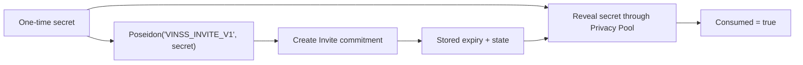
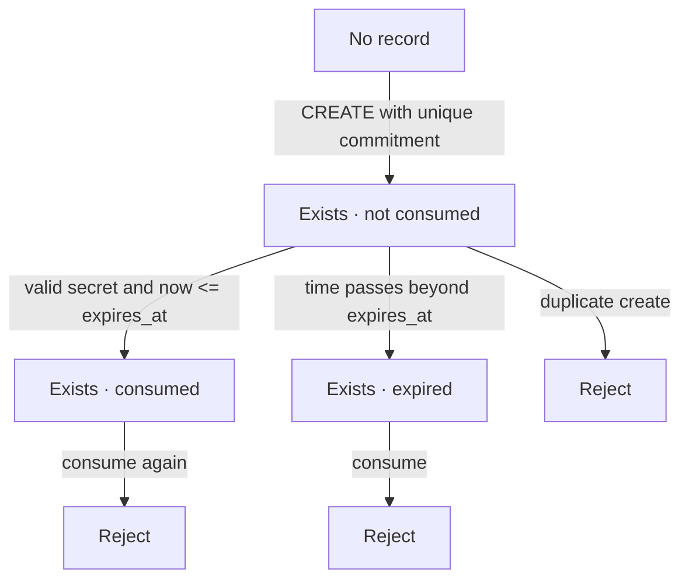

# VinssInvite

`VinssInvite` is the canonical one-time, expiring Invite commitment contract used by VINSS.

It does not store the full Invite payload, room secret, participant identity, or client encryption key. Instead, it stores only a Poseidon commitment plus expiry/consumption state and allows the matching one-time secret to consume that commitment through the configured STRK20 Privacy Pool.

Executable Cairo source is the source of truth.

## Source

```text
contracts/src/invite/
├── invite_events.cairo
├── invite_interfaces.cairo
├── invite_types.cairo
└── vinss_invite.cairo
```

## Purpose

The contract provides three core guarantees:

```text
one commitment can be created only once
one valid secret can consume it only once
consumption must occur before or at expiry
```

Invite creation is fee-bearing.

Invite consumption does not return a service-fee output.



## Trust Boundary

Only the immutable configured Privacy Pool may call:

```text
privacy_invoke(...)
```

Direct wallet or arbitrary-contract writes to Invite state are rejected.

The Privacy Pool caller restriction is an invocation boundary. It does not make the Invite secret permanently private once that secret is included in public transaction calldata.

## Constructor

Exact constructor order:

```text
privacy_pool: ContractAddress
open_note_token: ContractAddress
fee_policy: ContractAddress
```

All three addresses must be non-zero:

```text
privacy_pool != 0
open_note_token != 0
fee_policy != 0
```

The current contract exposes no setters for these dependencies.

Therefore after deployment:

```text
privacy_pool    immutable
open_note_token immutable
fee_policy      immutable
```

## Storage

The contract stores:

```text
privacy_pool
open_note_token
fee_policy
invites[commitment]
```

Each Invite record is:

```text
InviteEntry {
  expires_at: u64,
  consumed: bool,
  exists: bool,
}
```

The explicit `exists` bit matters because an unwritten Starknet storage map entry otherwise reads as its default zero-valued struct.

## Operation Selectors

```text
0 = INVITE_OP_CREATE
1 = INVITE_OP_CONSUME
```

`privacy_invoke` requires at least one felt so the operation selector can be read.

Any operation other than `0` or `1` is rejected.

## Commitment

The canonical commitment tag is:

```text
VINSS_INVITE_V1
```

Commitment construction:

```text
Poseidon(
  'VINSS_INVITE_V1',
  secret
)
```

Equivalent source-level behavior:

```text
compute_invite_commitment(secret)
```

The commitment domain is independent from any frontend encrypted Invite-token version.

For example, a frontend may evolve its encrypted token format without changing the Cairo commitment domain, provided it still derives the on-chain commitment exactly as shown above.

## Operation `0` — Create

### Exact Calldata

Create requires exactly five logical felts:

```text
[0,
 commitment,
 expires_at,
 quoted_fee,
 open_note_id]
```

Exact logical calldata length:

```text
5
```

The Ready X / STRK20 transaction wrapper may prefix that logical calldata with its own invoke-calldata length. That wallet framing is not part of the Cairo Invite action itself.

### Fee Quote

The contract resolves its immutable FeePolicy and calls:

```text
FeePolicy.quote_fee(
  FEE_ACTION_ROOM_ACTIVATION
)
```

The submitted fee must satisfy:

```text
quoted_fee >= minimum_fee
```

Unlike Rekber funding, Invite creation does not require exact equality with the current quote.

A caller-provided quote above the current minimum is accepted.

### Validation

Create requires:

```text
commitment != 0

expires_at != 0

expires_at > current block timestamp

invites[commitment].exists == false

quoted_fee >=
    FeePolicy.quote_fee(FEE_ACTION_ROOM_ACTIVATION)
```

The commitment itself is not recomputed from a secret during creation because CREATE receives only the commitment, not the preimage.

### Stored State

After validation:

```text
invites[commitment] = {
  expires_at,
  consumed: false,
  exists: true
}
```

No room metadata is stored.

### Event

Create emits:

```text
InviteCreated
```

Exact event shape:

```text
key:
  commitment

data:
  expires_at
```

### Revenue Output

The contract reads its configured:

```text
open_note_token
```

and calls:

```text
open_note_token.approve(
  spender = privacy_pool,
  amount = quoted_fee
)
```

Approval must return success.

The contract then returns exactly one:

```text
OpenNoteDeposit {
  note_id: open_note_id,
  token: open_note_token,
  amount: quoted_fee
}
```

Therefore:

```text
returned revenue amount == accepted wallet quoted_fee
```

not necessarily:

```text
returned revenue amount == minimum FeePolicy quote
```

because a higher quote is valid.

### Important Allowance Boundary

The current Invite implementation checks whether ERC-20 `approve(...)` returns success.

It does **not** implement the additional explicit allowance discipline used by `VinssEscrowRekber`, such as:

```text
require previous allowance == 0
approve exact amount
read allowance back
require resulting allowance == exact amount
```

Do not attribute Rekber's stale-allowance guards to `VinssInvite`.

## Operation `1` — Consume

### Exact Calldata

Consume requires exactly:

```text
[1, secret]
```

Exact logical calldata length:

```text
2
```

There is:

```text
no quoted_fee
no open_note_id
```

in the Invite contract consume calldata.

### Secret Validation

The supplied secret must satisfy:

```text
secret != 0
```

The contract recomputes:

```text
commitment =
    Poseidon(
      'VINSS_INVITE_V1',
      secret
    )
```

and loads:

```text
invites[commitment]
```

### State Validation

Consume requires:

```text
Invite exists
Invite is not already consumed
current block timestamp <= expires_at
```

The expiry edge is deliberate:

```text
create:
  expires_at > now

consume:
  now <= expires_at
```

So an Invite is still consumable when the block timestamp is exactly equal to `expires_at`.

It becomes invalid only when:

```text
now > expires_at
```

### State Transition

On success:

```text
consumed = true
```

while preserving:

```text
expires_at
exists = true
```

The Invite record remains queryable after consumption.

### Event

Consume emits:

```text
InviteConsumed
```

Exact event shape:

```text
key:
  commitment

data:
  none
```

### Output

Consume returns:

```text
[]
```

an empty `OpenNoteDeposit` span.

There is no service-fee output from the Invite contract consume operation.

## Lifecycle



There is no delete/reset/reopen operation.

A consumed or expired commitment cannot be recreated because:

```text
exists == true
```

remains permanently stored.

## Replay and Uniqueness Boundaries

`VinssInvite` enforces contract-level one-time semantics through:

```text
unique commitment at create
consumed flag at consume
expiry check
```

That is distinct from STRK20 Privacy Pool replay protection for the containing private transaction.

The contract-level Invite state prevents the same Invite commitment from being successfully consumed twice even if a surrounding transaction were constructed differently.

Privacy Pool replay protection remains a separate transaction-layer property.

## Public Read API

The current interface exposes:

```text
get_privacy_pool()
get_fee_policy()
get_invite(commitment)
```

`get_invite(commitment)` returns:

```text
InviteEntry {
  expires_at,
  consumed,
  exists
}
```

For a never-created commitment, the storage map returns the default zero-valued record:

```text
expires_at = 0
consumed   = false
exists     = false
```

### Not Exposed by Dedicated Getter

The current interface does not expose a dedicated:

```text
get_open_note_token()
```

even though `open_note_token` is immutable contract storage and is used by CREATE revenue output.

Clients should not invent such an ABI entrypoint.

## Events

Canonical Invite events:

### `InviteCreated`

```text
#[key] commitment: felt252
expires_at: u64
```

### `InviteConsumed`

```text
#[key] commitment: felt252
```

Neither event contains:

```text
secret
room secret
room ID
room label
participant wallet address
frontend Invite token
client encryption key
```

## Privacy Boundary

### Public Before Consumption

Once an Invite is created, public contract/event state can reveal:

```text
Invite commitment
expiry timestamp
exists state
consumed state
InviteCreated event
transaction/block metadata
```

The commitment is an opaque Poseidon value if the secret remains unknown.

### Public During/After Consumption

Consume calldata contains:

```text
secret
```

The secret therefore becomes public as transaction calldata when the consume action executes.

After that point an observer can recompute:

```text
Poseidon(
  'VINSS_INVITE_V1',
  secret
)
```

and link the revealed preimage to the public Invite commitment.

This is safe only because the secret is a one-time authorization preimage and the contract marks the Invite consumed atomically.

It must not be described as a permanently hidden on-chain secret.

### Not Stored by `VinssInvite`

The contract does not store:

```text
room secret
room ID
room label
Invite display text
participant identities
inviter identity
invitee identity
full encrypted Invite payload
frontend Invite token
AES key
client encryption keys
group metadata
```

Those belong outside this public commitment contract.

## Fee Boundary

Invite CREATE uses:

```text
FEE_ACTION_ROOM_ACTIVATION
```

from the configured `VinssFeePolicy`.

The contract enforces:

```text
quoted_fee >= current FeePolicy minimum
```

and returns:

```text
amount = quoted_fee
```

in its revenue `OpenNoteDeposit`.

Invite CONSUME:

```text
does not call FeePolicy
does not return revenue OpenNoteDeposit
```

Any small withdrawal included by a frontend solely for Privacy Pool replay protection is transaction-bundle behavior, not an Invite contract service fee.

## Failure Conditions

Representative contract failures include:

```text
ZERO_ADDRESS
UNAUTHORIZED_POOL
BAD_CALLDATA
BAD_OPERATION
ZERO_COMMITMENT
ZERO_SECRET
ZERO_EXPIRY
INVITE_EXISTS
INVITE_NOT_FOUND
INVITE_CONSUMED
INVITE_EXPIRED
FEE_QUOTE_TOO_LOW
APPROVE_FAILED
```

These felt errors are implementation details of the current contract and may surface through wallet/RPC error wrapping.

## Security Properties

The current contract enforces:

```text
only configured Privacy Pool may mutate Invite state

create calldata length is exact

consume calldata length is exact

commitment cannot be zero

secret cannot be zero

expiry must be in the future at creation

commitment cannot be created twice

unknown commitment cannot be consumed

consumed Invite cannot be consumed twice

expired Invite cannot be consumed

room activation fee minimum is enforced on CREATE

CREATE output uses configured revenue token

CONSUME has no service-fee output
```

## Non-Guarantees

`VinssInvite` does not prove or enforce:

```text
who created the Invite in product/business terms

who received the Invite link

who possesses a frontend decryption key

whether an Invite represents direct chat or group membership

room membership authorization beyond the one-time commitment secret

frontend encrypted-token format

wallet UI correctness

backend/indexer synchronization

Privacy Pool proof/session freshness

paymaster availability
```

Those belong to application/integration layers.

## Source Comment Caveat

Two comments in the current Cairo source are stale relative to executable behavior:

1. `invite_interfaces.cairo` documents CREATE as:

```text
[0, commitment, expires_at]
```

but the executable implementation requires:

```text
[0, commitment, expires_at, quoted_fee, open_note_id]
```

2. `vinss_invite.cairo` contains a general comment saying Invite has no token output / OPEN note immediately before operation dispatch, while CREATE does return a revenue `OpenNoteDeposit`.

The executable implementation is authoritative.

These are documentation/comment issues, not contract-logic failures.

## Compatibility Checklist

When changing Invite-related contract or frontend code, verify:

```text
Privacy Pool address
open-note revenue token
FeePolicy address
operation selector
exact CREATE calldata length = 5
exact CONSUME calldata length = 2
VINSS_INVITE_V1 domain
Poseidon input order
u64 expiry encoding
quoted_fee >= minimum rule
open_note_id position for CREATE
no open_note_id for CONSUME
InviteEntry field order
InviteCreated key/data order
InviteConsumed key order
network-specific deployment address
```

See [Frontend Compatibility](./frontend-compatibility.md) for Ready X transaction framing and frontend Invite-token version boundaries.
