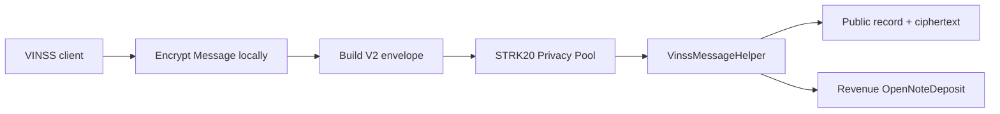
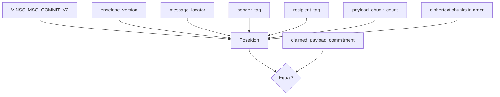
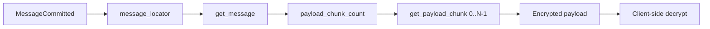

# VinssMessageHelper

`VinssMessageHelper` is the canonical encrypted Message storage helper used by VINSS.

It stores one independently addressable encrypted Message envelope, exposes only opaque routing metadata plus ciphertext, enforces envelope integrity and duplicate protection, and returns one fee-bearing `OpenNoteDeposit` for the configured revenue token.

Executable Cairo source is the source of truth.

## Source

```text
contracts/src/messaging/
├── messaging_events.cairo
├── messaging_interfaces.cairo
├── messaging_types.cairo
├── messaging_validation.cairo
├── timeline_payload_hash.cairo
└── vinss_message_helper.cairo
```

Shared constants and errors are defined under:

```text
contracts/src/utils/constants.cairo
contracts/src/utils/errors.cairo
```

## Purpose

The helper is intentionally narrow.

It proves and persists:

```text
valid encrypted-envelope version
valid required public header fields
bounded ciphertext length
exact ciphertext length
domain-separated commitment integrity
one-time locator uniqueness
payload-commitment uniqueness
minimum Message fee
Privacy-Pool-only invocation
```

It does **not** parse or store plaintext Message semantics.



## Trust Boundary

Only the configured Privacy Pool may invoke:

```text
privacy_invoke(...)
```

The contract checks:

```text
get_caller_address()
    == configured privacy_pool
```

Direct wallet or arbitrary-contract writes are rejected.

This is an invocation boundary.

It does **not** prove:

```text
which human authored the plaintext Message
which wallet owns sender_tag
which wallet owns recipient_tag
which conversation the Message belongs to
```

Those meanings are supplied by the client-side encrypted application protocol.

## Constructor

Exact constructor order:

```text
privacy_pool: ContractAddress
open_note_token: ContractAddress
fee_policy: ContractAddress
```

All three must be non-zero:

```text
privacy_pool != 0
open_note_token != 0
fee_policy != 0
```

The current contract exposes no setter for any of them.

Therefore after deployment:

```text
privacy_pool    immutable
open_note_token immutable
fee_policy      immutable
```

## Storage

The contract stores:

```text
privacy_pool
open_note_token
fee_policy

messages[message_locator]

payload_chunks[
  (message_locator, chunk_index)
]

stored_message_locators[
  message_locator
]

committed_payloads[
  payload_commitment
]
```

### Structural Message Record

The stored public record is:

```text
VinssMessageRecord {
  envelope_version: u8,
  message_locator: felt252,
  sender_tag: felt252,
  recipient_tag: felt252,
  payload_commitment: felt252,
  payload_chunk_count: u64,
}
```

Ciphertext chunks are stored separately:

```text
(message_locator, chunk_index)
    -> ciphertext felt
```

This keeps the fixed structural record small while allowing clients/indexers to retrieve ciphertext chunks individually.

## Explicit Existence Map

Cairo storage maps return default values for unwritten keys.

Therefore the contract separately tracks:

```text
stored_message_locators[
  message_locator
] -> bool
```

This prevents an unknown locator from being confused with a legitimate all-zero default record.

## Payload Commitment Reuse Map

The contract also tracks:

```text
committed_payloads[
  payload_commitment
] -> bool
```

This creates helper-level duplicate protection independent from locator uniqueness.

The two guards protect different identifiers:

```text
message locator
    cannot be reused

payload commitment
    cannot be reused
```

Neither replaces Privacy Pool replay/nullifier protection for the containing private transaction.

---

## Envelope Version

Current encrypted Message envelope version:

```text
2
```

Canonical constant:

```text
VINSS_MESSAGE_ENVELOPE_VERSION = 2
```

`V2` describes the public encrypted-envelope / commitment format.

It does not mean the deployed contract is named `VinssMessageHelperV2`.

## Envelope Header

The fixed header contains six felts:

```text
MESSAGE_ENVELOPE_HEADER_FELTS = 6
```

Layout:

| Index | Field | Cairo type / meaning |
|---:|---|---|
| `0` | `envelope_version` | decoded as `u8` |
| `1` | `message_locator` | one-time opaque felt |
| `2` | `sender_tag` | opaque routing felt |
| `3` | `recipient_tag` | opaque routing felt |
| `4` | `claimed_payload_commitment` | caller-supplied Poseidon commitment |
| `5` | `payload_chunk_count` | decoded as `u64` |
| `6...` | `ciphertext_chunks` | opaque felt ciphertext |

The claimed commitment at index `4` is **not** recursively included in its own hash.

## Ciphertext Bounds

Current bound:

```text
MAX_PAYLOAD_CHUNKS = 64
```

The contract requires:

```text
payload_chunk_count > 0
payload_chunk_count <= 64
```

Therefore valid encrypted Message payloads contain:

```text
1..64 ciphertext felts
```

The `64` value is an implementation bound.

It should not be described as an intrinsic Starknet or STRK20 protocol limit.

## Zero-Valued Ciphertext

Individual ciphertext felts may be zero.

The storage loop intentionally accepts:

```text
0
```

as a valid ciphertext chunk value.

This is distinct from required public header fields such as locator/tags/commitment, which must be non-zero.

---

## Full `privacy_invoke` Calldata

The external Message helper receives:

```text
[encrypted envelope,
 quoted_fee,
 open_note_id]
```

Expanded:

```text
[0] envelope_version
[1] message_locator
[2] sender_tag
[3] recipient_tag
[4] claimed_payload_commitment
[5] payload_chunk_count
[6...] ciphertext_chunks
[next] quoted_fee
[last] open_note_id
```

### Full Logical Length

For:

```text
N = payload_chunk_count
```

the encrypted envelope length is:

```text
6 + N
```

and the full logical `privacy_invoke` calldata length is:

```text
8 + N
```

because the helper appends:

```text
quoted_fee
open_note_id
```

outside the encrypted envelope.

Examples:

```text
1 ciphertext chunk
-> 9 logical felts

64 ciphertext chunks
-> 72 logical felts
```

The Ready X invoke-action length prefix is wallet framing and is not one of these logical Cairo fields.

## Fee Tail Parsing

The executable contract interprets:

```text
calldata[len - 2]
    -> quoted_fee: u128

calldata[len - 1]
    -> open_note_id: felt252
```

It then slices:

```text
message_calldata =
    calldata[0 .. len - 2]
```

and validates/stores only that encrypted Message envelope.

Therefore:

```text
quoted_fee
open_note_id
```

are not included in the Message commitment.

A `quoted_fee` that cannot fit `u128` reverts during decoding.

---

## Commitment Domain

Canonical commitment domain:

```text
VINSS_MSG_COMMIT_V2
```

## Commitment Formula

The contract computes:

```text
Poseidon(
  'VINSS_MSG_COMMIT_V2',
  envelope_version,
  message_locator,
  sender_tag,
  recipient_tag,
  payload_chunk_count,
  ...ciphertext_chunks
)
```

Exact input order matters.



The contract requires:

```text
computed_payload_commitment
    == claimed_payload_commitment
```

## Commitment Security Meaning

The commitment binds:

```text
domain
envelope version
one-time locator
sender routing tag
recipient routing tag
declared chunk count
every ciphertext chunk
ciphertext ordering
```

Changing any committed value changes the expected commitment.

It does not authenticate plaintext semantics by itself.

The application must encrypt/authenticate the Message correctly before creating the Cairo envelope.

---

## Header Validation

The executable validation path requires:

```text
envelope_version
    == VINSS_MESSAGE_ENVELOPE_VERSION

message_locator != 0

sender_tag != 0

recipient_tag != 0

claimed_payload_commitment != 0

payload_chunk_count > 0

payload_chunk_count <= 64
```

Type decoding also requires:

```text
envelope_version fits u8
payload_chunk_count fits u64
quoted_fee fits u128
```

## Exact Envelope Length

After decoding the declared ciphertext count, the helper computes:

```text
expected_envelope_length =
    MESSAGE_ENVELOPE_HEADER_FELTS
    + payload_chunk_count
```

and requires:

```text
actual sliced envelope length
    == expected_envelope_length
```

This rejects:

```text
missing ciphertext chunks
extra ciphertext chunks
extra unexpected fields inside the encrypted envelope
declared chunk count that does not match actual payload
```

The two fee/output tail fields are removed before this exact-length check.

---

## Duplicate Protection

After commitment verification the helper checks both:

```text
stored_message_locators[message_locator]
    == false

committed_payloads[computed_payload_commitment]
    == false
```

Only after those checks does it persist the Message.

### Locator Guard

A locator is a one-time Message locator.

It must never be reused as:

```text
conversation ID
channel ID
room ID
deal ID
sender ID
recipient ID
```

Reusing a locator would make otherwise separate actions linkable and is rejected by contract storage anyway.

### Payload Commitment Guard

Even if a new locator were supplied, an already committed encrypted envelope commitment is rejected.

This is helper-level duplicate protection.

### Privacy Pool Replay Boundary

The helper-level guards do not replace:

```text
STRK20 Privacy Pool replay/nullifier protections
```

Both layers matter.

---

## Message Persistence Order

The executable path effectively performs:

```text
1. verify caller is Privacy Pool
2. decode fee/output tail
3. obtain live FeePolicy minimum
4. require quoted_fee >= minimum
5. validate encrypted header
6. require exact envelope length
7. recompute Message commitment
8. require commitment match
9. require unused locator
10. require unused payload commitment
11. write structural Message record
12. write ciphertext chunks
13. mark locator used
14. mark payload commitment used
15. emit MessageCommitted
16. approve revenue token to Privacy Pool
17. return one OpenNoteDeposit
```

All operations occur inside the same Starknet transaction.

A later revert rolls back the transaction's state changes.

---

## Fee Policy

The helper stores an immutable:

```text
fee_policy
```

address.

For every Message invocation it resolves:

```text
FeePolicy.quote_fee(
  FEE_ACTION_MESSAGE
)
```

and requires:

```text
quoted_fee >= minimum_fee
```

This makes Message pricing dynamic.

The smart contract does **not** contain a permanent fixed:

```text
7 STRK
```

Message price.

Any stale source/frontend comment describing a permanently fixed 7 STRK Message contract fee is not authoritative.

## Minimum vs Accepted Quote

Suppose:

```text
minimum_fee = X
quoted_fee  = Y
```

The condition is:

```text
Y >= X
```

If accepted, the returned revenue amount is:

```text
Y
```

not:

```text
X
```

Therefore a wallet that deliberately submits a higher quote pays that higher accepted amount.

---

## Revenue Token

The constructor pins one:

```text
open_note_token
```

for Message revenue.

The helper does not dynamically choose a token per Message.

The returned `OpenNoteDeposit` always uses:

```text
token = configured open_note_token
```

The frontend deployment configuration must match that constructor-fixed token.

## Revenue Approval

After Message persistence, the helper creates an ERC-20 dispatcher for:

```text
open_note_token
```

and calls:

```text
approve(
  spender = configured privacy_pool,
  amount = quoted_fee
)
```

The call must return success.

If it returns false:

```text
APPROVE_FAILED
```

reverts the transaction.

## Allowance Boundary

The Message helper checks only that:

```text
approve(...) == true
```

It does not implement Rekber's stronger explicit allowance discipline such as:

```text
require previous allowance == 0
approve exact amount
read allowance back
require resulting allowance == exact amount
```

Do not attribute Rekber-specific stale-allowance invariants to `VinssMessageHelper`.

The Message helper relies on its configured token's ERC-20 approval behavior plus the containing Privacy Pool flow.

---

## Revenue Output

On success, the helper returns exactly one:

```text
OpenNoteDeposit {
  note_id: open_note_id,
  token: open_note_token,
  amount: quoted_fee
}
```

Therefore:

```text
output count = 1
output note ID = wallet-supplied open_note_id
output token = constructor-fixed open_note_token
output amount = accepted quoted_fee
```

The helper does not calculate a separate output amount after accepting the quote.

## `open_note_id` Boundary

The current Message helper reads:

```text
open_note_id
```

as a felt and places it into the returned `OpenNoteDeposit`.

It does not contain an explicit:

```text
open_note_id != 0
```

assertion in the Message helper itself.

Validity/substitution requirements for the wallet-generated open note belong to the containing STRK20 / Privacy Pool integration.

This is different from the helper's explicit validation of Message locator, tags, commitment, and ciphertext count.

---

## Event

The canonical event is:

```text
MessageCommitted
```

Exact field shape:

```text
key:
  message_locator

data:
  payload_commitment
  sender_tag
  recipient_tag
```

The event does not emit ciphertext chunks.

Clients retrieve ciphertext from storage using the Message locator.

## Event Privacy Meaning

The event publicly reveals:

```text
one Message helper invocation occurred
one-time message locator
encrypted-envelope commitment
opaque sender routing tag
opaque recipient routing tag
transaction/block metadata
```

It does not directly reveal:

```text
sender wallet address
recipient wallet address
Message type
Message body
private sequence number
conversation identifier
room identifier
deal identifier
```

The routing tags are public opaque felts.

Their privacy properties depend on correct client derivation and one-time use.

---

## Public Read API

The current interface exposes:

```text
get_privacy_pool()

get_fee_policy()

message_exists(
  message_locator
)

get_message(
  message_locator
)

get_payload_chunk(
  message_locator,
  chunk_index
)

is_payload_committed(
  payload_commitment
)
```

## `get_privacy_pool()`

Returns the immutable authorized Privacy Pool address.

## `get_fee_policy()`

Returns the immutable FeePolicy contract address.

## `message_exists(locator)`

Returns:

```text
stored_message_locators[locator]
```

It does not revert for an unknown locator.

## `get_message(locator)`

Requires:

```text
message_exists(locator) == true
```

and returns the stored:

```text
VinssMessageRecord
```

Unknown locator:

```text
MESSAGE_NOT_FOUND
```

## `get_payload_chunk(locator, index)`

Requires:

```text
Message exists
index < payload_chunk_count
```

Then returns:

```text
payload_chunks[(locator, index)]
```

Unknown Message and out-of-range chunk access revert.

## `is_payload_committed(commitment)`

Returns whether that encrypted-envelope commitment has already been used.

It is useful for duplicate/replay diagnostics at the helper layer.

## No `get_open_note_token()` Getter

The current public Message interface does **not** expose:

```text
get_open_note_token()
```

even though `open_note_token` is constructor-fixed storage.

Clients must not invent that ABI entrypoint.

Deployment/frontend configuration must know the correct revenue token independently.

---

## Read/Discovery Pattern

A generic on-chain reconstruction flow is:



The contract itself never decrypts the payload.

An indexer may optimize retrieval, but the canonical storage model remains the same.

---

## Public vs Private Data

### Public Contract State

The helper stores publicly:

```text
envelope version
message locator
sender tag
recipient tag
payload commitment
ciphertext chunk count
ciphertext chunks
existence marker
commitment-used marker
```

Ciphertext is public data.

Its confidentiality comes from encryption, not from being hidden from chain observers.

### Public Transaction/Revenue Metadata

The surrounding transaction may additionally expose or permit inference of:

```text
helper address
revenue token
fee amount
transaction timing
block number
transaction hash
```

The precise Privacy Pool transaction representation is a separate integration concern.

### Not Stored as Plaintext

The Message helper does not store fields such as:

```text
sender wallet address
recipient wallet address
room ID
channel ID
conversation ID
deal ID
message kind
message text
attachment plaintext
business semantics
encryption key
room secret
pairwise key
```

If those concepts appear inside the encrypted payload, they remain ciphertext from the helper's perspective.

---

## Routing Tag Boundary

The contract validates only:

```text
sender_tag != 0
recipient_tag != 0
```

It does not know how the client generated those tags.

The current VINSS frontend derives per-action routing tags privately and uses the action locator in that derivation, but that client behavior is not independently proven by this contract.

Therefore the smart-contract invariant is:

```text
non-zero opaque tags are committed and stored
```

not:

```text
the tags mathematically prove a specific wallet identity
```

---

## Commitment vs Encryption Authentication

The Cairo Poseidon commitment protects the exact public encrypted envelope from silent modification relative to the claimed commitment.

It does not replace authenticated encryption.

Conceptually:

```text
client encryption/authentication
    protects plaintext confidentiality/integrity

Cairo Poseidon envelope commitment
    binds public ciphertext envelope fields

Privacy Pool
    provides containing private-transaction semantics/replay protection
```

These are separate layers.

---

## Failure Conditions

Relevant Message failures include:

```text
ZERO_ADDRESS
NOT_PRIVACY_POOL

BAD_MESSAGE_DATA
BAD_ENVELOPE_VER
UNSUPPORTED_VER

ZERO_MSG_LOCATOR
ZERO_SENDER_TAG
ZERO_RECIPIENT_TAG
ZERO_PAYLOAD_COMMIT

EMPTY_CIPHERTEXT
BAD_CHUNK_COUNT
TOO_MANY_CHUNKS
BAD_PAYLOAD_SIZE

COMMITMENT_MISMATCH

LOCATOR_ALREADY_USED
PAYLOAD_ALREADY_USED

MESSAGE_NOT_FOUND
CHUNK_OOB

FEE_OVERFLOW
FEE_QUOTE_TOO_LOW
APPROVE_FAILED
```

Some of these are shared error constants while others are literal felt errors in the current implementation.

Wallet/RPC layers may wrap these errors before presenting them to the application.

---

## Security Properties

The current executable contract enforces:

```text
only configured Privacy Pool may write Messages

constructor dependencies cannot be zero

Message envelope version must be supported

Message locator cannot be zero

sender routing tag cannot be zero

recipient routing tag cannot be zero

claimed payload commitment cannot be zero

ciphertext cannot be empty

ciphertext cannot exceed 64 chunks

declared chunk count must match exact envelope length

claimed commitment must match recomputed commitment

one-time Message locator cannot be reused

payload commitment cannot be reused

Message quote must satisfy live FeePolicy minimum

accepted quote is used as revenue output amount

unknown Message record cannot be read as a real Message

out-of-range ciphertext chunk cannot be read

revenue-token approve must report success
```

## Non-Guarantees

The helper does not prove or enforce:

```text
human sender identity
human recipient identity
wallet ownership of routing tags
conversation membership
room membership
Message semantic type
business authorization
plaintext validity
frontend decryption correctness
client key backup/recovery
backend/indexer completeness
paymaster availability
wallet session freshness
Privacy Pool proving success
```

Those belong to other layers.

---

## Fee Boundary

The canonical Message fee path is:

```text
VinssMessageHelper
    -> configured VinssFeePolicy
    -> quote_fee(FEE_ACTION_MESSAGE)
```

The helper requires:

```text
quoted_fee >= live minimum
```

and returns:

```text
amount = quoted_fee
```

There is no hardcoded permanent Message fee amount in `VinssMessageHelper`.

Frontend display values must not be promoted to smart-contract invariants unless the Cairo source enforces them.

---

## Source Comment Caveat

The current executable implementation correctly parses:

```text
[...encrypted envelope,
 quoted_fee,
 open_note_id]
```

However, comments in both:

```text
messaging_interfaces.cairo
vinss_message_helper.cairo
```

still contain older wording that describes the last `open_note_id` felt while implying everything before it is only the Message envelope.

That wording omits the current `quoted_fee` tail felt.

The executable implementation is authoritative:

```text
second-to-last felt = quoted_fee
last felt           = open_note_id
```

This is a source-comment/documentation issue, not a Message contract logic bug.

---

## Compatibility Checklist

When changing Message contract/frontend integration, verify:

```text
constructor argument order
Privacy Pool address
open-note revenue token
FeePolicy address

envelope version = 2
header length = 6
maximum ciphertext chunks = 64

message_locator position
sender_tag position
recipient_tag position
claimed commitment position
chunk-count position
ciphertext starting index

VINSS_MSG_COMMIT_V2 exact domain
Poseidon input order
claimed commitment excluded from its own hash

full logical length = 8 + chunk_count
quoted_fee is second-to-last felt
open_note_id is last felt

quoted_fee fits u128
quoted_fee >= FeePolicy minimum

locator uniqueness
payload-commitment uniqueness

MessageCommitted key/data order
VinssMessageRecord field order
ciphertext chunk indexing

returned OpenNoteDeposit count = 1
returned token = constructor-fixed open_note_token
returned amount = accepted quoted_fee

network-specific helper address
network-specific FeePolicy address
network-specific revenue token
```

See [Envelopes, Commitments & Events](./envelopes-events.md) for the shared encrypted-envelope/event reference and [Frontend Compatibility](./frontend-compatibility.md) for Ready X framing.
