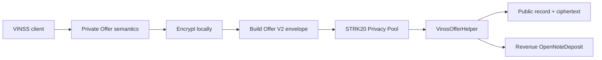
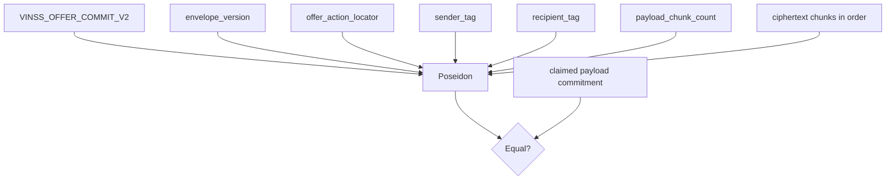
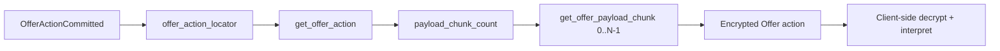

# VinssOfferHelper

`VinssOfferHelper` is the canonical encrypted Offer-action storage helper used by VINSS.

It stores one independently addressable encrypted Offer lifecycle action, exposes only opaque routing metadata plus ciphertext, enforces envelope integrity and duplicate protection, and returns one FeePolicy-driven revenue `OpenNoteDeposit`.

Executable Cairo source is the source of truth.

## Source

```text
contracts/src/offers/
├── offer_commitments.cairo
├── offer_events.cairo
├── offer_interfaces.cairo
├── offer_types.cairo
├── offer_validation.cairo
└── vinss_offer.cairo
```

Shared envelope constants and errors are defined under:

```text
contracts/src/utils/constants.cairo
contracts/src/utils/errors.cairo
```

## Purpose

The helper is intentionally narrow.

It proves and persists:

```text
valid encrypted Offer envelope version
non-zero required public header fields
bounded ciphertext length
exact ciphertext length
domain-separated commitment integrity
one-time action-locator uniqueness
payload-commitment uniqueness
minimum Offer fee
Privacy-Pool-only invocation
```

It does **not** interpret plaintext Offer lifecycle semantics.



## Trust Boundary

Only the configured Privacy Pool may call:

```text
privacy_invoke(...)
```

The helper checks:

```text
get_caller_address()
    == configured privacy_pool
```

Direct writes by wallets or arbitrary contracts are rejected.

This boundary proves who may invoke the helper contract.

It does **not** prove:

```text
which human created the Offer
which participant is maker or taker
which participant may accept/cancel
which encrypted action follows which previous Offer
```

Those relationships remain application-level encrypted semantics.

## Constructor

Exact constructor order:

```text
privacy_pool: ContractAddress
open_note_token: ContractAddress
fee_policy: ContractAddress
```

All three addresses must be non-zero:

```text
privacy_pool != 0
open_note_token != 0
fee_policy != 0
```

The current contract exposes no setter for these dependencies.

Therefore after deployment:

```text
privacy_pool    immutable
open_note_token immutable
fee_policy      immutable
```

## Storage

The contract stores:

```text
privacy_pool
open_note_token
fee_policy

offer_actions[
  offer_action_locator
]

payload_chunks[
  (offer_action_locator, chunk_index)
]

stored_offer_action_locators[
  offer_action_locator
]

committed_offer_payloads[
  payload_commitment
]
```

## Structural Offer Record

The canonical stored record is:

```text
EncryptedOfferActionRecord {
  envelope_version: u8,
  offer_action_locator: felt252,
  sender_tag: felt252,
  recipient_tag: felt252,
  payload_commitment: felt252,
  payload_chunk_count: u64,
}
```

Ciphertext is stored separately:

```text
(offer_action_locator, chunk_index)
    -> ciphertext felt
```

The contract does not store plaintext Offer fields alongside the structural record.

## Explicit Existence Marker

Cairo storage maps return default values for unwritten keys.

The helper therefore maintains:

```text
stored_offer_action_locators[
  offer_action_locator
] -> bool
```

This prevents a never-written locator from being mistaken for a legitimate default-valued record.

## Payload Commitment Reuse Map

The helper also tracks:

```text
committed_offer_payloads[
  payload_commitment
] -> bool
```

This duplicate guard is separate from locator uniqueness.

The contract therefore enforces:

```text
one locator
    -> may be stored only once

one encrypted payload commitment
    -> may be stored only once
```

These are helper-level duplicate protections.

They do not replace the containing Privacy Pool transaction's replay/nullifier protection.

---

## Envelope Version

Current encrypted Offer envelope version:

```text
2
```

Canonical constant:

```text
VINSS_OFFER_ENVELOPE_VERSION = 2
```

The version refers to the public encrypted-envelope format.

It does not mean the contract is named:

```text
VinssOfferHelperV2
```

The canonical contract remains:

```text
VinssOfferHelper
```

## Envelope Header

The fixed Offer header contains six felts:

```text
OFFER_ENVELOPE_HEADER_FELTS = 6
```

Layout:

| Index | Field | Meaning |
|---:|---|---|
| `0` | `envelope_version` | decoded as `u8` |
| `1` | `offer_action_locator` | one-time opaque locator |
| `2` | `sender_tag` | opaque routing tag |
| `3` | `recipient_tag` | opaque routing tag |
| `4` | `claimed_payload_commitment` | caller-supplied commitment |
| `5` | `payload_chunk_count` | decoded as `u64` |
| `6...` | `ciphertext_chunks` | encrypted Offer payload felts |

The claimed commitment at index `4` is not recursively included in its own Poseidon input.

## Ciphertext Bounds

Current limit:

```text
MAX_OFFER_PAYLOAD_CHUNKS = 64
```

Validation requires:

```text
payload_chunk_count > 0
payload_chunk_count <= 64
```

Therefore one Offer action contains:

```text
1..64 ciphertext felts
```

This `64` value is a VINSS implementation bound, not a generic Starknet or STRK20 protocol limit.

## Zero-Valued Ciphertext

Individual ciphertext felts may be:

```text
0
```

The storage implementation explicitly accepts zero-valued ciphertext chunks.

This is different from required public header values such as:

```text
offer_action_locator
sender_tag
recipient_tag
claimed_payload_commitment
```

which must be non-zero.

---

## Full `privacy_invoke` Calldata

The executable external layout is:

```text
[encrypted Offer envelope,
 quoted_fee,
 open_note_id]
```

Expanded:

```text
[0] envelope_version
[1] offer_action_locator
[2] sender_tag
[3] recipient_tag
[4] claimed_payload_commitment
[5] payload_chunk_count
[6...] ciphertext_chunks
[next] quoted_fee
[last] open_note_id
```

The two tail felts are outside the encrypted Offer commitment.

## Full Logical Length

For:

```text
N = payload_chunk_count
```

the encrypted Offer envelope length is:

```text
6 + N
```

The complete logical `privacy_invoke` calldata length is:

```text
8 + N
```

because it adds:

```text
quoted_fee
open_note_id
```

Examples:

```text
1 ciphertext chunk
-> 9 logical felts

64 ciphertext chunks
-> 72 logical felts
```

Any Ready X invoke-action count prefix is wallet framing and is not one of these Offer logical fields.

## Fee Tail Parsing

The current implementation interprets:

```text
calldata[len - 2]
    -> quoted_fee: u128

calldata[len - 1]
    -> open_note_id: felt252
```

Then:

```text
offer_calldata =
    calldata[0 .. len - 2]
```

is passed into Offer envelope validation/storage.

Therefore:

```text
quoted_fee
open_note_id
```

are not committed by `VINSS_OFFER_COMMIT_V2`.

A `quoted_fee` that does not fit `u128` reverts during decoding.

---

## Commitment Domain

Canonical domain:

```text
VINSS_OFFER_COMMIT_V2
```

## Commitment Formula

The helper recomputes:

```text
Poseidon(
  'VINSS_OFFER_COMMIT_V2',
  envelope_version,
  offer_action_locator,
  sender_tag,
  recipient_tag,
  payload_chunk_count,
  ...ciphertext_chunks
)
```

Exact input order is part of the compatibility contract.



The contract requires:

```text
computed_payload_commitment
    == claimed_payload_commitment
```

## Commitment Meaning

The commitment binds:

```text
domain
envelope version
one-time Offer action locator
sender routing tag
recipient routing tag
declared ciphertext count
every ciphertext chunk
ciphertext ordering
```

Changing any committed field changes the expected commitment.

The Poseidon commitment does not itself reveal or validate the plaintext Offer semantics.

---

## Semantics Intentionally Not Parsed

The contract does not decode whether an encrypted action represents:

```text
create
counter
accept
reject
cancel
expire
prepare escrow
or another application-level Offer semantic
```

Those names exist in application/client semantics, not in the public Cairo Offer action selector.

The contract also does not decode plaintext fields such as:

```text
offer ID
root Offer relationship
parent Offer relationship
maker identity
taker identity
participant wallet addresses
deal type
asset
amount
price
payment terms
conditions
expiry
accept reason
reject reason
deal commitment
Rekber coordination metadata
```

If those values exist in the payload, the helper sees only ciphertext.

## Consequence

From the smart contract's perspective:

```text
encrypted create action
encrypted accept action
encrypted reject action
```

all use the same public Offer envelope structure.

The helper cannot enforce a rule such as:

```text
only the intended counterparty may accept
```

because it does not receive that intended counterparty identity or plaintext action type.

That authorization belongs to the encrypted application protocol and downstream Rekber capability design where applicable.

---

## Header Validation

The executable validation requires:

```text
envelope_version
    == VINSS_OFFER_ENVELOPE_VERSION

offer_action_locator != 0

sender_tag != 0

recipient_tag != 0

claimed_payload_commitment != 0

payload_chunk_count > 0

payload_chunk_count <= 64
```

Type conversions additionally require:

```text
envelope_version fits u8
payload_chunk_count fits u64
quoted_fee fits u128
```

## Exact Envelope Size

The helper computes:

```text
expected_calldata_length =
    OFFER_ENVELOPE_HEADER_FELTS
    + payload_chunk_count
```

and requires:

```text
actual sliced Offer envelope length
    == expected_calldata_length
```

This rejects:

```text
missing ciphertext
extra ciphertext
unexpected tail fields inside committed envelope
chunk-count mismatch
```

The fee/output tail is removed before this check.

---

## Duplicate Protection

After commitment verification:

```text
stored_offer_action_locators[
  offer_action_locator
] == false
```

must hold.

The helper also requires:

```text
committed_offer_payloads[
  computed_payload_commitment
] == false
```

### Locator Boundary

`offer_action_locator` identifies exactly one encrypted Offer action.

It must not be treated as a stable:

```text
Offer ID
conversation ID
deal-room ID
channel ID
participant ID
escrow ID
```

The public interface comments explicitly establish this one-action boundary.

### Commitment Boundary

A previously stored encrypted Offer commitment cannot be stored again.

### Privacy Pool Boundary

These helper guards are separate from the Privacy Pool's transaction-level replay requirements.

A correctly designed integration needs both.

---

## Persistence Flow

The executable path effectively performs:

```text
1. require caller == configured Privacy Pool
2. decode quoted_fee and open_note_id tail
3. query live Offer FeePolicy minimum
4. require quoted_fee >= minimum
5. validate Offer envelope header
6. require exact envelope length
7. recompute Offer commitment
8. require exact commitment match
9. require unused action locator
10. require unused payload commitment
11. store structural Offer record
12. store ciphertext chunks
13. mark action locator used
14. mark payload commitment used
15. emit OfferActionCommitted
16. approve revenue token to Privacy Pool
17. return one revenue OpenNoteDeposit
```

All changes occur atomically in one Starknet transaction.

If a later assertion/call reverts, earlier storage/event effects are reverted with the transaction.

---

## Fee Policy

The helper stores an immutable:

```text
fee_policy
```

address.

For every Offer action it queries:

```text
FeePolicy.quote_fee(
  FEE_ACTION_OFFER
)
```

Then requires:

```text
quoted_fee >= minimum_fee
```

This is a dynamic FeePolicy-driven fee.

The current executable Offer helper does **not** contain a permanently hardcoded:

```text
10 STRK
```

contract fee.

## Minimum vs Accepted Quote

For:

```text
minimum_fee = X
quoted_fee  = Y
```

the contract accepts:

```text
Y >= X
```

If accepted:

```text
revenue output amount = Y
```

not automatically:

```text
X
```

A wallet that supplies a higher valid quote therefore produces a higher revenue output.

---

## Revenue Token

The constructor fixes one:

```text
open_note_token
```

for Offer revenue.

The helper does not choose a token per Offer action.

Every successful revenue output uses:

```text
token = configured open_note_token
```

Deployment/frontend configuration must therefore match the constructor-fixed revenue token.

## Revenue Approval

After storing the encrypted Offer action, the helper calls:

```text
open_note_token.approve(
  spender = configured privacy_pool,
  amount = quoted_fee
)
```

The call must return true.

Failure reverts with:

```text
APPROVE_FAILED
```

## Allowance Boundary

The Offer helper checks only:

```text
approve(...) == true
```

It does not implement the stronger explicit allowance lifecycle used by canonical Rekber, such as:

```text
require previous allowance == 0
approve exact amount
read allowance back
require resulting allowance == exact amount
```

Do not attribute Rekber-specific stale-allowance protections to `VinssOfferHelper`.

---

## Revenue Output

Successful external invocation returns exactly one:

```text
OpenNoteDeposit {
  note_id: open_note_id,
  token: open_note_token,
  amount: quoted_fee
}
```

Therefore:

```text
output count  = 1
output note   = caller/wallet-supplied open_note_id
output token  = constructor-fixed open_note_token
output amount = accepted quoted_fee
```

## Internal Empty Span vs External Revenue Output

`store_offer_action(...)` internally returns an empty `OpenNoteDeposit` span after storing the encrypted action.

That internal return value is not the external Offer revenue result.

`privacy_invoke(...)` ignores the internal storage return and separately constructs the actual fee-bearing external `OpenNoteDeposit`.

The authoritative external behavior is:

```text
privacy_invoke -> exactly one revenue output
```

This distinction matters when reading the implementation.

## `open_note_id` Validation Boundary

The Offer helper reads the final felt as:

```text
open_note_id
```

and places it into the returned output.

The current helper does not explicitly require:

```text
open_note_id != 0
```

inside `VinssOfferHelper`.

Wallet/open-note substitution validity belongs to the STRK20 / Privacy Pool integration layer.

---

## Event

Canonical event:

```text
OfferActionCommitted
```

Exact shape:

```text
key:
  offer_action_locator

data:
  payload_commitment
  sender_tag
  recipient_tag
```

Ciphertext is not duplicated into the event.

Clients/indexers use the locator to retrieve the structural record and ciphertext chunks.

## Public Event Meaning

The event reveals:

```text
one Offer helper invocation occurred
one-time Offer action locator
encrypted-envelope commitment
opaque sender routing tag
opaque recipient routing tag
transaction/block metadata
```

It does not directly reveal:

```text
Offer action type
maker wallet
taker wallet
deal terms
price
asset
conditions
expiry
root/parent relationships
accept/reject reason
```

---

## Public Read API

The current interface exposes:

```text
get_privacy_pool()

get_fee_policy()

has_offer_action(
  offer_action_locator
)

get_offer_action(
  offer_action_locator
)

get_offer_payload_chunk(
  offer_action_locator,
  chunk_index
)

is_offer_payload_committed(
  payload_commitment
)
```

## `get_privacy_pool()`

Returns the immutable authorized Privacy Pool.

## `get_fee_policy()`

Returns the immutable FeePolicy address.

## `has_offer_action(locator)`

Returns the explicit existence marker:

```text
stored_offer_action_locators[locator]
```

An unknown locator returns false.

## `get_offer_action(locator)`

Requires:

```text
has_offer_action(locator) == true
```

Then returns:

```text
EncryptedOfferActionRecord
```

Unknown locators revert with the Offer-action-not-found error.

## `get_offer_payload_chunk(locator, index)`

Requires:

```text
Offer action exists
index < payload_chunk_count
```

Then returns:

```text
payload_chunks[(locator, index)]
```

Unknown action or out-of-range index reverts.

## `is_offer_payload_committed(commitment)`

Returns whether that encrypted-envelope commitment has already been stored.

## No `get_open_note_token()` Getter

The current public interface does **not** expose:

```text
get_open_note_token()
```

although `open_note_token` is constructor-fixed storage.

Clients must not invent that entrypoint.

The deployment/integration layer must know the correct revenue token separately.

---

## Read / Discovery Pattern

A canonical reconstruction path is:



The contract never decrypts the Offer.

An indexer can optimize discovery but does not change the canonical storage model.

---

## Public vs Private Data

### Public Contract State

The helper publicly stores:

```text
envelope version
one-time Offer action locator
sender routing tag
recipient routing tag
payload commitment
ciphertext chunk count
ciphertext chunks
existence marker
payload-commitment-used marker
```

Ciphertext is public chain data.

Confidentiality comes from encryption, not from hiding ciphertext from observers.

### Public Transaction / Revenue Metadata

The containing transaction may additionally reveal or permit inference of:

```text
helper address
revenue token
accepted fee amount
transaction timing
block number
transaction hash
```

The exact Privacy Pool representation belongs to the integration layer.

### Not Stored as Plaintext

The helper does not store plaintext:

```text
Offer lifecycle action kind
maker
taker
participant addresses
stable Offer ID
root Offer ID
parent Offer ID
deal type
settlement asset
amount
price
payment terms
conditions
expiry
accept reason
reject reason
room/channel identity
Rekber terms
```

If the client includes such fields, they remain inside ciphertext.

---

## Routing Tag Boundary

The contract validates only that:

```text
sender_tag != 0
recipient_tag != 0
```

It does not verify the derivation algorithm used by the frontend.

Therefore the smart-contract guarantee is:

```text
the non-zero opaque tags are committed and stored
```

not:

```text
the tags prove a specific wallet identity
```

The current frontend's private routing derivation is an integration property.

---

## Offer Lifecycle Boundary

The helper persists immutable encrypted **actions**, not a mutable on-chain Offer object.

Conceptually:

```text
create action     -> separate encrypted record
counter action    -> separate encrypted record
accept action     -> separate encrypted record
reject action     -> separate encrypted record
...
```

The contract does not mutate:

```text
offer.status
current_offer
accepted_offer
```

because those plaintext lifecycle concepts are not public helper storage.

Clients reconstruct lifecycle by decrypting the relevant action stream and validating relationships in application logic.

This distinction is fundamental to the privacy architecture.

---

## Failure Conditions

Relevant current errors include:

```text
ZERO_ADDRESS
NOT_PRIVACY_POOL

BAD_OFFER_DATA
BAD_OFFER_VER
UNSUPPORTED_OFFER_VER

ZERO_OFFER_LOCATOR
ZERO_OFFER_SENDER
ZERO_OFFER_RECIPIENT
ZERO_OFFER_COMMIT

EMPTY_OFFER_CIPHERTEXT
BAD_OFFER_CHUNK_COUNT
TOO_MANY_OFFER_CHUNKS
BAD_OFFER_PAYLOAD_SIZE

OFFER_COMMIT_MISMATCH

OFFER_LOCATOR_USED
OFFER_PAYLOAD_USED

OFFER_ACTION_NOT_FOUND
OFFER_CHUNK_OOB

FEE_OVERFLOW
FEE_QUOTE_TOO_LOW
APPROVE_FAILED
```

Wallet/RPC layers may wrap these felt errors before they reach the frontend.

---

## Security Properties

The current executable contract enforces:

```text
only configured Privacy Pool may write

constructor dependencies are non-zero

supported Offer envelope version

non-zero one-time Offer locator

non-zero sender routing tag

non-zero recipient routing tag

non-zero claimed payload commitment

at least one ciphertext chunk

at most 64 ciphertext chunks

exact envelope size

exact recomputed commitment

one-time locator cannot be reused

payload commitment cannot be reused

live FeePolicy minimum must be satisfied

accepted quoted fee becomes revenue amount

unknown Offer action cannot be read as real state

out-of-range ciphertext chunk cannot be read

ERC-20 approval must report success
```

## Non-Guarantees

The helper does not prove or enforce:

```text
human maker identity
human taker identity
wallet ownership of routing tags
Offer lifecycle authorization
who may accept
who may reject
who may cancel
root/parent Offer correctness
business term validity
asset/amount correctness
accepted Offer linkage to Rekber
frontend decryption correctness
client key recovery
backend/indexer completeness
wallet session freshness
Privacy Pool proving success
paymaster availability
```

Those belong to other layers.

---

## Fee Boundary

The canonical Offer fee path is:

```text
VinssOfferHelper
    -> configured VinssFeePolicy
    -> quote_fee(FEE_ACTION_OFFER)
```

The helper requires:

```text
quoted_fee >= live minimum
```

and returns:

```text
amount = accepted quoted_fee
```

There is no permanent hardcoded `10 STRK` Offer contract fee in the current executable helper.

---

## Source Comment Caveats

The current `offer_interfaces.cairo` contains stale documentation relative to executable behavior.

### Missing `quoted_fee` Tail in Interface Comment

The interface comment currently shows a layout ending in:

```text
[last] open_note_id
```

without documenting the current second-to-last:

```text
quoted_fee
```

The executable implementation is authoritative:

```text
[...encrypted envelope,
 quoted_fee,
 open_note_id]
```

### Stale `10 STRK` Wording

The interface comment also says successful invocation returns:

```text
10 STRK VINSS Offer application revenue
```

That is stale.

The executable helper uses:

```text
FeePolicy.quote_fee(FEE_ACTION_OFFER)
```

and accepts:

```text
quoted_fee >= minimum
```

The returned amount is the accepted `quoted_fee`.

These are source-comment/documentation issues, not Offer helper logic bugs.

---

## Compatibility Checklist

When changing Offer contract/frontend integration, verify:

```text
constructor argument order
Privacy Pool address
revenue open-note token
FeePolicy address

envelope version = 2
header length = 6
maximum ciphertext chunks = 64

offer_action_locator position
sender_tag position
recipient_tag position
claimed commitment position
payload chunk count position
ciphertext starting index

VINSS_OFFER_COMMIT_V2 exact domain
Poseidon input order
claimed commitment excluded from its own hash

full logical length = 8 + chunk_count
quoted_fee is second-to-last felt
open_note_id is last felt

quoted_fee fits u128
quoted_fee >= FeePolicy minimum

one-time locator uniqueness
payload-commitment uniqueness

EncryptedOfferActionRecord field order
OfferActionCommitted key/data order
ciphertext chunk indexing

returned OpenNoteDeposit count = 1
returned token = constructor-fixed open_note_token
returned amount = accepted quoted_fee

network-specific helper address
network-specific FeePolicy address
network-specific revenue token
```

See [Envelopes, Commitments & Events](./envelopes-events.md) for the shared envelope/event reference and [Frontend Compatibility](./frontend-compatibility.md) for Ready X transaction framing.
