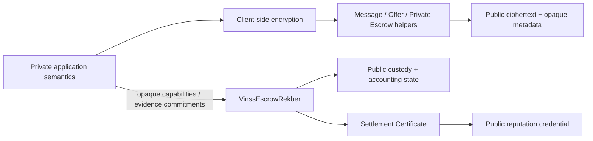
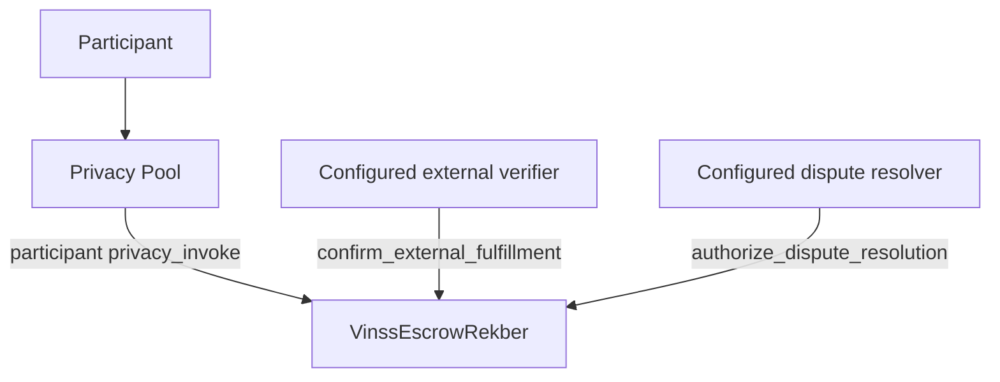
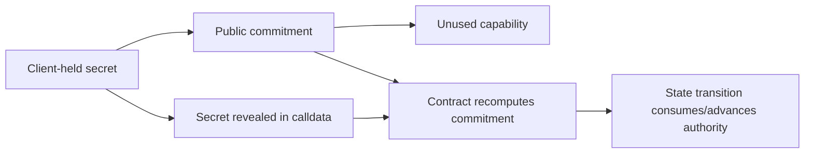

# Privacy & Trust Boundary

VINSS uses privacy-preserving coordination, but it is **not** a system where every on-chain value is hidden.

This document defines the privacy and trust boundaries enforced by the current canonical VINSS smart contracts.

Executable Cairo source is authoritative.

## Scope

The current smart-contract architecture separates three broad classes of data:

```text
encrypted application semantics
public opaque commitments / routing metadata
public custody / accounting / reputation state
```

The contracts deliberately keep plaintext negotiation content out of encrypted coordination helpers while exposing the public state required for verification, settlement, accounting, replay protection, and optional reputation credentials.



## Core Privacy Rule

On Starknet:

```text
ciphertext stored on-chain is public data
```

Privacy comes from:

```text
client-side encryption
secret-key possession
one-time opaque routing identifiers
domain-separated commitments
capability preimages before use
```

not from hiding calldata, storage, or events from chain observers.

Therefore VINSS should describe encrypted coordination as:

```text
plaintext-private
```

rather than:

```text
on-chain data invisible
```

---

# Invocation Boundaries

## Privacy-Pool-Only `privacy_invoke`

The current privacy helper contracts require:

```text
get_caller_address()
    == configured Privacy Pool
```

for their `privacy_invoke(...)` path.

This applies to the canonical encrypted coordination helpers such as:

```text
VinssMessageHelper
VinssOfferHelper
VinssPrivateEscrowHelper
VinssInvite
```

and participant Rekber actions routed through:

```text
VinssEscrowRekber.privacy_invoke(...)
```

The exact error names vary by contract, but the trust model is the same:

```text
arbitrary wallet
    cannot directly call the protected privacy_invoke path successfully

configured Privacy Pool
    may invoke it
```

## What This Authority Proves

The caller check proves:

```text
the invocation reached the helper through the configured Privacy Pool
```

It does **not** prove:

```text
the helper knows the human participant
the helper knows the plaintext Message sender
the helper knows the Offer maker/taker
the helper knows the Room ID
the helper knows a real-world identity
```

The Privacy Pool address is an invocation authority, not an identity oracle.

## Rekber Direct Public Hooks

Not every Rekber state mutation is a participant `privacy_invoke`.

The Rekber interface intentionally exposes two narrow direct hooks:

```text
confirm_external_fulfillment(
  custody_commitment,
  evidence_commitment
)

authorize_dispute_resolution(
  custody_commitment,
  resolution_commitment,
  payer_amount,
  payee_amount
)
```

These are authorized respectively to the configured:

```text
external verifier
dispute resolver
```

They are intentionally public/direct contract calls.

They do not permit arbitrary principal withdrawal.

The external verifier can only confirm submitted evidence under the external-verification policy.

The dispute resolver can only authorize a payer/payee split that later must be claimed by the precommitted participant capabilities.



---

# Message Privacy Boundary

## Public Message State

`VinssMessageHelper` publicly stores:

```text
envelope version
one-time message locator
opaque sender tag
opaque recipient tag
payload commitment
ciphertext chunk count
ciphertext chunks
locator existence state
payload-commitment reuse state
```

The corresponding event publicly exposes:

```text
message locator
payload commitment
sender tag
recipient tag
transaction/block metadata
```

## Not Stored as Plaintext

The Message helper does not accept/store plaintext fields such as:

```text
sender wallet address
recipient wallet address
Room ID
Channel ID
Conversation ID
Deal ID
Message kind
Message body
attachment plaintext
human identity
encryption key
room secret
pairwise key
```

If some of those concepts are present in application payloads, they remain inside ciphertext.

## Locator Boundary

A Message locator is:

```text
one-time
opaque
specific to one encrypted Message action
```

It must not be reused as a stable:

```text
conversation identifier
room identifier
deal identifier
participant identifier
```

Repeated stable identifiers would create unnecessary public linkability.

## Routing-Tag Boundary

The contract verifies only that:

```text
sender_tag != 0
recipient_tag != 0
```

and commits those values into the encrypted-envelope commitment.

It does not independently verify:

```text
which wallet generated a tag
whether a tag derivation algorithm was used correctly
whether sender_tag corresponds to a real human sender
```

Those are client/integration properties.

---

# Offer Privacy Boundary

## Public Offer State

`VinssOfferHelper` publicly stores:

```text
envelope version
one-time Offer action locator
opaque sender tag
opaque recipient tag
payload commitment
ciphertext chunk count
ciphertext chunks
existence state
payload-commitment reuse state
```

The event exposes:

```text
Offer action locator
payload commitment
sender tag
recipient tag
transaction/block metadata
```

## Encrypted Offer Semantics

The helper intentionally does not decode whether an action means:

```text
create
counter
accept
reject
cancel
expire
prepare escrow
```

It also does not decode:

```text
maker
taker
participant addresses
stable Offer ID
root Offer relationship
parent Offer relationship
asset
amount
price
payment terms
conditions
expiry
accept/reject reason
deal commitment
```

These remain encrypted application semantics.

## Offer Authorization Boundary

Because lifecycle kind and participant identities remain encrypted, `VinssOfferHelper` does not prove rules such as:

```text
only Bob may accept Alice's Offer
only the maker may cancel
this counter belongs to this parent Offer
```

Those are application-level lifecycle rules.

The helper guarantees encrypted-envelope integrity and uniqueness, not plaintext business authorization.

---

# Private Escrow Coordination Boundary

`VinssPrivateEscrowHelper` is an encrypted coordination helper.

It is separate from:

```text
VinssEscrowRekber
```

which actually custodies principal.

## Public Private-Escrow Helper State

The helper publicly exposes/stores:

```text
envelope version
one-time private Escrow action locator
opaque sender tag
opaque recipient tag
payload commitment
ciphertext chunk count
ciphertext chunks
existence state
payload-commitment reuse state
```

## Not Parsed

It does not parse plaintext coordination semantics such as:

```text
Agreement
Agreement acceptance
dispute coordination
fund confirmation
private reason
private evidence narrative
private participant identity
```

The helper sees an encrypted envelope.

## No Principal Custody

`VinssPrivateEscrowHelper`:

```text
does not custody Rekber principal
does not settle STRK/USDC principal
does not determine payer/payee payout
```

Those responsibilities belong to `VinssEscrowRekber`.

## No Contract-Level Revenue Output

The current Private Escrow helper returns:

```text
[]
```

an empty `OpenNoteDeposit` span.

Any application-level STRK withdrawal bundled by the frontend around selected encrypted coordination actions is not enforced by this helper.

---

# Ciphertext Boundary

## Ciphertext Is Public

For Message, Offer, and Private Escrow helpers:

```text
ciphertext chunks are stored on-chain
```

Anyone who can read Starknet state may retrieve them.

Therefore VINSS confidentiality assumes that an observer does **not** possess the correct decryption key.

## Encryption-Key Boundary

The smart contracts do not store:

```text
room secret
ECDH shared key
group secret
AES key
message encryption key
private routing key
```

Key generation, derivation, backup, synchronization, and compromise resistance belong to the client layer.

## What a Commitment Adds

A Poseidon payload commitment binds the exact public encrypted envelope.

It provides:

```text
integrity binding
duplicate-detection identifier
domain separation
```

It does not itself encrypt data.

It also does not prove the truth of plaintext business statements.

---

# FeePolicy Privacy Boundary

`VinssFeePolicy` contains pricing/oracle configuration.

It has no private deal semantics.

## Direct ABI-Readable Values

The current FeePolicy interface directly exposes:

```text
get_pricing_admin()
get_pragma_oracle()
get_sponsor_cost_strk_wei()
```

It also exposes public quote functions:

```text
quote_fee(action)
quote_fee_usd_micros(action)
```

Therefore the pricing admin, oracle address, sponsor cost, and live quotes are intended public contract information.

## Constructor / Storage Configuration

The implementation also stores:

```text
strk_usd_pair
max_oracle_age
min_oracle_sources
```

These are constructor-fixed contract configuration values.

However, the current public FeePolicy interface does **not** provide dedicated getters for them.

Therefore documentation should distinguish:

```text
ABI-readable configuration
```

from:

```text
configuration observable from deployment inputs,
source/class knowledge, or low-level storage inspection
```

Do not claim that the current ABI exposes:

```text
get_strk_usd_pair()
get_max_oracle_age()
get_min_oracle_sources()
```

because those entrypoints do not exist.

## Compile-Time Public Pricing Constants

Action IDs, USD floors, and sponsor multipliers are compile-time Cairo constants.

They are not secret business data.

Current pricing logic can be understood from verified/source-equivalent class code.

---

# Invite Privacy Boundary

`VinssInvite` stores a one-time authorization commitment.

## Before Consumption

Public Invite state includes:

```text
Invite commitment
expiry timestamp
exists state
consumed state
InviteCreated event
transaction/block metadata
```

The contract does not store the full frontend Invite payload.

## Commitment

The commitment is:

```text
Poseidon(
  'VINSS_INVITE_V1',
  secret
)
```

Before the secret is known, the commitment acts as an opaque preimage commitment.

## Consumption

Consume calldata is:

```text
[1, secret]
```

Because Starknet calldata is public, the one-time Invite secret becomes public when consumption executes.

The contract then atomically marks:

```text
consumed = true
```

so the same commitment cannot successfully be consumed again.

## Privacy Meaning

The Invite secret is:

```text
private before use
public after use
one-time by contract state
```

It must not be described as a permanently private on-chain secret.

## Not Stored by Invite Contract

The Invite contract does not store:

```text
room secret
room label
full encrypted Invite token
client AES key
participant identity
group metadata
inviter identity
invitee identity
```

---

# Rekber Custody Privacy Boundary

`VinssEscrowRekber` intentionally exposes much more public state than encrypted coordination helpers because custody and settlement must be auditable.

## Public Custody Record

The current `EscrowRekberCustody` public record contains:

```text
custody_commitment

release_authorization_commitment
payee_claim_commitment
refund_commitment
payer_confirmation_commitment

payer_dispute_commitment
payee_dispute_commitment
payee_refund_consent_commitment

fulfillment_chain_head
revision_chain_head

payer_certificate_commitment
payee_certificate_commitment

token
amount
fee_amount

fulfillment_deadline
review_window
review_deadline
revision_deadline

verification_policy
fulfillment_rounds_remaining
revision_rounds_remaining

fulfillment_evidence_commitment
dispute_evidence_commitment

resolution_commitment
resolution_payer_amount
resolution_payee_amount

fulfillment_submitted
fulfillment_confirmed
revision_pending
disputed
resolution_authorized
resolution_payer_claimed
resolution_payee_claimed

consumed
refunded

created_at
fulfilled_at
settled_at
```

These fields are returned by the public:

```text
get_custody(custody_commitment)
```

ABI.

Therefore they must be treated as public state. filecite placeholder removed in generated doc context>

## Public Token and Principal

In particular:

```text
settlement token
principal amount
fee amount
```

are public.

VINSS must not claim that Rekber hides settlement amount.

## Public Policy and Deadlines

The following are also public:

```text
verification policy
fulfillment deadline
review window
review deadline
revision deadline
remaining fulfillment rounds
remaining revision rounds
```

They can reveal lifecycle structure/timing even though plaintext deal terms remain encrypted.

## Public Lifecycle Flags

Observers can read whether custody has states such as:

```text
fulfillment submitted
fulfillment confirmed
revision pending
disputed
resolution authorized
resolution shares claimed
consumed
refunded
```

Therefore VINSS does not provide metadata-free settlement.

---

# Rekber Events

Current Rekber events intentionally expose accounting and lifecycle verification fields.

Examples include:

## Funding

```text
custody commitment
token
principal amount
fulfillment deadline
timestamp
fee amount
review window
verification policy
```

## Fulfillment

```text
custody commitment
evidence commitment
review deadline
rounds remaining
timestamp
```

## Revision

```text
custody commitment
reason commitment
revision deadline
rounds remaining
timestamp
```

## Dispute

```text
custody commitment
evidence commitment
opened-by role
timestamp
```

## Resolver Authorization

```text
custody commitment
resolution commitment
payer amount
payee amount
timestamp
```

## Claims / Terminal Settlement

Depending on path, events expose fields such as:

```text
custody commitment
output_note_id
role
amount
release mode
refund mode
resolution commitment
payer amount
payee amount
timestamp
```

These are public event fields, not encrypted application data.

---

# What Rekber Does Not Store as Plaintext

The canonical custody record does not contain explicit plaintext fields such as:

```text
Deal Room ID
Conversation ID
Message history
Offer text
Offer description
work-file bytes
tracking number
shipment description
dispute narrative
human legal name
explicit payer wallet address
explicit payee wallet address
```

Participant roles are represented by precommitted capabilities rather than permanent public payer/payee wallet-address fields in custody storage.

This reduces direct participant-address linkage at the contract-state level.

It does **not** imply perfect anonymity.

Transaction-level or external data may still create linkability.

---

# Capability / Preimage Boundary

Rekber participant authority is represented by commitments to secrets.

## Before Use

Capability preimages are intended to be held client-side.

Public custody initially contains only commitments such as:

```text
release authorization commitment
payee claim commitment
refund commitment
payer confirmation commitment
payer/payee dispute commitments
refund-consent commitment
secret-chain heads
certificate commitments
```

## During Use

When a participant uses a capability through `privacy_invoke`, the preimage becomes part of public contract calldata.

Examples:

### Mutual release

```text
[2,
 custody,
 payer_release_secret,
 payee_claim_secret,
 output_note_id]
```

### No-fulfillment refund

```text
[3,
 custody,
 payer_refund_secret,
 output_note_id]
```

### Submit fulfillment

```text
[4,
 custody,
 chain_secret,
 evidence_commitment]
```

### Confirm fulfillment

```text
[5,
 custody,
 payer_confirmation_secret,
 evidence_commitment]
```

### Open dispute

```text
[6,
 custody,
 role,
 dispute_secret,
 evidence_commitment]
```

### Request revision

```text
[7,
 custody,
 chain_secret,
 reason_commitment]
```

### Auto-release

```text
[8,
 custody,
 payee_claim_secret,
 output_note_id]
```

### Mutual refund

```text
[9,
 custody,
 payer_refund_secret,
 payee_refund_consent_secret,
 output_note_id]
```

### Resolution claim

```text
[10,
 custody,
 role,
 party_secret,
 output_note_id]
```

## Used Secrets Are Public

After execution, anyone observing calldata may know the used secret.

Therefore Rekber security must not depend on:

```text
a used capability secret staying hidden forever
```

Instead it relies on:

```text
domain-separated commitment construction
custody binding
role-specific capability meaning
one-time / state-dependent transitions
deadline rules
secret-chain advancement
terminal-state guards
atomic state updates
```



---

# Secret-Chain Boundary

Fulfillment and revision may use bounded one-way secret chains.

Public custody stores only:

```text
fulfillment_chain_head
revision_chain_head
```

A valid next secret is revealed when that action executes.

The contract validates the chain relationship and advances/consumes the relevant authority according to the lifecycle.

This permits bounded repeated actions without publishing every future preimage at funding time.

Once an individual chain secret is used in calldata, that used preimage is public.

---

# Evidence Boundary

## Public Evidence Commitments

Rekber stores public opaque values such as:

```text
fulfillment_evidence_commitment
dispute_evidence_commitment
resolution_commitment
```

and events may publish evidence/reason commitments.

## Private Evidence Content

The contract does not store plaintext/file bytes such as:

```text
work product
image
document
shipment tracking detail
dispute narrative
chat transcript
private proof attachment
```

Those may remain encrypted/off-chain.

## Commitment Meaning

A stored `felt252` commitment proves only that the contract was given a particular commitment value and later logic may require equality with that value.

By itself, a commitment does **not** prove:

```text
the underlying file is truthful
the work is high quality
the shipment arrived
a dispute claim is factually correct
```

Truth interpretation belongs to:

```text
counterparty review
configured external verifier
dispute resolution process
off-chain evidence analysis
```

depending on the selected policy/path.

---

# Verification Policy Boundary

The public Rekber record contains a broad:

```text
verification_policy
```

classification.

Current policy classes include:

```text
1 = submission review
2 = counterparty confirmation
3 = external verification
```

This is public.

The encrypted Offer can still contain the richer private business template and deal-specific semantics.

Therefore policy privacy is:

```text
broad policy class public
specific private business terms encrypted
```

---

# External Verifier Boundary

For external-verification policy, the configured verifier address is public through Rekber's getter.

The verifier may call:

```text
confirm_external_fulfillment(
  custody_commitment,
  evidence_commitment
)
```

This hook changes fulfillment state only after the contract's validation.

It does not:

```text
receive principal
choose a recipient
withdraw custody
rewrite participant capabilities
```

The verifier is therefore a narrowly scoped state authority, not a custody owner.

---

# Dispute Resolver Boundary

The configured dispute resolver address is public through:

```text
get_dispute_resolver()
```

## Resolver Authorization Data

Resolver authorization exposes:

```text
custody commitment
resolution commitment
payer amount
payee amount
timestamp
```

The stored custody record also exposes:

```text
resolution_authorized
resolution_payer_amount
resolution_payee_amount
resolution claim state
```

## Exact Principal Split

The resolver can authorize only a split satisfying the contract's principal accounting rules.

The resolver does not receive principal.

It also cannot choose an arbitrary third-party payout address.

## Participant Claims Still Required

After authorization:

```text
payer share
```

must be claimed using the payer-side precommitted capability, while:

```text
payee share
```

must be claimed using the payee-side precommitted capability.

This separates:

```text
resolver decides allowed split
participants retain payout-claim authority
```

---

# Output Note Privacy Boundary

Rekber payout events may expose:

```text
output_note_id
```

for release/refund/resolution-claim paths.

An output-note ID is not the same thing as storing the recipient's wallet address in custody.

However, it is still public metadata and must not be described as “no metadata.”

The privacy properties of STRK20 notes and wallet ownership are part of the Privacy Pool layer, not guaranteed solely by VINSS Cairo contracts.

---

# Fee and Revenue Boundary

## Message / Offer / Invite

Fee-bearing helper paths expose or allow derivation of:

```text
fee policy contract
quoted fee
revenue token
OpenNoteDeposit amount
transaction timing
```

The fee itself is not private business content.

## Rekber Funding

Rekber publicly stores:

```text
principal
fee_amount
token
```

The funding fee is therefore public settlement accounting data.

## Frontend Workflow Charges

Application-level workflow withdrawals constructed only by frontend transaction bundles are not smart-contract privacy guarantees or invariants unless the relevant Cairo contract validates them.

This document focuses on contract-enforced boundaries.

---

# Settlement Certificate Boundary

`VinssSettlementCertificate` is intentionally a public reputation credential.

## Claim Preconditions

The contract checks a clean successful settlement:

```text
custody.consumed == true
custody.refunded == false
custody.disputed == false
```

and verifies the role-specific precommitted certificate secret.

## Public Certificate Record

After successful claim, public state includes:

```text
token ID
custody commitment
role
recipient wallet address
settled_at
issued_at
```

The custom issuance event contains:

```text
key: token_id
key: recipient

data:
  custody_commitment
  role
  settled_at
  issued_at
```

ERC-721 mint events additionally expose normal ownership information.

## Certificate Secret Boundary

The claim call receives:

```text
custody_commitment
role
secret
```

as public transaction calldata.

The certificate precommitment itself also binds the intended:

```text
recipient address
```

Therefore certificate claiming is intentionally public identity/reputation linkage at the wallet-address level.

## Non-Transferability

The ERC-721 hook permits only:

```text
zero owner -> initial recipient
```

and rejects later ownership changes.

Transfers and burns fail with:

```text
CERT_NON_TRANSFERABLE
```

Non-transferability protects reputation assignment.

It does **not** create privacy.

---

# Public ABI vs Public Chain Observability

“Public” can mean several different things.

This document distinguishes:

## 1. ABI-Readable

A public view/getter directly returns the value.

Examples:

```text
Rekber get_custody(...)
FeePolicy get_pricing_admin()
FeePolicy get_sponsor_cost_strk_wei()
Certificate get_certificate(...)
```

## 2. Public Event / Calldata

A value appears in:

```text
transaction calldata
event keys
event data
```

Examples:

```text
used Rekber capability secret
Invite consume secret
Rekber output note ID
evidence commitment
certificate recipient
```

## 3. Constructor / Class / Storage Observable

A value may not have a dedicated getter but can still be discoverable from:

```text
deployment transaction
verified/source-equivalent class
known storage layout + low-level storage reads
```

FeePolicy's current:

```text
strk_usd_pair
max_oracle_age
min_oracle_sources
```

fall into this category rather than having dedicated getters.

This distinction avoids incorrectly describing every storage field as an ABI endpoint.

---

# Metadata Leakage Boundary

Even where plaintext business terms are encrypted, public chain activity may reveal metadata such as:

```text
contract address
transaction timestamp
block number
transaction ordering
number of actions
ciphertext length
fee amount
settlement token
principal amount
deadline schedule
verification policy
dispute occurrence
settlement outcome
certificate ownership
```

VINSS does not eliminate all metadata.

Privacy claims should focus on what the architecture actually protects:

```text
plaintext negotiation content
private deal semantics inside encrypted helpers
direct participant-address fields in encrypted helper records
private evidence/file contents where only commitments go on-chain
```

---

# Linkability Boundary

One-time locators and opaque routing tags reduce direct stable-link exposure in encrypted helpers.

However, no contract can guarantee perfect unlinkability across all observable signals.

Potential external correlation sources include:

```text
transaction timing
wallet behavior
network-level information
reused application identifiers
incorrect key/tag derivation
frontend telemetry
off-chain communication
public certificate claiming
public Rekber amount/token/deadline patterns
```

Therefore:

```text
perfect anonymity
```

is not a valid smart-contract claim.

---

# Backend / Indexer Trust Boundary

The current contract design does not require an indexer to decrypt Message, Offer, or Private Escrow ciphertext.

An indexer may expose:

```text
events
opaque locators
routing tags
ciphertext chunks
block/transaction metadata
public Rekber state
```

but decryption keys should remain client-side.

A compromised or malicious indexer can affect:

```text
availability
freshness
ordering presentation
omission of records
```

but should not gain plaintext solely from the canonical contract data without the relevant decryption key.

Smart contracts do not prove that a particular deployed backend obeys this architecture.

---

# Client Trust Boundary

The contracts rely on the client for important privacy properties.

The client must correctly perform:

```text
encryption
authenticated payload construction
key derivation
key storage
one-time locator generation
routing-tag derivation
secret generation
secret-chain construction
commitment calculation
private evidence handling
```

A contract can reject a malformed public commitment, but it cannot protect plaintext that the frontend accidentally leaks before encryption.

Therefore client implementation security is part of the end-to-end privacy model.

---

# Wallet / Privacy Pool Boundary

VINSS Cairo contracts do not independently guarantee:

```text
wallet session privacy
proof-generation correctness
Privacy Pool anonymity-set size
note ownership privacy
network-level privacy
paymaster privacy
wallet telemetry privacy
```

Those properties belong to the underlying wallet / STRK20 Privacy Pool / infrastructure layers.

The contracts assume the configured Privacy Pool satisfies the expected protocol behavior.

---

# Trust Summary

| Component | Trusted / authorized for | Not trusted / not capable of |
|---|---|---|
| Privacy Pool | Calling protected `privacy_invoke` paths | Interpreting VINSS plaintext semantics automatically |
| Message Helper | Envelope integrity, uniqueness, fee minimum | Human sender/recipient identity |
| Offer Helper | Encrypted Offer action integrity, uniqueness, fee minimum | Plaintext lifecycle authorization |
| Private Escrow Helper | Encrypted coordination integrity | Principal custody or settlement |
| FeePolicy | Pricing/oracle floor calculation | Private deal semantics |
| Rekber | Custody, deadlines, capabilities, settlement accounting | Hiding principal/token/deadlines |
| External verifier | Narrow objective fulfillment confirmation | Receiving/redirecting principal |
| Dispute resolver | Authorizing exact participant split | Arbitrary payout redirection |
| Certificate | Public clean-settlement credential | Private ownership |
| Client | Encryption, keys, routing, secret generation | On-chain enforcement by itself |
| Indexer | Retrieval/availability | Trusted decryption authority |

---

# Accurate Product Claims

The following type of statement matches the current contract architecture:

> VINSS keeps plaintext Message, Offer, and private coordination semantics out of its encrypted helper records while using public commitments, ciphertext, and auditable Rekber accounting state for on-chain coordination and settlement.

Also accurate:

```text
Message and Offer plaintext are not stored by their helpers.

Private Escrow coordination is stored as ciphertext.

Rekber principal, token, fee, deadlines, policy, and lifecycle state are public.

Evidence contents can stay encrypted/off-chain while opaque commitments are public.

Participant Rekber authority is capability-based rather than stored payer/payee wallet fields.

Used capability secrets become public calldata.

Settlement Certificates are public wallet-linked reputation credentials.
```

# Claims VINSS Should Not Make

Avoid claims such as:

```text
no metadata

everything is hidden

all transactions are anonymous

Rekber amount is private

Rekber token is private

settlement deadlines are private

used settlement secrets remain private forever

Invite consume secret stays private

ciphertext is invisible on-chain

certificate ownership is private

disputes are invisible

perfect anonymity

the contract proves the human identity of Message/Offer participants
```

---

# Security / Privacy Invariants

The current contracts support these precise statements:

```text
encrypted helper payloads are committed before storage

helper ciphertext remains publicly retrievable

required opaque routing tags are non-zero

one-time helper locators cannot be reused

helper payload commitments cannot be reused

participant Rekber custody does not store explicit payer/payee wallet fields

Rekber principal accounting state is public

used capability preimages are public after execution

Invite consume preimage is public after execution

evidence commitments do not reveal evidence bytes by themselves

external verifier cannot directly withdraw principal

dispute resolver cannot redirect principal to arbitrary recipients

clean Settlement Certificate ownership is public and non-transferable
```

---

# Review Checklist

When changing privacy-sensitive contract code, verify:

```text
Does a new plaintext field enter calldata?

Does a new plaintext field enter storage?

Does a new field enter an event?

Is the field really necessary to be public?

Could it instead be an opaque commitment?

Could it stay encrypted inside Message/Offer/Private Escrow payload?

Does a locator become reusable/stable?

Does a routing tag reveal a wallet address?

Does a capability secret become public earlier than intended?

Does a new public hook gain principal-transfer authority?

Does a resolver/verifier gain arbitrary recipient control?

Does a certificate expose additional identity metadata?

Is an ABI getter being documented that does not actually exist?

Are constructor/storage observability and ABI readability being confused?

Are public ciphertext and private plaintext being described correctly?

Are product claims stronger than the executable contract guarantees?
```

## Related Documentation

```text
architecture.md
envelopes-events.md
message-helper.md
offer-helper.md
private-escrow-helper.md
invite.md
escrow-rekber.md
fee-policy.md
frontend-compatibility.md
```

`envelopes-events.md` is the canonical field-level reference for event and encrypted-envelope layouts.

`escrow-rekber.md` is the canonical detailed custody/lifecycle reference.

`frontend-compatibility.md` covers client/Ready X encoding boundaries that are not themselves Cairo privacy guarantees.
