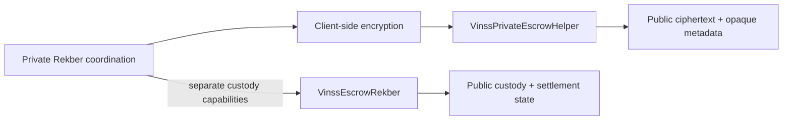
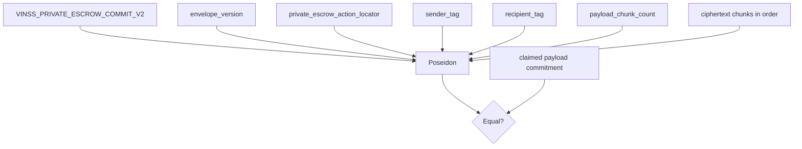
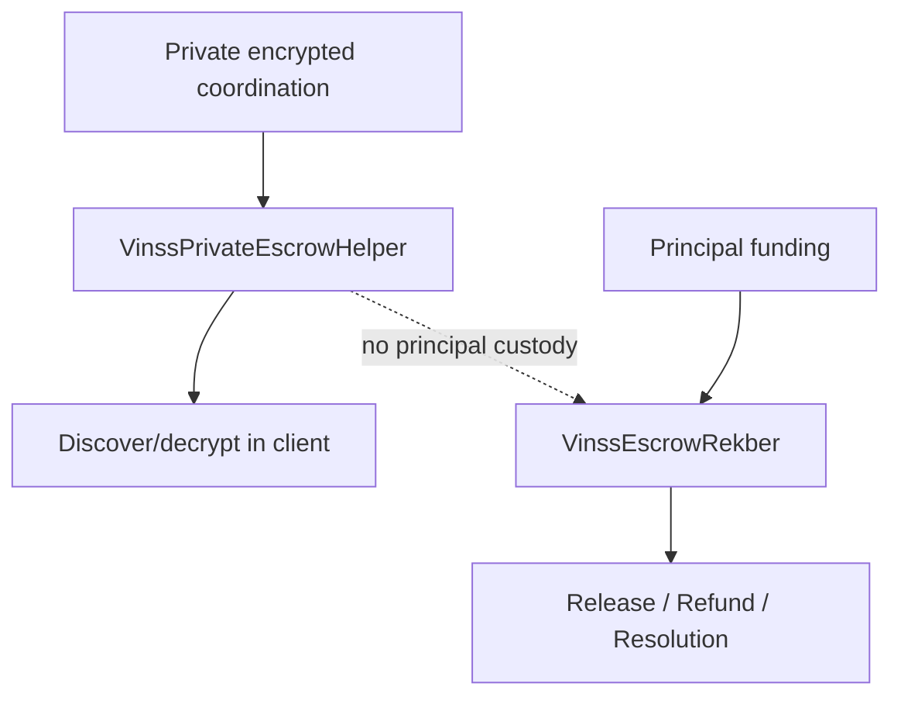
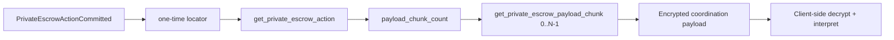

# VinssPrivateEscrowHelper

`VinssPrivateEscrowHelper` is the canonical encrypted Rekber-coordination storage helper used by VINSS.

It persists one independently addressable encrypted coordination action, exposes only opaque routing metadata plus ciphertext, enforces envelope integrity and duplicate protection, and returns no token output.

It is **not** the custody contract.

Executable Cairo source is the source of truth.

## Source

```text
contracts/src/private_escrow/
├── private_escrow_commitments.cairo
├── private_escrow_events.cairo
├── private_escrow_interfaces.cairo
├── private_escrow_types.cairo
├── private_escrow_validation.cairo
└── vinss_private_escrow_helper.cairo
```

Shared envelope constants and errors are defined under:

```text
contracts/src/utils/constants.cairo
contracts/src/utils/errors.cairo
```

## Purpose

The helper exists to store encrypted Rekber coordination actions for discovery without exposing plaintext coordination semantics and without taking custody of ERC-20 principal.

The architectural split is:

```text
VinssPrivateEscrowHelper
    encrypted coordination storage

VinssEscrowRekber
    enforceable custody and settlement
```



These contracts serve different security roles and must not be documented as interchangeable.

---

## What This Helper Enforces

The executable helper enforces:

```text
configured Privacy Pool caller
supported encrypted-envelope version
non-zero one-time locator
non-zero sender routing tag
non-zero recipient routing tag
non-zero claimed commitment
non-empty ciphertext
bounded ciphertext length
exact calldata length
exact recomputed commitment
unused action locator
unused payload commitment
```

It does not enforce plaintext lifecycle semantics.

---

## What This Helper Does Not Enforce

The helper does not validate:

```text
Agreement semantics
accept/reject semantics
funding intent
funding confirmation
release intent
refund intent
dispute reason
resolution reason
stable Rekber ID
asset
amount
principal
fee
deadlines
payer identity
payee identity
participant authorization
custody state transitions
settlement outcome
```

If those concepts exist in the application payload, they remain inside ciphertext.

---

# Constructor

Exact constructor:

```text
privacy_pool: ContractAddress
```

The address must satisfy:

```text
privacy_pool != 0
```

The contract stores it as:

```text
privacy_pool
```

and exposes no setter.

Therefore after deployment:

```text
privacy_pool immutable
```

There is no constructor parameter for:

```text
open_note_token
fee_policy
revenue treasury
STRK token
USDC token
Rekber custody contract
```

That absence is important.

This helper is not fee-bearing and does not custody settlement assets.

---

# Privacy Pool Authority

Only the configured Privacy Pool may call:

```text
privacy_invoke(...)
```

The contract checks:

```text
get_caller_address()
    == configured privacy_pool
```

Direct wallet or arbitrary-contract writes are rejected.

This is an invocation boundary.

It does not prove:

```text
which human sent the action
which wallet corresponds to sender_tag
which wallet corresponds to recipient_tag
which plaintext action kind was encrypted
```

The helper sees only the public encrypted envelope.

---

# Envelope Version

Current version:

```text
VINSS_PRIVATE_ESCROW_ENVELOPE_VERSION = 2
```

The public version value is:

```text
2
```

`V2` refers to the encrypted-envelope and commitment format.

It does not mean the canonical contract is named:

```text
VinssPrivateEscrowHelperV2
```

The canonical contract remains:

```text
VinssPrivateEscrowHelper
```

---

# Envelope Header

The fixed header length is:

```text
PRIVATE_ESCROW_ENVELOPE_HEADER_FELTS = 6
```

Canonical layout:

| Index | Field | Meaning |
|---:|---|---|
| `0` | `envelope_version` | decoded as `u8` |
| `1` | `private_escrow_action_locator` | one-time opaque action locator |
| `2` | `sender_tag` | opaque sender-routing tag |
| `3` | `recipient_tag` | opaque recipient-routing tag |
| `4` | `claimed_payload_commitment` | caller-supplied Poseidon commitment |
| `5` | `payload_chunk_count` | decoded as `u64` |
| `6...` | `ciphertext_chunks` | encrypted coordination payload |

There is no fee or output tail.

---

# Full `privacy_invoke` Calldata

The full logical calldata is exactly the encrypted envelope:

```text
[0] envelope_version
[1] private_escrow_action_locator
[2] sender_tag
[3] recipient_tag
[4] claimed_payload_commitment
[5] payload_chunk_count
[6...] ciphertext_chunks
```

There is:

```text
no quoted_fee
no open_note_id
no token
no amount
```

appended by this contract ABI.

## Full Logical Length

For:

```text
N = payload_chunk_count
```

the exact logical calldata length is:

```text
6 + N
```

Examples:

```text
1 ciphertext chunk
-> 7 logical felts

64 ciphertext chunks
-> 70 logical felts
```

Any Ready X invoke-action felt-count prefix is wallet framing and is not part of this logical Cairo calldata.

---

# Ciphertext Bounds

Current maximum:

```text
MAX_PRIVATE_ESCROW_PAYLOAD_CHUNKS = 64
```

The helper requires:

```text
payload_chunk_count > 0
payload_chunk_count <= 64
```

Therefore one encrypted coordination action contains:

```text
1..64 ciphertext felts
```

The `64` value is a VINSS implementation bound.

It is not a universal Starknet or STRK20 protocol limit.

---

# Zero-Valued Ciphertext

Ciphertext chunks may contain:

```text
0
```

The storage implementation explicitly accepts zero-valued ciphertext felts.

This is different from required public header values.

The helper requires non-zero:

```text
private_escrow_action_locator
sender_tag
recipient_tag
claimed_payload_commitment
```

but does not require every ciphertext felt to be non-zero.

---

# Commitment Domain

Canonical domain:

```text
VINSS_PRIVATE_ESCROW_COMMIT_V2
```

---

# Commitment Formula

The executable helper computes:

```text
Poseidon(
  'VINSS_PRIVATE_ESCROW_COMMIT_V2',
  envelope_version,
  private_escrow_action_locator,
  sender_tag,
  recipient_tag,
  payload_chunk_count,
  ...ciphertext_chunks
)
```

Exact input order matters.



The contract requires:

```text
computed_payload_commitment
    == claimed_payload_commitment
```

The claimed commitment itself is not recursively included in the Poseidon input.

---

# What the Commitment Binds

The commitment binds:

```text
domain
envelope version
one-time action locator
sender routing tag
recipient routing tag
declared ciphertext length
every ciphertext chunk
ciphertext ordering
```

Changing any committed field changes the expected hash.

The commitment does not reveal or interpret plaintext lifecycle semantics.

---

# Header Validation

The helper validates:

```text
envelope_version
    == VINSS_PRIVATE_ESCROW_ENVELOPE_VERSION

private_escrow_action_locator != 0

sender_tag != 0

recipient_tag != 0

claimed_payload_commitment != 0

payload_chunk_count > 0

payload_chunk_count <= 64
```

Type decoding additionally requires:

```text
envelope_version fits u8
payload_chunk_count fits u64
```

---

# Exact Calldata Length

After decoding `payload_chunk_count`, the contract computes:

```text
expected_calldata_length =
    PRIVATE_ESCROW_ENVELOPE_HEADER_FELTS
    + payload_chunk_count
```

and requires:

```text
actual calldata length
    == expected_calldata_length
```

This rejects:

```text
missing ciphertext chunks
extra ciphertext chunks
unexpected trailing fields
declared chunk-count mismatch
fee/output fields accidentally appended to helper calldata
```

That final point matters because unlike Message and Offer helpers, this helper has no fee/output tail.

---

# Duplicate Protection

The helper maintains two independent duplicate guards.

## Locator Guard

It requires:

```text
stored_private_escrow_action_locators[
  private_escrow_action_locator
] == false
```

A one-time locator cannot be stored twice.

## Payload Commitment Guard

It also requires:

```text
committed_private_escrow_payloads[
  computed_payload_commitment
] == false
```

An already stored encrypted-envelope commitment cannot be stored again.

## Different Purposes

These protect different identifiers:

```text
locator uniqueness
    prevents one action locator from being reused

payload-commitment uniqueness
    prevents one encrypted envelope commitment from being reused
```

Neither replaces Privacy Pool replay/nullifier protection.

---

# Privacy Pool Replay Boundary

The helper comments and validation explicitly distinguish helper-level duplicate guards from Privacy Pool transaction-level replay protection.

The helper does not itself establish the complete protocol-level replay guarantee for a standalone transaction.

The containing STRK20 Privacy Pool transaction must satisfy its own replay-protection requirements.

Therefore:

```text
helper locator/commitment uniqueness
!=
Privacy Pool replay protection
```

Both belong to different layers.

---

# Stored Public Structure

The helper stores:

```text
EncryptedPrivateEscrowActionRecord {
  envelope_version: u8,
  private_escrow_action_locator: felt252,
  sender_tag: felt252,
  recipient_tag: felt252,
  payload_commitment: felt252,
  payload_chunk_count: u64,
}
```

Ciphertext chunks are stored separately:

```text
(
  private_escrow_action_locator,
  chunk_index
)
    -> ciphertext felt
```

---

# Storage Maps

Current storage consists of:

```text
privacy_pool

private_escrow_actions[
  private_escrow_action_locator
]

payload_chunks[
  (
    private_escrow_action_locator,
    chunk_index
  )
]

stored_private_escrow_action_locators[
  private_escrow_action_locator
]

committed_private_escrow_payloads[
  payload_commitment
]
```

There is no ERC-20 principal reserve map in this helper.

There is no Rekber settlement state machine in this helper.

---

# Explicit Existence Marker

Cairo maps return zero/default values for unwritten keys.

The helper therefore separately tracks:

```text
stored_private_escrow_action_locators[
  locator
] -> bool
```

This prevents an unknown locator from being interpreted as a valid all-zero record.

---

# Persistence Flow

The executable path effectively performs:

```text
1. require caller == configured Privacy Pool

2. require calldata length >= 6

3. decode:
   envelope_version
   locator
   sender_tag
   recipient_tag
   claimed commitment
   chunk count

4. validate header

5. require exact length = 6 + chunk_count

6. recompute commitment

7. require exact commitment match

8. require unused locator

9. require unused payload commitment

10. write structural record

11. write ciphertext chunks

12. mark locator used

13. mark commitment used

14. emit PrivateEscrowActionCommitted

15. return empty OpenNoteDeposit span
```

All writes are atomic inside the Starknet transaction.

A later revert rolls the transaction back.

---

# Token / Revenue Behavior

`VinssPrivateEscrowHelper` does not import or dispatch ERC-20 token logic.

It has no constructor field for a revenue token.

It has no FeePolicy dependency.

It has no fee quote.

It has no token approval path.

It has no principal transfer path.

It returns:

```text
[]
```

from successful `privacy_invoke`.

Therefore the contract itself:

```text
does not charge a VINSS workflow fee
does not mint/fill an output note
does not reserve custody principal
does not release custody principal
does not refund custody principal
```

---

# Frontend Withdrawal Boundary

A frontend may construct a surrounding STRK20 transaction containing:

```text
withdraw
invoke VinssPrivateEscrowHelper
```

for application revenue or replay-protection purposes.

That surrounding withdrawal is not validated by this helper.

The helper sees only its own exact encrypted-envelope calldata.

Therefore:

```text
frontend transaction-bundle withdrawal
!=
VinssPrivateEscrowHelper contract fee
```

This distinction is especially important for the current VINSS workflow-pricing discussion.

If a mandatory workflow fee is ever moved on-chain, that requires an explicit contract design change rather than documentation pretending the current helper already enforces one.

---

# Custody Boundary

This helper never holds Rekber principal.

The canonical principal-custody contract is:

```text
VinssEscrowRekber
```

## `VinssPrivateEscrowHelper`

Responsible for:

```text
encrypted coordination storage
one-time action discovery
ciphertext commitment verification
opaque routing metadata
helper-level duplicate protection
```

## `VinssEscrowRekber`

Responsible for:

```text
STRK/USDC principal custody
funding fee enforcement
fulfillment/review deadlines
release
refund
revision
dispute
resolver split
settlement accounting
certificate eligibility state
```



The dotted relationship is conceptual application coordination, not a direct custody transfer from the helper.

---

# No Stable Public Rekber Identifier

`private_escrow_action_locator` identifies exactly one encrypted coordination action.

It must not be reused as a stable:

```text
private escrow ID
Rekber ID
conversation ID
deal-room ID
channel ID
participant ID
custody ID
```

Each encrypted action receives its own locator.

This avoids unnecessarily exposing a reusable public relationship identifier in the helper.

The actual public Rekber custody contract uses its own:

```text
custody_commitment
```

for public custody state.

---

# Lifecycle Semantics Remain Encrypted

The helper does not know whether ciphertext represents:

```text
create private escrow
funding intent
accept
reject
funding confirmation
cancel
refund coordination
release coordination
dispute coordination
resolution coordination
Agreement
Submit Work
```

These are application semantics.

The exact names used by frontend code may evolve without changing the helper as long as the encrypted envelope format remains compatible.

---

# Participant Authorization Boundary

The helper validates:

```text
caller is Privacy Pool
locator/tags/commitment structure is valid
```

It does not verify:

```text
Alice is payer
Bob is payee
Alice is allowed to create
Bob is allowed to accept
payer is allowed to cancel
payee is allowed to dispute
```

Those business permissions are not present as plaintext inputs.

Participant authorization for enforceable custody transitions belongs to:

```text
VinssEscrowRekber capability commitments
```

and client-side protocol logic.

---

# Routing Tag Boundary

The contract requires:

```text
sender_tag != 0
recipient_tag != 0
```

and commits both into the Poseidon hash.

It does not know how those tags were derived.

Therefore the contract proves:

```text
the submitted opaque routing tags
are non-zero and cryptographically bound
to this encrypted envelope
```

It does not prove:

```text
sender_tag == a particular wallet
recipient_tag == a particular wallet
```

Routing identity is a client-layer property.

---

# Public vs Private Data

## Public

The helper exposes/stores publicly:

```text
helper contract address
transaction/block timing

envelope version
one-time private Escrow action locator
sender routing tag
recipient routing tag
payload commitment
ciphertext chunk count
ciphertext chunks

existence state
payload-commitment reuse state

PrivateEscrowActionCommitted event
```

Ciphertext is public chain data.

## Not Stored as Plaintext

The helper does not store plaintext:

```text
participant wallet addresses
payer/payee roles
stable Rekber identifier
Room ID
Conversation ID
Offer ID
deal terms
asset
amount
price
payment terms
fulfillment deadline
review deadline
release/refund conditions
dispute narrative
resolution narrative
work evidence bytes
shipment data
private action kind
encryption keys
room secret
pairwise secret
```

If those values are encoded by the application, they remain inside ciphertext.

---

# Event

Canonical event:

```text
PrivateEscrowActionCommitted
```

Exact shape:

```text
key:
  private_escrow_action_locator

data:
  payload_commitment
  sender_tag
  recipient_tag
```

Ciphertext chunks are not duplicated into the event.

They are retrieved from storage.

---

# Event Privacy Meaning

The event reveals that:

```text
VinssPrivateEscrowHelper was invoked
one encrypted action was stored
the one-time locator exists
the payload commitment exists
two opaque routing tags exist
the transaction occurred at a specific block/time
```

It does not reveal the plaintext coordination kind.

---

# Public Read API

The current interface exposes:

```text
get_privacy_pool()

has_private_escrow_action(
  private_escrow_action_locator
)

get_private_escrow_action(
  private_escrow_action_locator
)

get_private_escrow_payload_chunk(
  private_escrow_action_locator,
  chunk_index
)

is_private_escrow_payload_committed(
  payload_commitment
)
```

There is no FeePolicy getter because this helper has no FeePolicy dependency.

There is no revenue-token getter because this helper has no revenue token.

There is no Rekber-custody getter because this helper does not store custody.

---

# `get_privacy_pool()`

Returns the immutable Privacy Pool authorized to call `privacy_invoke`.

---

# `has_private_escrow_action(locator)`

Returns:

```text
stored_private_escrow_action_locators[
  locator
]
```

For an unknown locator:

```text
false
```

No revert is required.

---

# `get_private_escrow_action(locator)`

Requires the locator to exist.

Then returns:

```text
EncryptedPrivateEscrowActionRecord
```

Unknown locator reverts with the corresponding Private Escrow action-not-found error.

---

# `get_private_escrow_payload_chunk(locator, index)`

Requires:

```text
action exists
index < payload_chunk_count
```

Then returns:

```text
payload_chunks[
  (locator, index)
]
```

Unknown locator or out-of-range index reverts.

---

# `is_private_escrow_payload_committed(commitment)`

Returns whether the encrypted-envelope commitment has already been stored.

This is useful for helper-level duplicate diagnostics.

---

# Discovery Pattern

A canonical on-chain reconstruction path is:



The helper never decrypts the payload.

An indexer may optimize retrieval but does not change the canonical storage model.

---

# Commitment vs Encryption

The Cairo Poseidon commitment protects the exact public encrypted envelope against mismatch relative to the claimed commitment.

It does not itself encrypt plaintext.

Conceptually:

```text
client encryption
    provides plaintext confidentiality

Poseidon commitment
    binds public encrypted envelope

Privacy Pool
    provides containing private-transaction semantics

Private Escrow helper
    persists and validates encrypted coordination structure

Rekber
    enforces custody/settlement
```

These are separate security layers.

---

# Evidence Boundary

If encrypted coordination carries:

```text
work evidence
shipment evidence
dispute reason
resolution rationale
```

the Private Escrow helper does not parse those semantics.

They remain ciphertext.

This is different from `VinssEscrowRekber`, where selected public `felt252` evidence commitments can enter custody state/events for settlement verification.

Do not conflate:

```text
encrypted coordination evidence content
```

with:

```text
public Rekber evidence commitment
```

---

# Failure Conditions

Relevant current failures include shared error constants such as:

```text
ZERO_ADDRESS
NOT_PRIVACY_POOL

BAD_ESCROW_DATA
BAD_ESCROW_VER
UNSUPPORTED_ESCROW_VER

ZERO_ESCROW_LOCATOR
ZERO_ESCROW_SENDER
ZERO_ESCROW_RECIPIENT
ZERO_ESCROW_COMMIT

EMPTY_ESCROW_CIPHERTEXT
BAD_ESCROW_CHUNK_COUNT
TOO_MANY_ESCROW_CHUNKS
BAD_ESCROW_PAYLOAD_SIZE

ESCROW_COMMIT_MISMATCH

ESCROW_LOCATOR_USED
ESCROW_PAYLOAD_USED

ESCROW_ACTION_NOT_FOUND
ESCROW_CHUNK_OOB
```

Wallet/RPC layers may wrap these felt errors before exposing them to application code.

---

# Security Properties

The current executable helper enforces:

```text
only configured Privacy Pool may invoke

constructor Privacy Pool cannot be zero

supported encrypted-envelope version

non-zero one-time action locator

non-zero sender routing tag

non-zero recipient routing tag

non-zero claimed payload commitment

ciphertext cannot be empty

ciphertext cannot exceed 64 chunks

exact calldata size = 6 + chunk count

exact recomputed commitment

one-time action locator cannot be reused

payload commitment cannot be reused

unknown action cannot be read as valid state

out-of-range ciphertext chunk cannot be read

successful invocation returns no OpenNoteDeposit
```

---

# Non-Guarantees

The helper does not prove or enforce:

```text
human participant identity
wallet ownership of routing tags
payer/payee role
Agreement correctness
funding correctness
principal amount
settlement token
workflow fee
release authorization
refund authorization
dispute authority
resolver authority
custody reserve
settlement accounting
certificate eligibility
frontend decryption correctness
client key security
indexer completeness
wallet session freshness
paymaster availability
Privacy Pool proving success
```

Those belong to other components.

---

# Source Comment Caveats

The executable implementation is internally consistent, but two source comments are stale.

## 1. Interface Envelope Layout Is Old

`private_escrow_interfaces.cairo` currently documents:

```text
[0] envelope_version
[1] private_escrow_action_locator
[2] claimed_payload_commitment
[3] payload_chunk_count
[4...] ciphertext_chunks
```

That is not the current executable V2 layout.

The executable implementation requires:

```text
[0] envelope_version
[1] private_escrow_action_locator
[2] sender_tag
[3] recipient_tag
[4] claimed_payload_commitment
[5] payload_chunk_count
[6...] ciphertext_chunks
```

The implementation and validation code are authoritative.

## 2. Commitment Comment Omits Routing Tags

The comment above `compute_private_escrow_action_commitment(...)` currently shows a formula that omits:

```text
sender_tag
recipient_tag
```

But the executable function appends both routing tags to the Poseidon input.

The actual commitment is:

```text
Poseidon(
  'VINSS_PRIVATE_ESCROW_COMMIT_V2',
  envelope_version,
  private_escrow_action_locator,
  sender_tag,
  recipient_tag,
  payload_chunk_count,
  ...ciphertext_chunks
)
```

These are documentation/comment issues, not runtime contract-logic bugs.

---

# Smart-Contract Fee Boundary

Current `VinssPrivateEscrowHelper` has:

```text
no FeePolicy
no quoted_fee
no open_note_id
no revenue token
no revenue OpenNoteDeposit
```

Therefore any current frontend 3 STRK or other workflow charge must not be documented as a contract invariant of this helper.

If VINSS later wants mandatory on-chain pricing for selected private coordination actions, that requires an explicit architecture change that preserves the fact that action semantics are currently encrypted.

The present helper cannot distinguish:

```text
Agreement
Submit Work
Dispute
other private coordination kind
```

without changing the protocol boundary.

---

# Compatibility Checklist

When changing Private Escrow helper/frontend integration, verify:

```text
constructor argument order
configured Privacy Pool address

envelope version = 2
header length = 6
maximum ciphertext chunks = 64

private_escrow_action_locator position
sender_tag position
recipient_tag position
claimed commitment position
payload chunk count position
ciphertext starting index

VINSS_PRIVATE_ESCROW_COMMIT_V2 exact domain
Poseidon input order
sender_tag included
recipient_tag included
claimed commitment excluded from its own hash

exact logical calldata length = 6 + chunk_count

no quoted_fee tail
no open_note_id tail

locator uniqueness
payload-commitment uniqueness

EncryptedPrivateEscrowActionRecord field order
PrivateEscrowActionCommitted key/data order
ciphertext chunk indexing

returned OpenNoteDeposit count = 0

no FeePolicy dependency
no revenue token dependency
no principal custody

network-specific helper address
network-specific Privacy Pool address
```

See [Envelopes, Commitments & Events](./envelopes-events.md) for the shared envelope/event reference.

See [Privacy & Trust Boundary](./privacy-boundary.md) for the system-wide privacy model.

See [Escrow Rekber](./escrow-rekber.md) for enforceable custody and settlement behavior.

See [Frontend Compatibility](./frontend-compatibility.md) for Ready X framing and the current application-level workflow-charge boundary.
