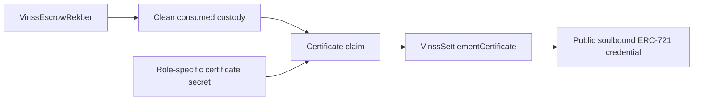
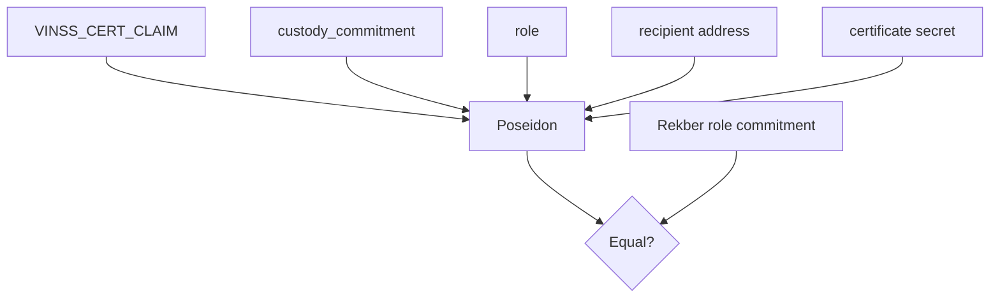
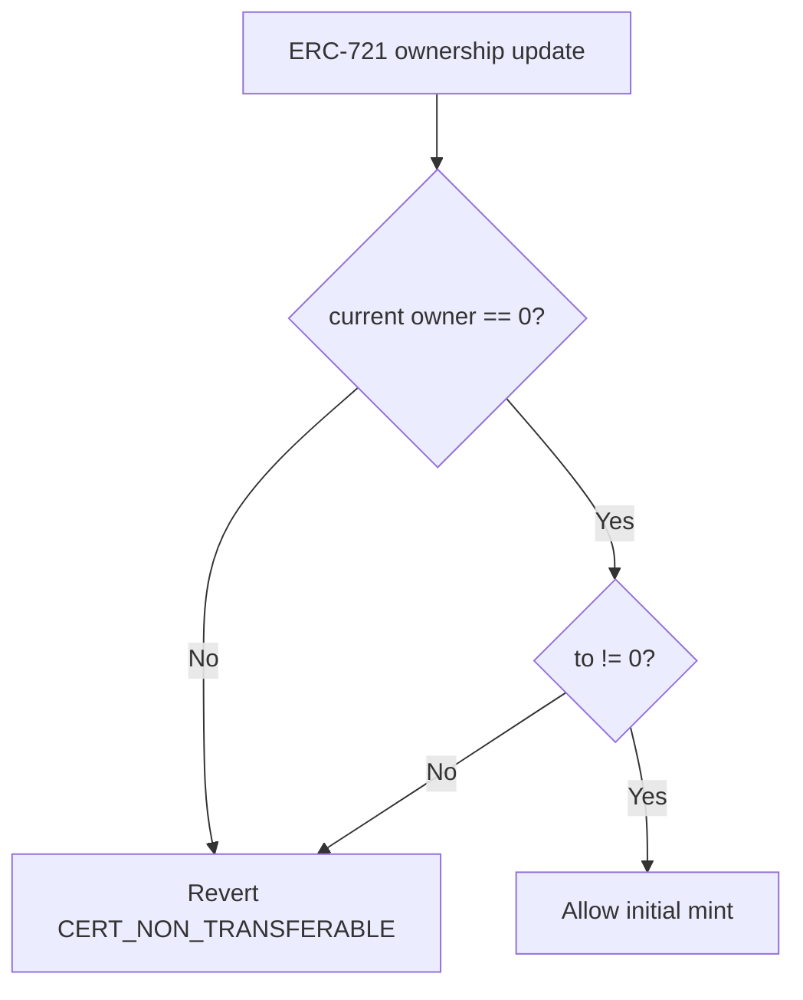

# VinssSettlementCertificate

`VinssSettlementCertificate` is the canonical public settlement-credential contract used by VINSS.

It issues an ERC-721-compatible credential to an eligible Rekber participant after the referenced custody reaches a clean consumed state.

The credential is soulbound by on-chain ownership-update enforcement: minting is allowed, while any later ownership change routed through the ERC-721 update hook is rejected.

Executable Cairo source is the source of truth.

## Source

```text
contracts/src/settlement_certificate/
├── commitments.cairo
├── events.cairo
├── interfaces.cairo
├── types.cairo
└── vinss_settlement_certificate.cairo
```

The contract reads canonical Rekber state through:

```text
contracts/src/escrow_rekber/interfaces.cairo
```

## Purpose

The certificate is an optional public reputation artifact tied to one Rekber custody and one participant role.

It proves that the claiming wallet satisfied the certificate capability precommitted for that role and that, at claim time, the referenced Rekber custody satisfies the certificate contract's clean-outcome conditions.



The certificate is not private settlement evidence.

It intentionally creates public wallet-linked reputation state.

---

# Contract Boundary

`VinssSettlementCertificate` does not custody principal and does not settle Rekber funds.

Its role is limited to:

```text
read Rekber custody state
verify role-specific certificate capability
mint deterministic credential
store public certificate metadata
prevent post-mint ownership changes
```

It does not:

```text
release principal
refund principal
resolve disputes
verify work quality
verify shipment truth
store private evidence files
decrypt Deal Room content
```

Those belong to Rekber or application/integration layers.

---

# Constructor

Exact constructor order:

```text
escrow_rekber: ContractAddress
base_uri: ByteArray
```

The Rekber address must be non-zero.

The constructor writes:

```text
escrow_rekber
```

and initializes the OpenZeppelin ERC-721 component with:

```text
name     = VINSS Settlement Certificate
symbol   = VINSS-CERT
base_uri = constructor base_uri
```

The contract exposes no setter for:

```text
escrow_rekber
```

Therefore the Rekber dependency is fixed after deployment.

## Base URI Boundary

The base URI is passed into the ERC-721 initializer during construction.

The VINSS-specific interface does not expose a custom method for changing it later.

Documentation should therefore treat metadata behavior as deployment/configuration dependent rather than inventing a VINSS certificate metadata setter that does not exist.

---

# ERC-721 Composition

The contract embeds:

```text
ERC721Component
SRC5Component
```

and exposes the OpenZeppelin ERC-721 mixin ABI.

This means standard ERC-721 compatibility remains present for things such as:

```text
ownership queries
balance queries
token metadata behavior
approval interfaces
transfer interfaces
SRC5/interface detection
```

However, normal transferability is intentionally restricted by the custom ownership-update hook.

---

# Roles

Canonical certificate role encoding:

```text
1 = payer
2 = payee
```

Each role has its own certificate capability commitment stored in Rekber custody:

```text
payer_certificate_commitment
payee_certificate_commitment
```

These capabilities are independent.

Therefore one custody can potentially produce:

```text
one payer certificate
one payee certificate
```

provided each role separately satisfies the claim rules.

## Role Validation Boundary

`claim(...)` explicitly requires:

```text
role == 1 || role == 2
```

Other role values revert with:

```text
BAD_CERT_ROLE
```

The pure token-ID helper does not itself validate role membership before hashing.

Therefore:

```text
get_certificate_token_id(custody, arbitrary_role)
```

can deterministically compute a hash for any `u8` role value, but only role `1` or `2` is valid for an actual certificate claim.

---

# Certificate Claim Domain

Canonical claim domain:

```text
VINSS_CERT_CLAIM
```

Defined as:

```text
CERTIFICATE_CLAIM_DOMAIN
```

Do not append `_V2`.

This domain is independent from Message/Offer/Private-Escrow encrypted-envelope versions.

---

# Claim Commitment

The exact claim commitment is:

```text
Poseidon(
  'VINSS_CERT_CLAIM',
  custody_commitment,
  role,
  recipient_address,
  secret
)
```

Exact input order matters.



## Recipient Binding

The recipient address is included in the commitment.

That means possession of the certificate secret alone is not sufficient for another wallet to claim the certificate.

For a valid claim:

```text
recipient = get_caller_address()
```

must produce the same Poseidon commitment that was precommitted in Rekber custody.

If a different wallet uses the same secret:

```text
computed commitment != stored commitment
```

and the claim fails.

## Secret Boundary

The certificate secret is intended to be client-held before use.

When calling:

```text
claim(custody, role, secret)
```

the secret becomes public transaction calldata.

Therefore the certificate secret is:

```text
private before claim
public after claim
```

Security does not depend on keeping a used certificate secret hidden forever.

---

# Certificate Token Domain

Canonical token-ID domain:

```text
VINSS_CERT_TOKEN
```

Defined as:

```text
CERTIFICATE_TOKEN_DOMAIN
```

---

# Deterministic Token ID

Token ID calculation:

```text
Poseidon(
  'VINSS_CERT_TOKEN',
  custody_commitment,
  role
)
```

The token ID depends only on:

```text
custody commitment
role
```

It does not depend on:

```text
recipient
secret
claim timestamp
settled_at
base URI
```

Therefore for a fixed:

```text
(custody_commitment, role)
```

the token ID is deterministic.

## Consequence

Payer and payee certificates for the same custody have different token IDs because:

```text
role 1 != role 2
```

is included in the Poseidon input.

---

# `claim(...)`

Canonical VINSS entrypoint:

```text
claim(
  custody_commitment: felt252,
  role: u8,
  secret: felt252
) -> felt252
```

The returned felt is the deterministic certificate token ID.

The recipient is not passed as an argument.

Instead:

```text
recipient = get_caller_address()
```

This makes certificate ownership an explicit action by the wallet that receives the credential.

---

# Claim Validation Order

The executable path performs the following checks and transitions conceptually:

```text
1. require role == 1 or role == 2

2. recipient = get_caller_address()

3. require recipient != zero address

4. require secret != 0

5. require claimed[(custody, role)] == false

6. call configured Rekber.get_custody(custody)

7. require custody.consumed == true

8. require custody.refunded == false

9. require custody.disputed == false

10. choose expected role commitment:
    payer -> payer_certificate_commitment
    payee -> payee_certificate_commitment

11. recompute VINSS_CERT_CLAIM commitment

12. require computed == expected

13. compute deterministic VINSS_CERT_TOKEN token ID

14. issued_at = current block timestamp

15. mark claimed[(custody, role)] = true

16. store SettlementCertificateRecord

17. mark certificate_exists[token_id] = true

18. ERC-721 mint to caller

19. emit SettlementCertificateIssued

20. return token_id
```

The complete transaction is atomic.

If minting or a later assertion in the call reverts, preceding writes in the same transaction are reverted.

---

# Custody Existence

`VinssSettlementCertificate` does not separately call:

```text
custody_exists(...)
```

before retrieving custody.

Instead it calls:

```text
Rekber.get_custody(custody_commitment)
```

The canonical Rekber getter itself requires:

```text
custody_exists == true
```

and reverts with its custody-not-found error if the custody does not exist.

Therefore a non-existent custody cannot mint a certificate.

---

# Clean-Outcome Eligibility

The certificate contract checks exactly these public Rekber lifecycle conditions:

```text
custody.consumed == true
custody.refunded == false
custody.disputed == false
```

This is the executable clean-outcome definition used by certificate claiming.

## Important Precision

The certificate contract itself does **not** separately require fields such as:

```text
fulfillment_submitted == true
fulfillment_confirmed == true
particular release_mode
particular verification_policy
specific review deadline outcome
specific fulfillment evidence commitment
```

Those may be relevant to how Rekber reaches its state, but they are not additional checks in `VinssSettlementCertificate.claim()`.

Documentation should not invent certificate eligibility conditions beyond the actual executable predicates.

---

# Refunded Custody

If:

```text
custody.refunded == true
```

claim reverts with:

```text
REKBER_WAS_REFUNDED
```

Therefore a refund cannot produce a clean-success certificate.

This holds even though the custody may also be marked consumed as part of the refund terminal state.

---

# Disputed Custody

If:

```text
custody.disputed == true
```

claim reverts with:

```text
REKBER_WAS_DISPUTED
```

This is deliberate.

A dispute-resolved custody cannot mint the normal clean-success reputation credential even when the final resolver split gives:

```text
100% of principal to payer
```

or:

```text
100% of principal to payee
```

The certificate represents a clean settlement path, not merely a financial payout result.

The contract test suite includes a disputed payee-win case that expects certificate rejection.

---

# Role-Specific Expected Commitment

For:

```text
role = 1
```

the expected commitment is:

```text
custody.payer_certificate_commitment
```

For:

```text
role = 2
```

the expected commitment is:

```text
custody.payee_certificate_commitment
```

The certificate contract does not let the caller select an arbitrary commitment field.

Role determines the expected Rekber capability.

---

# One Claim per Custody / Role

Storage tracks:

```text
claimed[(custody_commitment, role)] -> bool
```

Before mint:

```text
claimed[(custody, role)] == false
```

is required.

After successful claim:

```text
claimed[(custody, role)] = true
```

A replayed claim for the same pair fails with:

```text
CERT_ALREADY_CLAIMED
```

This is independent for payer and payee.

Therefore:

```text
payer claim does not consume payee claim
payee claim does not consume payer claim
```

---

# Settlement Certificate Record

Canonical record:

```text
SettlementCertificateRecord {
  token_id: felt252,
  custody_commitment: felt252,
  role: u8,
  recipient: ContractAddress,
  settled_at: u64,
  issued_at: u64,
}
```

Exact field order matters for ABI decoding.

## `settled_at`

`settled_at` is copied from:

```text
Rekber custody.settled_at
```

The certificate contract does not invent a new settlement timestamp.

## `issued_at`

`issued_at` is captured from:

```text
get_block_timestamp()
```

at certificate claim time.

Therefore:

```text
settled_at
```

and:

```text
issued_at
```

may be different.

The credential can be claimed after settlement rather than being forced to mint in the settlement transaction itself.

---

# Storage

VINSS-specific storage contains:

```text
escrow_rekber

claimed[
  (custody_commitment, role)
]

certificates[
  token_id
]

certificate_exists[
  token_id
]
```

The contract also embeds the OpenZeppelin component substorages:

```text
erc721
src5
```

## Explicit Certificate Existence Marker

The contract maintains:

```text
certificate_exists[token_id]
```

because an unwritten Cairo map entry otherwise decodes as a default zero-valued record.

`get_certificate(token_id)` requires the explicit marker to be true.

Unknown token records therefore do not silently appear as valid zero-valued certificates.

---

# Public Read API

The VINSS-specific interface exposes:

```text
get_escrow_rekber()

is_claimed(
  custody_commitment,
  role
)

get_certificate_token_id(
  custody_commitment,
  role
)

get_certificate(
  token_id
)
```

The embedded ERC-721 mixin additionally exposes standard ERC-721 read/write interfaces.

---

# `get_escrow_rekber()`

Returns the constructor-fixed Rekber contract address.

This is the exact contract whose custody state determines certificate eligibility.

---

# `is_claimed(custody, role)`

Returns:

```text
claimed[(custody, role)]
```

It does not itself validate that:

```text
role == 1 || role == 2
```

It simply reads the map for the supplied key.

Actual role validity is enforced by `claim()`.

---

# `get_certificate_token_id(custody, role)`

Returns:

```text
Poseidon(
  'VINSS_CERT_TOKEN',
  custody,
  role
)
```

This function computes the deterministic identifier.

It does not prove that:

```text
a certificate exists
that role is claim-valid
that custody exists
```

Use existence/claim state or `get_certificate(...)` when those facts matter.

---

# `get_certificate(token_id)`

Requires:

```text
certificate_exists[token_id] == true
```

otherwise it reverts with:

```text
CERT_NOT_FOUND
```

On success it returns the complete:

```text
SettlementCertificateRecord
```

---

# Event

Canonical VINSS event:

```text
SettlementCertificateIssued
```

Exact event layout:

```text
keys:
  token_id
  recipient

data:
  custody_commitment
  role
  settled_at
  issued_at
```

The event does not include the certificate secret.

However, the secret is still visible in claim transaction calldata.

---

# ERC-721 Mint Event

The call also executes:

```text
self.erc721.mint(
  recipient,
  token_id
)
```

so normal OpenZeppelin ERC-721 mint/ownership events are emitted through the flattened ERC721 component event system.

The custom VINSS event is additional settlement-specific credential metadata.

---

# Public Identity Boundary

A claimed certificate intentionally links:

```text
recipient wallet address
custody commitment
role
settlement timestamp
certificate issuance timestamp
ERC-721 token ID
```

on-chain.

Therefore this credential is public reputation data.

It must not be marketed as:

```text
private certificate ownership
anonymous certificate ownership
hidden settlement identity
```

The Deal Room may preserve plaintext negotiation privacy while the user later opts into a public certificate.

---

# Soulbound Enforcement

The contract overrides the ERC-721 ownership-update hook:

```text
before_update(...)
```

It loads:

```text
current_owner = self._owner_of(token_id)
```

and requires exactly:

```text
current_owner == zero_address
&&
to != zero_address
```

This allows the initial mint transition:

```text
zero owner
->
recipient
```

and rejects every later ownership update.



---

# Transfer Blocking

After mint:

```text
current_owner != zero_address
```

so a normal transfer fails the hook.

The contract tests explicitly cover:

```text
transfer_from
safe_transfer_from
```

and expect:

```text
CERT_NON_TRANSFERABLE
```

Therefore transfer blocking is an on-chain invariant of the current implementation, not a frontend convention.

---

# Burn Boundary

The hook also rejects any ownership update whose target is:

```text
to == zero_address
```

Therefore any burn path routed through the OpenZeppelin ownership-update hook is blocked by the same soulbound rule.

Documentation should phrase this as an ownership-update invariant rather than assuming a particular custom public VINSS `burn()` entrypoint exists.

The invariant is:

```text
a minted certificate can never transition away from its owner
```

through the hooked ERC-721 update mechanism.

---

# ERC-721 Approval Boundary

Because the contract embeds the standard ERC-721 mixin, standard approval interfaces remain part of ERC-721 compatibility.

An approval does **not** override the soulbound hook.

Even if an operator becomes approved:

```text
post-mint ownership update
```

still encounters:

```text
current_owner != zero_address
```

and therefore reverts with:

```text
CERT_NON_TRANSFERABLE
```

Approval authority is therefore not equivalent to transferability.

---

# Mint-Only Ownership Transition

The allowed state transition can be summarized as:

```text
unminted deterministic token ID
    -> mint to committed recipient
    -> permanently owned by that recipient
```

There is no intended lifecycle:

```text
recipient A
-> recipient B
```

or:

```text
recipient
-> zero/burned
```

for a successfully minted certificate.

---

# Claim Atomicity

The claim path writes:

```text
claimed[(custody, role)] = true
certificate record
certificate_exists = true
```

before calling the ERC-721 mint and emitting the custom issuance event.

These operations occur in one Starknet transaction.

If ERC-721 minting reverts, Starknet transaction atomicity rolls back the earlier writes.

Therefore the source ordering should not be interpreted as creating a permanently claimed-but-unminted state after a reverted transaction.

---

# Certificate Capability Timing

Certificate commitments are stored in Rekber custody when custody is funded.

The participant retains the corresponding secret client-side until they choose to claim.

Conceptually:

```text
fund Rekber
    -> certificate commitment public

settle cleanly
    -> claim becomes eligible

participant calls claim
    -> certificate secret becomes public
    -> public credential minted
```

The certificate is optional because settlement itself does not automatically mint it.

---

# Payer and Payee Independence

Each role has:

```text
separate commitment
separate claim bit
separate deterministic token ID
separate recipient binding
separate secret
```

Therefore possible states include:

```text
neither participant claimed
payer only claimed
payee only claimed
both claimed
```

A successful claim by one participant does not force the other participant to create a public credential.

---

# Privacy Boundary

## Public Before Claim

Rekber custody already publicly exposes:

```text
payer_certificate_commitment
payee_certificate_commitment
custody lifecycle/accounting state
```

but it does not store the certificate recipient addresses directly in those fields.

The recipient is cryptographically bound inside the commitment.

## Public During Claim

Claim calldata exposes:

```text
custody_commitment
role
secret
caller/transaction context
```

The contract then publicly records recipient ownership.

## Public After Claim

Public certificate data includes:

```text
token ID
recipient / ERC-721 owner
custody commitment
role
settled_at
issued_at
claim status
mint event
SettlementCertificateIssued event
```

The certificate therefore intentionally reduces privacy in exchange for public reputation evidence.

---

# What the Certificate Proves

At the smart-contract level, a successful certificate claim proves that at claim time:

```text
the referenced Rekber custody exists

custody.consumed == true
custody.refunded == false
custody.disputed == false

the caller supplied a non-zero secret

the caller/role/secret combination matches
that role's precommitted certificate commitment

the same custody/role had not already claimed
```

It also proves that the current certificate bytecode permitted the mint through its ERC-721 hook.

---

# What the Certificate Does Not Prove

A certificate does not independently prove:

```text
quality of delivered work
truth of off-chain evidence
legal identity of the wallet owner
real-world identity of payer/payee
fiat payment completion outside the protocol
absence of all off-chain disagreement
tax/compliance status
human reputation outside VINSS
```

It represents the on-chain clean-settlement conditions encoded by the current contracts.

---

# Settlement Outcome Precision

The phrase:

```text
successful settlement
```

should be interpreted according to executable certificate eligibility:

```text
consumed
not refunded
not disputed
```

Do not describe every terminal Rekber custody as certificate-eligible.

Examples:

```text
clean release                  eligible if commitment claim matches
refund                         not eligible
disputed/resolver settlement   not eligible
```

---

# Rekber Dependency Boundary

The certificate trusts the constructor-fixed Rekber contract for custody truth.

It calls:

```text
get_custody(custody_commitment)
```

on that exact address.

Therefore deploying a certificate contract against the wrong Rekber address changes the trust source for all future certificate claims.

Network/deployment configuration must keep:

```text
Settlement Certificate
<->
canonical Rekber
```

aligned.

---

# Deployment Compatibility

Soulbound behavior exists only in bytecode containing the custom `before_update` hook.

Updating local source or frontend ABI does not retroactively change an already deployed Starknet contract class.

Therefore an older deployment created before the soulbound hook was present must not be described as having current `CERT_NON_TRANSFERABLE` behavior unless its deployed class actually contains equivalent enforcement.

For current deployment validation, verify:

```text
certificate address
network
class hash / source-equivalent bytecode
configured Rekber address
base URI
```

rather than relying only on local repository source.

---

# Metadata Boundary

ERC-721 metadata behavior is initialized from the constructor base URI.

The certificate contract itself stores settlement credential fields separately from off-chain metadata representation.

A token image or JSON response served by an application endpoint is not an on-chain certificate invariant unless encoded directly in contract state/bytecode.

Therefore distinguish:

```text
on-chain credential record
ERC-721 token ownership
base URI configuration
frontend/API-rendered certificate artwork
```

These are separate layers.

---

# Public Event Surface

Canonical custom event:

```text
SettlementCertificateIssued {
  #[key] token_id
  #[key] recipient
  custody_commitment
  role
  settled_at
  issued_at
}
```

This exact key/data ordering matters for indexers.

## Event Keys

```text
token_id
recipient
```

are indexed event keys.

## Event Data

```text
custody_commitment
role
settled_at
issued_at
```

are event data.

---

# Indexer / Frontend Read Pattern

A typical public read path is:

```text
SettlementCertificateIssued
    -> token_id
    -> get_certificate(token_id)
    -> record
    -> ERC-721 owner_of(token_id)
```

The record and ERC-721 ownership should agree on the original recipient for a valid minted certificate.

Because transfers are blocked, ownership should remain stable after mint.

---

# Failure Conditions

Relevant current VINSS certificate failures include:

```text
BAD_CERT_ROLE
BAD_CERT_SECRET
REKBER_NOT_RELEASED
REKBER_WAS_REFUNDED
REKBER_WAS_DISPUTED
BAD_CERT_CLAIM
CERT_ALREADY_CLAIMED
CERT_NOT_FOUND
CERT_NON_TRANSFERABLE
```

The non-zero address helper may also revert for an invalid zero Rekber constructor address or zero claim caller context.

A missing custody fails through canonical Rekber `get_custody(...)`.

OpenZeppelin ERC-721 functions may additionally surface their own standard component errors where applicable.

Wallet/RPC layers may wrap felt errors before presenting them to frontend code.

---

# Contract Test Evidence

The current Cairo test suite includes certificate scenarios covering at least:

```text
clean release can mint payer and payee certificates

refunded custody cannot mint success certificate

disputed payee-win settlement cannot mint clean-success certificate

same custody/role claim cannot be replayed

transfer_from is blocked

safe_transfer_from is blocked
```

Those tests support the executable invariants but should not be confused with formal verification or full code-coverage evidence.

---

# Security Properties

The current executable contract enforces:

```text
constructor Rekber address cannot be zero

claim role must be payer or payee

claim caller must be non-zero

certificate secret cannot be zero

same custody/role cannot claim twice

referenced custody must exist

custody must be consumed

refunded custody cannot claim

disputed custody cannot claim

claim commitment binds custody
claim commitment binds role
claim commitment binds recipient wallet
claim commitment binds secret

expected commitment is selected by role

token ID is deterministic from custody + role

certificate record is stored on successful claim

ERC-721 mint goes to claim caller

post-mint transfer is blocked
post-mint safe transfer is blocked
ownership update toward zero is blocked by hook

custom issuance event is emitted
```

---

# Non-Guarantees

The certificate contract does not guarantee:

```text
private ownership
anonymous recipient
private custody linkage
business evidence truth
work quality
legal identity
real-world reputation
frontend artwork availability
metadata API availability
indexer freshness
wallet UI correctness
mainnet deployment correctness
```

These are outside the certificate contract's executable guarantees.

---

# ERC-721 Compatibility vs Soulbound Semantics

It is useful to distinguish:

```text
ERC-721-compatible interface
```

from:

```text
freely transferable NFT
```

`VinssSettlementCertificate` intentionally provides the former without the latter.

The contract uses ERC-721 ownership, metadata, interface, and approval machinery while restricting the ownership state machine to:

```text
unowned -> initial recipient
```

only.

That is the on-chain soulbound design.

---

# Certificate Claim Is Not Privacy-Pool Routed

`VinssSettlementCertificate.claim(...)` is a normal public contract call.

The certificate contract does not require:

```text
get_caller_address() == Privacy Pool
```

The claimant wallet is intentionally the direct recipient identity.

This is different from Message, Offer, Invite, Private Escrow, and participant Rekber `privacy_invoke` paths.

The public direct-call design is deliberate because certificate ownership itself is public.

---

# Capability vs Wallet Address Storage

Before certificate claim, Rekber stores only the role-specific certificate commitments.

The certificate claim commitment includes:

```text
recipient wallet address
```

inside Poseidon.

The raw recipient address is not separately stored in the Rekber certificate commitment field.

After claim, the recipient becomes explicit public ERC-721 ownership state.

This creates a clean transition:

```text
preclaim
    opaque role capability in Rekber

postclaim
    explicit public credential ownership
```

---

# Replay Boundary

There are two independent anti-replay properties:

## Deterministic Token ID

```text
(custody, role)
    -> one deterministic token ID
```

## Explicit Claim Map

```text
claimed[(custody, role)]
```

is permanently marked true after successful claim.

The explicit claim map is the direct contract-level replay guard.

The deterministic token ID additionally ensures the same custody/role maps to the same credential identity.

---

# Certificate Existence vs Claim State

Do not conflate:

```text
is_claimed(custody, role)
```

with:

```text
get_certificate(token_id)
```

The first reads claim-state by custody/role.

The second requires a stored certificate record for a token ID.

In a successful atomic claim these states are written together with minting, but they are conceptually different storage indexes.

---

# Timestamp Boundary

Two public timestamps are intentionally stored:

```text
settled_at
issued_at
```

They mean different things.

## `settled_at`

Comes from Rekber custody and represents when the settlement terminal state was recorded by Rekber.

## `issued_at`

Comes from certificate claim block time and represents when the optional reputation credential was minted.

Therefore a UI should not label both as the same event time.

---

# Certificate Privacy Statement

Accurate:

> A VINSS Settlement Certificate is an optional public, non-transferable wallet credential linked to an eligible clean Rekber custody outcome.

Also accurate:

```text
certificate ownership is public
custody linkage is public after claim
role is public
settlement and issuance timestamps are public
certificate secret is revealed in claim calldata
```

Inaccurate:

```text
the certificate is private
certificate ownership is anonymous
certificate secret remains hidden forever
every Rekber terminal state can mint a certificate
a dispute win is equivalent to a clean certificate outcome
ERC-721 approval makes the SBT transferable
```

---

# Deployment Audit Checklist

Before relying on soulbound behavior in a deployed environment, verify:

```text
correct network
correct certificate address
correct certificate class hash
class contains current before_update hook
CERT_NON_TRANSFERABLE behavior is present
constructor points to canonical Rekber
base URI matches intended metadata service
ERC-721 name is VINSS Settlement Certificate
ERC-721 symbol is VINSS-CERT
frontend points to same certificate address
```

Do not infer deployed behavior solely from the current Git working tree.

---

# Frontend Compatibility Checklist

Frontend code must match:

```text
role 1 = payer
role 2 = payee

VINSS_CERT_CLAIM exact string
VINSS_CERT_TOKEN exact string

claim Poseidon input order:
  custody
  role
  recipient
  secret

token ID Poseidon input order:
  custody
  role

claim ABI:
  custody_commitment
  role
  secret

recipient = calling wallet

SettlementCertificateRecord field order
SettlementCertificateIssued key/data order

no transfer UI
no burn UI
public ownership expectations
network-specific certificate address
```

---

# Smart-Contract Review Checklist

When changing certificate or Rekber integration, verify:

```text
Does Rekber custody still expose both certificate commitments?

Are payer/payee role values unchanged?

Did VINSS_CERT_CLAIM change?

Did VINSS_CERT_TOKEN change?

Did Poseidon input order change?

Does claim still bind recipient address?

Does claim still reject zero secret?

Does claim still reject duplicate custody/role?

Does Rekber get_custody still reject nonexistent custody?

Are clean-outcome checks still:
  consumed
  not refunded
  not disputed?

Did any new eligibility predicate get added?

Did SettlementCertificateRecord field order change?

Did SettlementCertificateIssued field/key order change?

Does before_update still permit only initial mint?

Can any new ERC-721 path bypass the hook?

Is deployed bytecode/class aligned with source?
```

---

# Related Documentation

```text
escrow-rekber.md
privacy-boundary.md
envelopes-events.md
frontend-compatibility.md
current-scope.md
```

`escrow-rekber.md` is the canonical source for custody lifecycle semantics.

`privacy-boundary.md` explains why certificate ownership is intentionally public.

`frontend-compatibility.md` defines the exact client-side role/domain encoding requirements.
