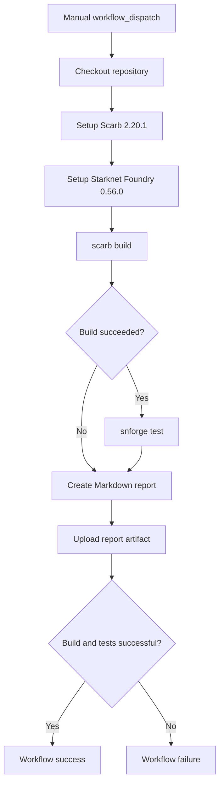
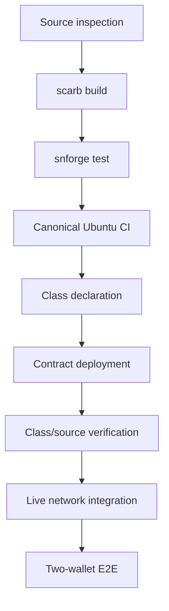
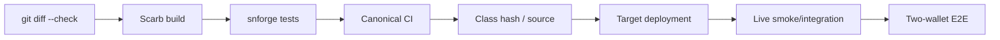

# Smart Contract Testing

This document describes the current VINSS Cairo smart-contract test surface, canonical GitHub Actions workflow, and the evidence boundaries of those tests.

Executable Cairo source, test source, and CI workflow configuration are authoritative.

A passing local or CI test suite is strong evidence for the behaviors exercised by those tests. It is **not** equivalent to formal verification, code-coverage measurement, deployed-bytecode verification, or wallet/network end-to-end proof.

---

# Canonical CI Workflow

The canonical smart-contract workflow is:

```text
.github/workflows/contracts-test.yml
```

Workflow name:

```text
VINSS Contracts Test
```

Current trigger:

```text
workflow_dispatch
```

The workflow is therefore manually dispatchable.

It does not currently declare automatic:

```text
push
pull_request
schedule
```

triggers.



---

# CI Runner

Current runner:

```text
ubuntu-latest
```

The workflow sets the default working directory to:

```text
contracts
```

Therefore the build and test commands execute against the Cairo package under:

```text
contracts/
```

rather than from repository root.

---

# Pinned Toolchain

The workflow explicitly installs:

```text
Scarb 2.20.1
Starknet Foundry 0.56.0
```

through:

```text
software-mansion/setup-scarb@v1
foundry-rs/setup-snfoundry@v3
```

Scarb cache is currently configured as:

```text
cache: false
```

These explicit version pins matter.

A local test performed with a materially different compiler or Starknet Foundry version is useful, but it is not byte-for-byte equivalent evidence to the canonical CI environment.

---

# Canonical Build Command

The workflow executes:

```bash
scarb build
```

with:

```bash
set -o pipefail
```

and captures output into:

```text
build-output.txt
```

using:

```bash
scarb build 2>&1 | tee build-output.txt
```

The build step uses:

```text
continue-on-error: true
```

This does **not** mean build failures are accepted.

It allows later reporting steps to execute even if the build fails.

---

# Canonical Test Command

If the build step succeeds, CI executes:

```bash
snforge test
```

also with:

```bash
set -o pipefail
```

and stores output in:

```text
test-output.txt
```

The test step is conditional:

```text
if: steps.build.outcome == 'success'
```

Therefore:

```text
build failure
-> test step skipped
```

rather than running tests against a failed build.

The test step also uses:

```text
continue-on-error: true
```

only so reporting can still run.

---

# Final CI Failure Gate

The workflow ends with an explicit failure gate equivalent to:

```text
if build outcome != success
OR test outcome != success
    exit 1
```

Therefore a green workflow requires both:

```text
Build = success
Tests = success
```

A build failure cannot produce a green workflow.

A test failure cannot produce a green workflow.

A skipped test caused by failed build cannot produce a green workflow.

---

# CI Markdown Report

The workflow generates:

```text
contracts-test-report.md
```

containing:

```text
commit short SHA
build outcome
test outcome
branch
tail of build log
tail of test log
```

The report is also appended to:

```text
GITHUB_STEP_SUMMARY
```

for convenient inspection in GitHub Actions.

---

# CI Artifact

The report is uploaded with:

```text
actions/upload-artifact@v4
```

Artifact name:

```text
vinss-contract-test-report
```

Retention:

```text
30 days
```

This artifact is useful evidence for a specific CI execution.

It should be associated with:

```text
workflow run ID
head SHA
branch
build result
test result
```

when being recorded as release/deployment evidence.

---

# What a Green Contracts Workflow Proves

For the exact checked-out commit and configured CI toolchain, a green workflow proves:

```text
repository checkout succeeded

Scarb 2.20.1 environment was installed

Starknet Foundry 0.56.0 environment was installed

contracts package passed scarb build

registered Starknet Foundry tests passed snforge test

the final failure gate observed both as successful
```

That is meaningful executable evidence.

---

# What a Green Contracts Workflow Does Not Prove

A green workflow does not by itself prove:

```text
100% source-code coverage

formal verification

absence of all smart-contract bugs

deployed class hash matches tested source

deployment transaction succeeded

deployed constructor arguments are correct

Voyager source verification

mainnet contract behavior

Sepolia contract behavior

Ready X Wallet API compatibility

STRK20 proof generation

Privacy Pool execution on a live network

AVNU paymaster behavior

frontend calldata compatibility

browser encryption/decryption

backend discovery/indexing

two-wallet end-to-end behavior

real ERC-20 token compatibility beyond tested assumptions

real Pragma oracle availability
```

Those require separate evidence.

---

# Testing Vocabulary

To avoid overclaiming, this documentation uses the following terms.

## Test Included

Means:

```text
a test exercising the behavior exists in the current source tree
```

## Test Passed

Means:

```text
that test executed successfully in a specific local or CI run
```

## CI Green

Means:

```text
the canonical workflow completed with build and test success
```

## Covered by Test Source

Informal wording meaning a scenario has an explicit regression test.

This should **not** be confused with a measured source-code coverage percentage.

## Code Coverage

Means instrumented coverage evidence such as:

```text
line coverage
branch coverage
function coverage
```

The canonical workflow currently does not generate such a metric.

Therefore avoid claims such as:

```text
100% coverage
fully covered
complete branch coverage
```

unless separate tooling actually produces that evidence.

---

# Test Registration

The Cairo package registers its tests through:

```text
contracts/src/lib.cairo
```

with:

```text
#[cfg(test)]
mod tests;
```

The canonical test module registry is:

```text
contracts/src/tests.cairo
```

Current registered modules:

```text
test_vinss_fee_policy
test_vinss_message_helper
test_vinss_invite
test_vinss_offer_helper
test_vinss_escrow_rekber
test_vinss_settlement_certificate
test_vinss_private_escrow_helper
```

---

# Current Test Files

The current test directory contains:

```text
contracts/src/tests/
├── test_vinss_escrow_rekber.cairo
├── test_vinss_fee_policy.cairo
├── test_vinss_invite.cairo
├── test_vinss_message_helper.cairo
├── test_vinss_offer_helper.cairo
├── test_vinss_private_escrow_helper.cairo
└── test_vinss_settlement_certificate.cairo
```

These seven modules are explicitly registered in:

```text
contracts/src/tests.cairo
```

---

# Test Mocks

The package also exposes test-only mocks under:

```text
#[cfg(test)]
test_mocks
```

Current mock families include:

```text
mock_erc20
mock_fee_policy
mock_pragma
```

These enable deterministic contract-level testing without requiring a live ERC-20 deployment, live Pragma oracle, or production FeePolicy in every scenario.

---

# Mock Boundary

A mock proves behavior against the mock's interface/semantics.

It does not prove that every production dependency behaves identically in all circumstances.

For example:

```text
MockPragma
```

can prove VINSS's handling of supplied oracle fields and timestamps.

It does not prove:

```text
Pragma network availability
real feed update cadence
real aggregator source behavior
production RPC reliability
```

Likewise, a mock ERC-20 can prove the contract's expected allowance/transfer interaction under that mock but not every nonstandard token implementation in existence.

---

# FeePolicy Test Module

File:

```text
contracts/src/tests/test_vinss_fee_policy.cairo
```

Current explicit tests include the following behavior.

## USD Public Price Floor

A test verifies live STRK conversion for Message, Offer, and Room Activation when the USD-derived floor wins.

The fixture intentionally uses a deterministic mock STRK/USD price.

The resulting STRK values are **test fixtures**, not permanent production fee constants.

---

# FeePolicy Sponsor Floor

A test verifies that the sponsor-cost floor wins when it is higher than the converted public USD floor.

This confirms the contract chooses the greater protected amount.

---

# Pricing Admin Update

A test verifies that the configured pricing admin can update:

```text
sponsor_cost_strk_wei
```

and that the changed value affects subsequent live quotes.

---

# Unauthorized FeePolicy Update

A test expects:

```text
NOT_PRICING_ADMIN
```

when an arbitrary wallet attempts to change sponsor cost.

This is explicit authorization regression coverage.

---

# Stale Oracle Failure

A test expects:

```text
STALE_ORACLE_PRICE
```

when FeePolicy receives a price older than the configured maximum age.

This verifies fail-closed behavior for that stale-price case.

It does not imply that every possible malformed oracle response has an explicit test in this module.

---

# Rekber FeePolicy Public Floor

A test verifies that:

```text
$0.75 public Rekber floor
```

wins when the sponsor reserve converted to USD is lower.

This is testing the current FeePolicy constants/algorithm.

---

# Rekber Sponsor Reserve

A test verifies that the Rekber reserve floor rises when the sponsor-cost/STRK-price combination makes the reserve protection larger than the public USD minimum.

The fixture demonstrates the current 12x Rekber sponsor multiplier behavior indirectly through the resulting quote.

---

# FeePolicy Test Precision

Accurate statement:

```text
The current FeePolicy test module includes tests for
USD-derived floors, sponsor floors, pricing-admin updates,
unauthorized updates, stale oracle failure, and Rekber reserve behavior.
```

Avoid:

```text
Every oracle edge case is tested.
Every FeePolicy branch is covered.
FeePolicy is formally verified.
```

---

# Message Helper Test Module

File:

```text
contracts/src/tests/test_vinss_message_helper.cairo
```

The source itself explicitly documents its local Cairo test boundary.

It distinguishes contract tests from real SDK/prover/Sepolia E2E.

---

# Message Constructor Tests

Current tests include:

```text
constructor stores configured Privacy Pool

constructor rejects zero Privacy Pool
```

The constructor test uses test mock token/FeePolicy dependencies.

---

# Message Commitment Primitive Tests

Current explicit tests include:

```text
deterministic commitment

locator binding

ciphertext-order binding

envelope-version binding
```

These use an independent test-side Poseidon construction that must remain synchronized with the production contract format.

This is valuable compatibility regression evidence.

---

# Message Successful Storage

A successful-path test verifies behavior including:

```text
Privacy Pool invocation

one revenue OpenNoteDeposit returned

configured revenue token

fixture revenue amount

message existence marker

payload commitment marker

stored envelope version

stored locator

stored sender tag

stored recipient tag

stored payload commitment

stored chunk count

ciphertext chunk retrieval
```

The fixture currently uses a mock Message fee value.

That fixture value must not be documented as a permanent production Message fee.

---

# Message Independent Locators

A test stores two different Message locators and verifies:

```text
both records exist independently
ciphertext chunks are not mixed
```

This protects per-action storage isolation.

---

# Message Zero Ciphertext Felt

A test explicitly verifies that:

```text
ciphertext felt = 0
```

is accepted and read back unchanged.

This is important because ciphertext is opaque data and must not be validated as if it were plaintext.

---

# Message Maximum Chunk Boundary

A test explicitly stores:

```text
MAX_PAYLOAD_CHUNKS
```

ciphertext chunks and verifies that the inclusive maximum is accepted.

This is direct boundary evidence for the current upper limit.

---

# Message Event Shape

A test spies on:

```text
MessageCommitted
```

and checks the current V2 event structure including:

```text
message locator
payload commitment
sender tag
recipient tag
```

This is useful protection against event/indexer drift.

---

# Message Authorization

A test expects:

```text
NOT_PRIVACY_POOL
```

for a non-Privacy-Pool caller.

---

# Message Envelope Rejection Tests

The module includes explicit malformed-input cases such as:

```text
truncated header

version that does not fit u8

unsupported envelope version

zero Message locator

zero payload commitment

empty ciphertext

invalid claimed commitment

chunk count above u64

ciphertext count above configured maximum

declared/provided ciphertext-length mismatch
```

Additional rejection tests may exist later in the module; documentation should stay synchronized with the actual source rather than infer exhaustive branch coverage.

---

# Message Test Source Comment Caveat

Some comments in the Message test file contain older wording such as references to an earlier fixed header description or test fixture revenue.

Executable test calldata/assertions are authoritative.

The test fixture value:

```text
MESSAGE_REVENUE
```

does not override current production FeePolicy-driven behavior.

---

# Offer Helper Test Module

File:

```text
contracts/src/tests/test_vinss_offer_helper.cairo
```

Current explicit tests include:

```text
constructor stores Privacy Pool

successful V2 record storage

one revenue OpenNoteDeposit

revenue token and fixture amount

sender tag persistence

recipient tag persistence

ciphertext chunk retrieval

non-Pool caller rejection

zero sender-tag rejection

zero recipient-tag rejection

invalid commitment rejection

same locator replay rejection

OfferActionCommitted event routing fields
```

---

# Offer Commitment Fixture

The Offer tests independently reconstruct:

```text
VINSS_OFFER_COMMITMENT_DOMAIN
VINSS_OFFER_ENVELOPE_VERSION
locator
sender tag
recipient tag
chunk count
ciphertext chunks
```

into the expected Poseidon commitment.

This exercises frontend/contract-compatible field ordering at the Cairo test level.

---

# Offer Fee Fixture Boundary

The Offer test uses:

```text
OFFER_REVENUE
```

through a mock FeePolicy.

That amount is a deterministic test fixture.

It does not make the production Offer helper fee hardcoded.

Production behavior remains:

```text
FeePolicy.quote_fee(FEE_ACTION_OFFER)
```

with helper enforcement of the submitted quote minimum.

---

# Offer Replay Precision

The current Offer module explicitly tests:

```text
same locator replay rejection
```

The production contract also contains a payload-commitment reuse guard.

Do not claim a dedicated:

```text
same payload commitment with different locator
```

regression test unless such a test is present in the current test source.

Implementation invariant and explicit test scenario are separate facts.

---

# Private Escrow Helper Test Module

File:

```text
contracts/src/tests/test_vinss_private_escrow_helper.cairo
```

Current explicit tests include:

```text
successful V2 encrypted action storage

empty OpenNoteDeposit output

sender tag persistence

recipient tag persistence

ciphertext chunk retrieval

non-Pool caller rejection

zero sender-tag rejection

zero recipient-tag rejection

invalid commitment rejection

same locator replay rejection

PrivateEscrowActionCommitted event routing fields
```

---

# Private Escrow Commitment Fixture

The test independently reconstructs the commitment using:

```text
VINSS_PRIVATE_ESCROW_COMMITMENT_DOMAIN
VINSS_PRIVATE_ESCROW_ENVELOPE_VERSION
locator
sender tag
recipient tag
chunk count
ciphertext
```

This is especially useful because stale source comments previously omitted routing tags while executable code includes them.

The test-side formula includes those routing tags.

---

# Private Escrow No-Output Behavior

The successful test explicitly checks:

```text
deposits.len() == 0
```

This is direct regression evidence that the helper itself does not return a token output.

It does not prove that a frontend transaction bundle contains no separate withdrawal.

That is a cross-layer concern.

---

# Private Escrow Replay Precision

The current test module explicitly verifies:

```text
same locator replay rejection
```

The production helper also implements payload-commitment reuse protection.

As with Offer, do not claim a dedicated different-locator/same-commitment regression test unless one is actually present.

---

# Invite Test Module

File:

```text
contracts/src/tests/test_vinss_invite.cairo
```

Current explicit tests include:

```text
constructor stores Privacy Pool

create stores commitment record

create returns Room Activation revenue OpenNoteDeposit

consume marks Invite consumed

duplicate create is rejected

same Invite cannot be consumed twice

unknown secret is rejected

expired Invite cannot be created

expired Invite cannot be consumed

non-Privacy-Pool caller is rejected
```

---

# Invite Revenue Fixture

The test uses a deterministic:

```text
ROOM_REVENUE
```

mock FeePolicy value.

The revenue-output test checks:

```text
one output

expected open note ID

expected configured token

expected fixture amount
```

That fixture does not make production Room Activation pricing immutable.

---

# Invite Expiry Precision

The current tests explicitly include:

```text
create at now=2000 with expiry=1999 -> rejected

consume at now=1501 with expiry=1500 -> rejected
```

The executable contract also defines exact equality behavior.

Unless the suite contains a dedicated equality-boundary test, do not claim that:

```text
consume exactly at expires_at
```

has a separate regression test.

Contract behavior and explicit test evidence must be distinguished.

---

# Rekber Test Module

File:

```text
contracts/src/tests/test_vinss_escrow_rekber.cairo
```

The suite focuses heavily on money invariants, timeout behavior, dispute authority, and participant capabilities.

It is broader than a simple happy-path UI test.

---

# Rekber Fee Quote Tests

Current explicit tests include:

```text
2% fee wins when larger than USD floor

USD floor wins for a smaller STRK deal

stale oracle price fails closed
```

These are local Cairo tests using deterministic mock oracle/FeePolicy components.

---

# Rekber No-Fulfillment Refund

A test verifies that at the fulfillment deadline, before fulfillment:

```text
payer timeout refund returns full principal

custody becomes consumed

custody becomes refunded

reserved principal becomes zero
```

This directly protects the important invariant:

```text
service fee is not deducted from refunded principal
```

because the output amount is checked against the original principal.

---

# Rekber Fulfillment Blocks Unilateral Refund

A regression test expects:

```text
REFUND_BLOCKED_FULFILL
```

when the payer attempts the unilateral timeout-refund path after fulfillment has been submitted.

This protects against post-work unilateral principal seizure.

---

# Rekber Auto Release

A test verifies the submission-review policy where:

```text
submission starts review

review deadline is computed

payer silence until review deadline

payee auto-release succeeds

output equals full principal
```

---

# Counterparty Confirmation Policy

A test verifies:

```text
POLICY_COUNTERPARTY_CONFIRM
```

behavior.

After payee submission:

```text
fulfillment_submitted == true
fulfillment_confirmed == false
review_deadline == 0
```

until the payer supplies the confirmation capability/evidence value.

After valid confirmation:

```text
fulfillment_confirmed == true
review deadline starts
```

---

# Rekber Revision / Resubmission

A test verifies a bounded revision cycle:

```text
fulfillment submitted

revision requested

revision_pending == true

old review no longer active

next fulfillment chain secret used

new evidence commitment stored

fresh review state becomes active
```

This protects the secret-chain and bounded revision lifecycle.

---

# Mutual Refund After Fulfillment

A test verifies that after fulfillment a full refund can still occur through the mutual path with:

```text
payer refund secret
payee refund-consent secret
```

and returns full principal.

This is different from unilateral pre-fulfillment timeout refund.

---

# Dispute Resolution Claims

A test verifies a resolver-authorized split such as:

```text
payer 40%
payee 60%
```

and confirms:

```text
payer claims only payer amount with payer-bound secret

payee claims only payee amount with payee-bound secret

final custody is consumed/disputed

reserved principal returns to zero
```

This is important evidence that resolver authorization does not itself redirect funds to an arbitrary recipient.

---

# Resolver Authorization

A test expects:

```text
NOT_DISPUTE_RESOLVER
```

when an arbitrary wallet attempts to authorize the dispute split.

---

# Review Deadline Guard

A regression test expects:

```text
REVIEW_WINDOW_CLOSED
```

for a dispute attempt at the closed review boundary represented by the test.

This guards late dispute behavior.

---

# Early Refund Guard

A test expects:

```text
REFUND_TOO_EARLY
```

when timeout refund is attempted before:

```text
fulfillment_deadline
```

---

# Wrong Refund Secret

A test expects:

```text
BAD_REFUND_SECRET
```

for an invalid payer refund capability.

---

# Wrong Mutual-Refund Consent

A test expects:

```text
BAD_REFUND_CONSENT
```

for incorrect payee consent on the mutual-refund path.

---

# Resolver Split Finality Guard

After a resolver split has been authorized, a regression test expects:

```text
RESOLUTION_ALREADY_SET
```

when trying to override that state through the clean mutual-release path.

---

# Rekber Privacy Pool Caller Guard

A test expects:

```text
NOT_PRIVACY_POOL
```

for an unauthorized direct participant-path invocation.

This does not apply to the separately authorized resolver/verifier direct hooks.

---

# Duplicate Custody Guard

A regression test expects:

```text
CUSTODY_ALREADY_EXISTS
```

when funding the same custody commitment twice.

---

# Funding Balance Invariant

A test expects:

```text
FUNDS_NOT_RECEIVED
```

when the Rekber address does not hold the required:

```text
principal + fee
```

before the funding action is processed.

This is direct money-invariant evidence.

---

# Terminal Replay Guard

A regression test releases a custody and then attempts a refund.

It expects:

```text
CUSTODY_ALREADY_CONSUMED
```

This protects terminal-state replay.

---

# Exact Fee Quote Guard

A regression test deliberately submits:

```text
required fee + 1
```

and expects:

```text
REKBER_FEE_CHANGED
```

The test confirms the current exact-fee-match behavior on Rekber funding.

This differs from Message/Offer/Invite helper semantics, where accepted `quoted_fee` may be greater than the current minimum.

---

# Rekber Test Boundary

Accurate:

```text
The current Rekber suite contains explicit regression tests for
major money, timeout, policy, revision, dispute, resolver,
refund, replay, and fee-quote invariants.
```

Do not claim:

```text
every action permutation is tested

every deadline boundary is tested

every oracle malformed-response branch is tested

every ERC-20 implementation is tested

the Rekber contract is formally verified
```

unless separate evidence exists.

---

# Settlement Certificate Test Module

File:

```text
contracts/src/tests/test_vinss_settlement_certificate.cairo
```

The source states the intended certificate meaning clearly:

```text
clean successful release -> claimable
refund -> not claimable
dispute resolution -> not claimable
```

---

# Clean Payer and Payee Certificate Claims

A test funds and cleanly releases Rekber, then verifies:

```text
payer can claim role 1 certificate

payee can claim role 2 certificate

returned payer token ID matches deterministic hash

returned payee token ID matches deterministic hash
```

This confirms independent role credentials for one clean custody.

---

# Refunded Certificate Rejection

A test expects:

```text
REKBER_WAS_REFUNDED
```

when trying to mint a clean-success certificate for a refunded custody.

---

# Disputed Settlement Certificate Rejection

A test creates a dispute, authorizes a payee-100% resolution, completes the payee claim, then expects:

```text
REKBER_WAS_DISPUTED
```

when the payee attempts to mint the normal clean-success certificate.

This explicitly proves that:

```text
financial win after dispute
!=
clean-success certificate eligibility
```

---

# Certificate Replay Guard

A regression test calls the same payer certificate claim twice and expects:

```text
CERT_ALREADY_CLAIMED
```

on replay.

---

# Soulbound Transfer Tests

Current explicit tests include:

```text
transfer_from -> CERT_NON_TRANSFERABLE

safe_transfer_from -> CERT_NON_TRANSFERABLE
```

These are direct regression tests for the current post-mint soulbound transfer invariant.

---

# Certificate Burn Precision

The production hook also blocks ownership updates to the zero address.

Do not claim a dedicated burn regression test unless one exists in the current suite.

Source invariant and explicit test case are separate evidence levels.

---

# Recipient Binding Precision

The production claim commitment includes:

```text
recipient address
```

and the contract uses:

```text
get_caller_address()
```

during claim.

If documentation says recipient/caller binding is “tested,” verify there is an explicit wrong-caller/same-secret regression test in the current suite.

The current clean claim fixture itself exercises the correct caller binding, but successful-path use is not the same as a dedicated negative test.

---

# Test Fixture Values Are Not Production Constants

Several test files intentionally use easy-to-read mock values such as:

```text
MESSAGE_REVENUE = 7 STRK-like units
OFFER_REVENUE = 10 STRK-like units
ROOM_REVENUE = 10 STRK-like units
$1 Rekber constructor floor in specific tests
mock STRK/USD prices
```

These values exist to make deterministic assertions.

They do **not** override current production contract rules.

Production pricing is defined by:

```text
VinssFeePolicy
VinssEscrowRekber
deployment constructor values
live Pragma data
```

depending on the path.

Never infer production fees from a test fixture alone.

---

# Local Contract Test Commands

From repository root:

```bash
cd ~/vinss/contracts

scarb build
snforge test
```

Or:

```bash
cd ~/vinss
(
  cd contracts
  scarb build
  snforge test
)
```

For evidence, preserve the exact:

```text
git commit SHA
Scarb version
snforge version
test output
```

---

# Verify Local Toolchain

Useful commands:

```bash
scarb --version
snforge --version
git rev-parse HEAD
```

Compare local versions against the canonical CI pins:

```text
Scarb 2.20.1
Starknet Foundry 0.56.0
```

---

# Run a Specific Test

Starknet Foundry supports test filtering.

A typical workflow is:

```bash
cd ~/vinss/contracts

snforge test <filter>
```

Use the tool's current CLI help if filter syntax changes:

```bash
snforge test --help
```

Do not hardcode undocumented filter flags in permanent docs when a simple positional test filter is sufficient.

---

# Manual CI Dispatch with GitHub CLI

The canonical workflow can be dispatched with GitHub REST through `gh api`:

```bash
cd ~/vinss

gh api \
  --method POST \
  repos/DXJLabs/vinss/actions/workflows/contracts-test.yml/dispatches \
  -f ref=main
```

A successful dispatch endpoint commonly returns no response body.

That means the dispatch request was accepted; it does not itself mean the workflow passed.

---

# Query Recent Manual Runs

```bash
gh api \
  'repos/DXJLabs/vinss/actions/workflows/contracts-test.yml/runs?branch=main&event=workflow_dispatch&per_page=5' \
  --jq '.workflow_runs[] | [.id, .head_sha[0:7], .status, (.conclusion // "-")] | @tsv'
```

This provides:

```text
run ID
head short SHA
status
conclusion
```

Always match a result to the expected commit SHA before treating it as evidence for current source.

---

# Inspect One Workflow Run

Given:

```text
RUN_ID
```

you can inspect it through GitHub CLI:

```bash
gh api \
  "repos/DXJLabs/vinss/actions/runs/$RUN_ID"
```

For concise fields:

```bash
gh api \
  "repos/DXJLabs/vinss/actions/runs/$RUN_ID" \
  --jq '[.id, .head_sha, .status, .conclusion, .html_url] | @tsv'
```

---

# Inspect Jobs

```bash
gh api \
  "repos/DXJLabs/vinss/actions/runs/$RUN_ID/jobs" \
  --jq '.jobs[] | [.name, .status, (.conclusion // "-")] | @tsv'
```

A green overall run is the primary workflow-level signal.

The job listing helps diagnose which stage failed.

---

# Download CI Report Artifact

The workflow uploads:

```text
vinss-contract-test-report
```

for 30 days.

GitHub CLI can list run artifacts:

```bash
gh api \
  "repos/DXJLabs/vinss/actions/runs/$RUN_ID/artifacts" \
  --jq '.artifacts[] | [.id, .name, .expired] | @tsv'
```

Use the exact artifact ID for retrieval through your preferred GitHub CLI/API flow.

An artifact being present does not itself imply tests passed because the workflow uploads the report under:

```text
if: always()
```

Read the report or run conclusion.

---

# Evidence Levels

VINSS should record smart-contract evidence in distinct levels.



Higher layers answer different questions.

They do not retroactively change what a lower layer proves.

---

# Evidence Level 1 — Source Inspection

Answers:

```text
What does current repository source say?
```

Useful for:

```text
ABI layouts
assertions
storage structures
commitment domains
event fields
```

Does not prove the code compiles.

---

# Evidence Level 2 — Build

A successful:

```bash
scarb build
```

proves the package compiles under that toolchain.

It does not prove behavioral correctness.

---

# Evidence Level 3 — Starknet Foundry Tests

A successful:

```bash
snforge test
```

proves the registered tests executed successfully in that environment.

It does not prove untested behavior.

---

# Evidence Level 4 — Canonical CI

A green:

```text
VINSS Contracts Test
```

run proves build + tests passed in the pinned Ubuntu CI workflow for the recorded commit.

This is stronger reproducibility evidence than an undocumented local run.

---

# Evidence Level 5 — Declaration

Successful class declaration proves a compiled class was accepted by the target Starknet network.

It does not prove constructor correctness because an instance has not necessarily been deployed.

---

# Evidence Level 6 — Deployment

Successful deployment proves an instance exists with some constructor calldata at a target address.

Record:

```text
network
contract address
class hash
deployment transaction
constructor values
deployment block
```

---

# Evidence Level 7 — Source / Class Verification

Explorer or independent class-hash/source verification establishes stronger linkage between reviewed source and deployed bytecode/class.

Do not label a deployment “source verified” only because local source exists.

---

# Evidence Level 8 — Live Integration

Examples:

```text
real Privacy Pool invoke

real Pragma read

real supported token

real resolver/verifier call

real OpenNoteDeposit consumption
```

This validates deployed dependency interaction.

---

# Evidence Level 9 — End-to-End

Examples:

```text
two real wallets

frontend encoding

Ready X proving

Privacy Pool submission

backend/indexer discovery

client decryption

Rekber lifecycle

certificate claim
```

E2E validates the assembled product path rather than only Cairo logic.

---

# Contract Test vs Frontend Compatibility

Cairo tests can pass while frontend encoding is wrong.

Example mismatch classes:

```text
frontend envelope domain differs from Cairo

frontend Poseidon input order differs

frontend calldata has extra field

frontend calldata omits required field

frontend role encoding differs

frontend appends open_note_id to a state-only action

frontend decoder expects stale struct field order
```

These errors may never occur inside a pure Cairo test because the test itself constructs valid Cairo calldata.

---

# Current Known Compatibility Example

A current compatibility audit identified a frontend risk around Rekber state-only actions:

```text
submit fulfillment
confirm fulfillment
open dispute
request revision
```

The Cairo contract expects exact state-only action lengths and no custody output-note tail for those actions.

A shared frontend helper that unconditionally appends an output note can therefore fail even when all Cairo tests remain green.

This demonstrates why:

```text
contract tests
```

and:

```text
frontend compatibility tests
```

must remain separate evidence categories.

See:

```text
frontend-compatibility.md
```

for the integration-level details.

---

# Cross-Layer Test Categories

Recommended evidence split:

| Layer | Primary question |
|---|---|
| Cairo unit/integration tests | Does contract logic enforce its intended invariants? |
| Frontend encoder tests | Does client calldata match Cairo ABI exactly? |
| Commitment golden-vector tests | Do client and Cairo hash the same bytes/felts/order? |
| Ready X transaction tests | Does wallet bundle framing match expected outputs? |
| Backend/indexer tests | Can public ciphertext/events be discovered without server decryption? |
| Two-wallet Sepolia E2E | Does the assembled live system work between real participants? |
| Mainnet smoke tests | Does the deployed production configuration behave correctly? |

---

# Golden-Vector Recommendation

For privacy-envelope compatibility, maintain shared deterministic vectors for:

```text
Message commitment

Offer commitment

Private Escrow commitment

Invite commitment

Rekber capability commitments

Certificate claim commitment

Certificate token ID
```

A golden vector should record:

```text
inputs
expected felt hash
domain
input order
version
```

Then verify the same vector in:

```text
Cairo
TypeScript/frontend
```

This is stronger cross-language compatibility evidence than independently written tests that never compare outputs.

---

# Exact-Calldata Recommendation

For each public action, maintain client tests asserting exact logical field count.

Especially:

```text
Message
Offer
Invite
Private Escrow
Rekber actions 1..10
Certificate claim
```

This catches accidental:

```text
extra open_note_id
missing fee tail
stale action field
wrong role
wrong positional ordering
```

before wallet proving.

---

# Ready X Boundary

Ready X may add framing such as:

```text
logical calldata length
wallet open-note substitutions
withdraw actions
OPEN transfers
proof/session data
```

Those are not part of the Cairo contract's application-level logical calldata unless explicitly passed to the contract.

A Cairo test normally sees only the final contract calldata.

Therefore Ready X request-shape testing is separate.

---

# Privacy Pool Boundary

Local contract tests often cheat:

```text
get_caller_address()
```

to the configured mock Privacy Pool.

This proves the contract's caller check.

It does not prove:

```text
Privacy Pool proof verification

WriteOnce/nullifier behavior

wallet note selection

real note ownership

actual InvokeExternal encoding

live pool contract version
```

Those require integration tests against the actual configured Privacy Pool.

---

# Oracle Boundary

Mock oracle tests can prove:

```text
VINSS timestamp checks

price conversion arithmetic

source-count checks when exercised

expiration behavior when exercised

fail-closed assertions
```

They do not prove:

```text
production Pragma feed uptime

real source diversity

real pair configuration

RPC response availability
```

Production deployment evidence should separately verify the configured oracle and pair values.

---

# Token Boundary

Mock ERC-20 tests can prove contract accounting against the expected standard interface.

They do not automatically prove behavior for arbitrary nonstandard ERC-20 implementations.

VINSS reduces this risk by supporting explicitly configured custody tokens rather than arbitrary tokens.

Live tests should still validate the production STRK and USDC addresses/configuration.

---

# Resolver / Verifier Boundary

Rekber tests can cheat caller addresses to configured:

```text
dispute resolver
external verifier
```

This proves the contract's authorization/state rules.

It does not prove:

```text
resolver backend key management

resolver policy correctness

external verifier availability

off-chain evidence truth

production transaction submission
```

Those are operational/integration concerns.

---

# Test Failure Interpretation

A failed Cairo test means:

```text
at least one tested assumption no longer matches executable behavior
```

Do not immediately “fix the test” merely to regain green CI.

First determine whether:

```text
contract behavior regressed

test expectation is stale

interface/documentation changed

fixture is stale

compiler/toolchain behavior changed
```

The source-of-truth decision should be deliberate.

---

# Documentation Drift Detection

The testing docs should be reviewed whenever any of these change:

```text
contracts/src/tests.cairo

contracts/src/tests/*.cairo

.github/workflows/contracts-test.yml

Scarb version

Starknet Foundry version

contract action layouts

commitment domains

event structures

FeePolicy behavior
```

Test documentation is itself subject to drift.

---

# Source Comment Drift

Comments inside test files are useful but can become stale.

For example, a test can still use a historical fixed mock fee while production code has moved to dynamic FeePolicy pricing.

Therefore interpret in this priority order:

```text
1. executable production source
2. executable test assertions/calldata
3. current CI configuration
4. comments
5. prose documentation
```

Comments do not override executable behavior.

---

# Recommended Pre-Merge Contract Check

From repository root:

```bash
cd ~/vinss

git diff --check

(
  cd contracts
  scarb build
  snforge test
)
```

Then inspect:

```bash
git status --short
```

A clean `git diff --check` verifies patch whitespace consistency.

It is not a Cairo semantic test.

---

# Recommended Release Evidence Record

For a release/mainnet candidate, record something similar to:

```text
Commit SHA:
Branch/tag:

Scarb:
Starknet Foundry:

Local build:
Local tests:

GitHub Actions run ID:
GitHub Actions conclusion:
CI report artifact:

Declared class hashes:
Deployment addresses:
Deployment tx hashes:

Explorer/source verification:
Live integration:
Two-wallet E2E:
```

Avoid recording “PASS” for evidence that was not actually executed.

---

# Workflow Dispatch Boundary

Because the canonical workflow currently uses only:

```text
workflow_dispatch
```

a code push does not automatically imply:

```text
contracts CI ran
```

unless another workflow invokes it externally.

For release evidence, explicitly verify a matching workflow run for the intended commit.

---

# Head SHA Boundary

Always compare CI:

```text
head_sha
```

with the source commit being released.

A recent green run from an older commit is not evidence for untested newer changes.

---

# Branch Boundary

The sample dispatch command uses:

```text
ref=main
```

If testing another branch, dispatch that exact ref and record it.

Do not assume:

```text
green main
```

proves a feature branch.

---

# Artifact Boundary

Because report generation and upload use:

```text
if: always()
```

a report artifact may exist for:

```text
successful run
failed build
failed tests
```

Artifact presence is not a success signal.

Check:

```text
conclusion
```

and report contents.

---

# Test Count Boundary

Do not hardcode a permanent test count in long-lived documentation unless it is updated automatically.

The number changes whenever tests are added/removed.

For a specific CI run, the `snforge test` output may be recorded as evidence.

Prefer wording such as:

```text
all registered tests passed in run <ID>
```

with the run/commit attached.

---

# Test Order Boundary

Do not rely on test source order as a contract invariant.

Tests are independent scenarios and should not require state created by another test.

Fixtures deploy their own contract state as needed.

---

# Failure-Expected Tests

Many security regressions use:

```text
#[should_panic(expected: '...')]
```

A passing such test means the expected rejection occurred.

It does **not** mean the underlying action succeeded.

When reading CI output, distinguish positive happy-path tests from expected-revert security tests.

---

# Why Negative Tests Matter

For escrow/security contracts, important regressions are often rejection properties:

```text
unauthorized caller rejected

wrong secret rejected

too-early refund rejected

late dispute rejected

duplicate custody rejected

stale fee rejected

transfer rejected
```

These are as important as successful release/refund paths.

---

# Money-Invariant Testing

For Rekber, particularly important test assertions include:

```text
output principal equals expected principal/share

reserved amount returns to zero after terminal payout

funding requires sufficient balance

fee quote is exact at funding

resolver split cannot be redirected

terminal custody cannot be replayed
```

These should remain release-blocking regression scenarios.

---

# Privacy-Invariant Testing

For encrypted helpers, important regression classes include:

```text
direct wallet cannot bypass Privacy Pool

routing tags are opaque structural values

ciphertext remains opaque

zero ciphertext felt allowed

locator reuse rejected

commitment mismatch rejected

event does not accidentally expose new plaintext fields
```

These should be updated whenever envelope/event layouts change.

---

# Suggested Missing Regression Tests

Based on the current explicit test source, useful additions include dedicated tests for cases where implementation invariants exist but direct regression evidence appears thinner.

Examples:

```text
Offer:
  same payload commitment under a different locator is rejected

Private Escrow:
  same payload commitment under a different locator is rejected

Invite:
  consume exactly at expires_at succeeds

Settlement Certificate:
  wrong caller with correct secret fails recipient binding

Settlement Certificate:
  explicit burn/update-to-zero path is rejected,
  if a callable ERC-721 burn path exists in the embedded ABI

Frontend:
  state-only Rekber actions do not append custody open_note_id
```

These are recommendations, not claims that the current suite lacks every equivalent indirect assertion.

Before adding a test, inspect the latest source to avoid duplicates.

---

# Suggested CI Improvements

The current workflow is valid and release-useful, but future hardening could include:

```text
automatic pull_request trigger for contracts changes

automatic push trigger for main

test count/report parsing

separate frontend compatibility job

shared commitment golden vectors

deployment manifest validation

optional formatter/lint stage

optional code-coverage tooling if supported/reliable
```

Do not describe these as current CI behavior until implemented.

---

# Current CI Summary

Current canonical CI behavior:

```text
Manual dispatch only

ubuntu-latest

working directory:
  contracts

Scarb:
  2.20.1

Starknet Foundry:
  0.56.0

Build:
  scarb build

Tests:
  snforge test

Report:
  Markdown summary + artifact

Artifact:
  vinss-contract-test-report
  30-day retention

Final outcome:
  fails unless build and tests both succeed
```

---

# Current Registered Contract Test Families

```text
FeePolicy
Message Helper
Invite
Offer Helper
Escrow Rekber
Settlement Certificate
Private Escrow Helper
```

This list comes from the current test registry, not an inferred documentation inventory.

---

# Verification Boundary

`snforge test` does not by itself prove:

```text
Ready X Wallet API request shape
STRK20 proof generation
deployed Privacy Pool execution
browser encryption/decryption
frontend encoder correctness
backend discovery/indexing
resolver backend transaction execution
external verifier operation
two-user E2E
Voyager source verification
Sepolia deployment
mainnet deployment
deployed class hash/source equivalence
```

Record those as separate evidence.

---

# Evidence Matrix

| Evidence | Builds Cairo | Tests contract logic | Proves deployed bytecode | Proves wallet integration | Proves E2E |
|---|---:|---:|---:|---:|---:|
| Source inspection | No | No | No | No | No |
| `scarb build` | Yes | No | No | No | No |
| `snforge test` | Implicit prerequisite | Yes, exercised cases | No | No | No |
| Canonical CI | Yes | Yes, registered tests | No | No | No |
| Class verification | N/A | No | Yes/links class to source | No | No |
| Live network integration | N/A | Some deployed behavior | Yes for target address | Partially | No |
| Two-wallet E2E | N/A | Indirectly | Yes for exercised deployment | Yes | Yes for exercised flow |

---

# Mainnet Readiness Use

For a mainnet candidate, smart-contract readiness should not be represented by a single checkbox.

A stronger evidence chain is:



Each step reduces a different category of risk.

---

# Documentation Rules for Test Claims

When updating other smart-contract docs:

Use:

```text
"the current test suite includes a regression test for..."
```

when an explicit test exists.

Use:

```text
"the contract enforces..."
```

when source contains the invariant but no dedicated test has been confirmed.

Use:

```text
"a specific CI run passed..."
```

only when the run ID/head SHA/result have actually been checked.

Avoid:

```text
"fully tested"
"100% covered"
"production proven"
"mainnet safe"
```

without the corresponding evidence.

---

# Related Documentation

```text
README.md
architecture.md
current-scope.md
fee-policy.md
message-helper.md
offer-helper.md
private-escrow-helper.md
invite.md
escrow-rekber.md
settlement-certificate.md
privacy-boundary.md
frontend-compatibility.md
```

`current-scope.md` should describe what is implemented and what evidence exists without implying code-coverage metrics.

`frontend-compatibility.md` covers exact client/Cairo layout compatibility.

`privacy-boundary.md` covers privacy claims that cannot be established by contract tests alone.

---

# Maintenance Checklist

When changing contract code or tests, verify:

```text
Is the test module still registered in tests.cairo?

Did any test fixture become stale?

Did a production fee become dynamic while tests still use fixed mocks?

Did a commitment domain change?

Did Poseidon input order change?

Did envelope version change?

Did a struct field order change?

Did an event key/data order change?

Did exact calldata length change?

Did an output-note requirement change?

Did an authorization path change?

Did a new direct resolver/verifier hook appear?

Did a test assertion still match executable errors?

Did CI toolchain versions change?

Did workflow triggers change?

Did the artifact/report behavior change?

Are docs claiming test coverage that is not explicitly present?

Does frontend compatibility need a corresponding regression test?
```

---

# Bottom Line

The current VINSS contract testing system provides a useful, reproducible Cairo regression layer:

```text
pinned Scarb
pinned Starknet Foundry
Ubuntu CI
scarb build
snforge test
explicit final failure gate
Markdown report artifact
seven registered contract test modules
```

That layer is necessary for release confidence.

It is intentionally only one part of the full evidence chain:

```text
contract tests
+
frontend compatibility
+
Privacy Pool / Ready X integration
+
deployment verification
+
two-wallet live E2E
```

Keeping those evidence categories separate prevents a green unit/integration test suite from being mistaken for proof that the entire VINSS production system is correct.
