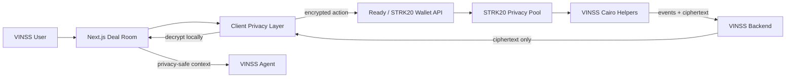

# VINSS Frontend

Next.js client for the VINSS private Deal Room.

The frontend is the privacy-sensitive execution layer: it connects the wallet, derives application encryption keys, encrypts private payloads before submission, decrypts discovered ciphertext locally, and renders private Chat and Offer state.

The frontend integrates directly with the STRK20 Privacy Pool / Wallet API and VINSS Cairo helper contracts through the internal **Deal Room integration layer** under `lib/deal-room/`.

## Current tested MVP

- Two-party private Chat.
- Private Offer flow for two-party deals.
- Ready/STRK20 wallet integration.
- Client-side encryption/decryption.
- Ciphertext-only backend discovery.
- Optional scoped VINSS Agent assistance.

Current application revenue:

- Private message: **0.5 STRK** per submitted message action.
- Offer action: **1 STRK** per submitted Offer action.

Features present in the repository outside this tested scope must not be interpreted as completed MVP functionality.

## Architecture



## Source structure

```text
app/                  Next.js routes and page composition
components/           UI components
hooks/room/           Deal Room state/orchestration
lib/deal-room/        STRK20 + VINSS helper integration modules
lib/privacy/          encryption, routing, presence, encrypted cache
lib/starknet/         wallet session and environment-driven addresses
types/                application domain types
```

## Run locally

```bash
cd ~/vinss/frontend
npm install
npm run dev
```

Validation:

```bash
npm run typecheck
npm run build
```

## Technical documentation

Start at [`../docs/technical/frontend/README.md`](../docs/technical/frontend/README.md).

## Privacy rule

Private message plaintext, private Offer terms, pairwise private keys, room secrets, and decrypted conversation state are client concerns and must not be sent to the VINSS backend as discovery data.
